# 常用插件

_Plugin，在 VSCode 中稱為 `延伸模組`。_

<br>

1. 點擊左側邊上的 `延伸模組` 功能圖標。

   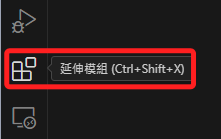

<br>

2. 進入後就會看到已經安裝以及推薦的插件。

   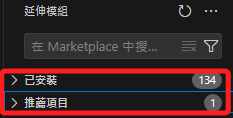

<br>

---

_以下逐一介紹_

<br>

## Jupyter

1. 這是在測試階段最常使用的開發環境。

   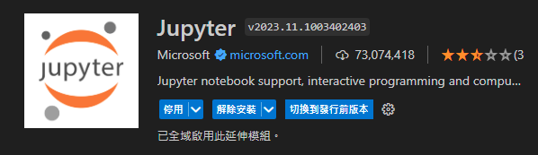

<br>

2. 除了透過市集進行安裝，當第一次建立副檔名為 `.ipynb` 的檔案時， VSCode 會詢問是否安裝相關運行所需模組，其中也包含了 `Jupyter Notebook`，在建立時，首先會安裝 `Python`。

   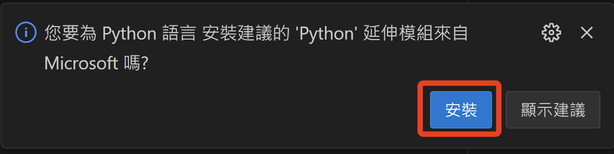

<br>

3. 任意建立一個檔案如 `test.ipynb` 並輸入簡單程式碼，點擊運行後，因為需選取 `核心`，所以會提示進行安裝。

   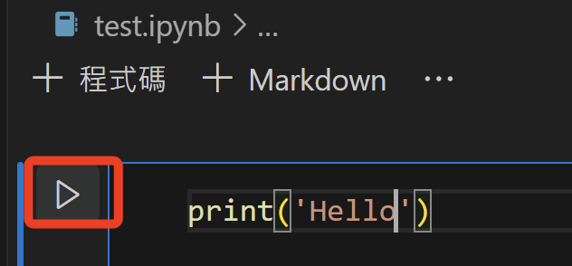

<br>

4. 上方會出現對話框，詢問是否開啟市集進行相關插件安裝。

   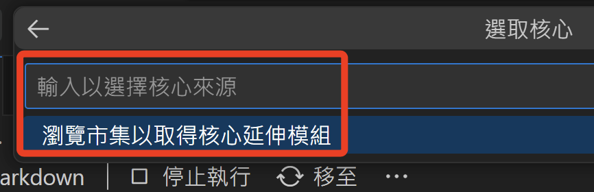

<br>

5. 可從左方市集點擊安裝，多餘安裝不會影響運行。

   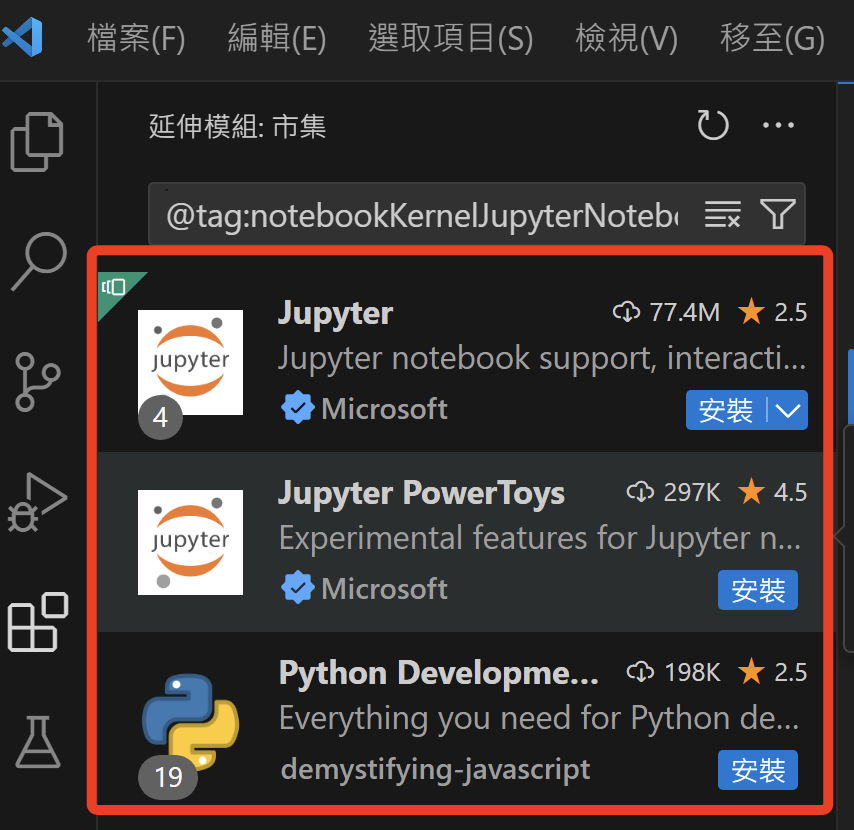

<br>

6. 同理，點擊右上角的 `選取核心`，相同會開啟市集。

   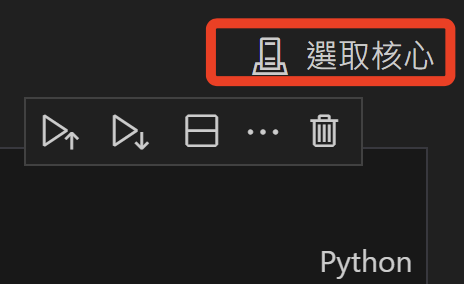

<br>

7. 這部分就是安裝 `Jupyter`。

   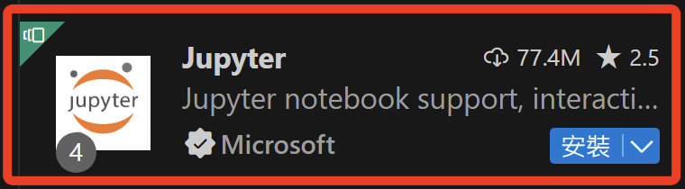

<br>

8. 補充說明，接下來選取 Python 環境後，若第一次運行，還會提示安裝 `ipykernel` 套件，點擊 `安裝` 即可。

   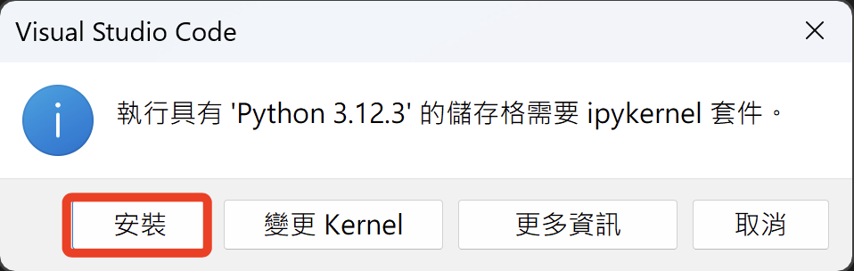

<br>

## Live Server

_即時伺服器插件，在這個課程中是很實用也會很常用的插件。_


<br>

## AWS Toolkit

_編程輔助工具，漸入佳境。_

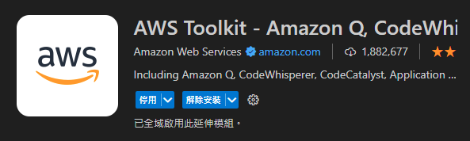

<br>

## Amazon Q

＿這是 2024/04/30 才發布的編程智能助理＿

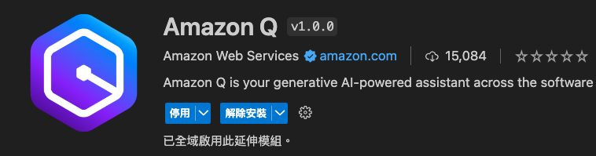


1. 點擊位於下方的功能鍵。

   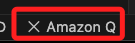

2. 假如已經運行 `AWS Toolkit`，則用來連線即可。

   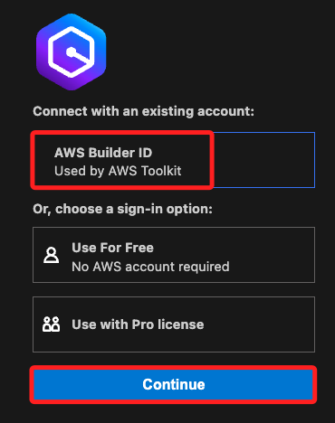

<br>

## IntelliCode

_智能補全插件_

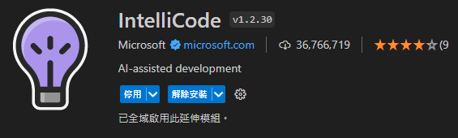

<br>

_會自動同時安裝_

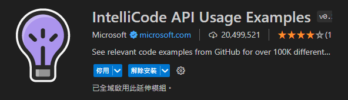

<br>

## Autopep8

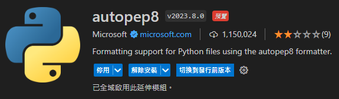

1. 這是一個 _格式檢驗工具_，可酌情取消部分的預設規則，如 `單行長度限制` 。

2. 這個插件可將 Python 程式碼自動格式化以符合 PEP 8 標準，而 PEP 8 是 Python 的官方風格指南，使用這個套件對於學習並遵循官方風格有相當幫助。

3. 設置範例。 

   ```json
   "[python]": {
      // 這是套件官方說明
      "editor.defaultFormatter": "ms-python.autopep8",
      "editor.formatOnSave": true,
      // 單行字數
      "python.formatting.autopep8Args": [
         "--max-line-length=120",  // 設置行長為 120 或更高的值
         "--ignore=E501"           // 忽略行長限制錯誤碼
    ]

   }
   ```

<br>

## Black Formatter

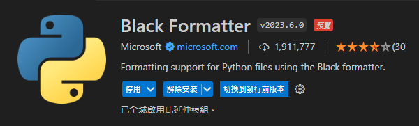

1. 是另一種 Python 程式碼格式化工具，提供一個 _無可選擇的_ 程式碼格式化方式，也就是說 Black 有一套固定的格式化規則，且不提供多餘配置選項以改變這些規則，而這些規範不僅限於官方風格的範疇。

2. 相較於 autopep8 則聚焦於修復程式碼中違反 PEP 8 的部分。

3. 設置說明。

   ```json
   // 這是官方文件的說明
   "[python]": {
      // 指定使用這個格式化插件
      "editor.defaultFormatter": "ms-python.black-formatter",
      // 儲存文件時會自動執行
      "editor.formatOnSave": true
   }
   ```

<br>

## Flake8


1. 由微軟所提供，這是一個程式碼檢查工具，檢查的項目包含了 `風格是否違規`，如 `單行的長度`。

2. 特別注意，這是檢查工具而不是格式化工具，與 autopep8 和 Black 可直接修改程式碼不同，Flake8 僅出具報告由使用者自行修正程式碼，這三者並不衝突，可以搭配使用。

<br>

## Excel Theme

_顯示 Excel 文件的插件_


<br>

## Excel Viewer

_另一種顯示 Excel 文件的插件_

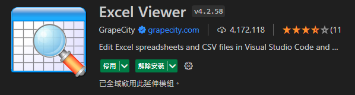

<br>

## Indent-Rainbow

_縮排有彩虹，非常好用_

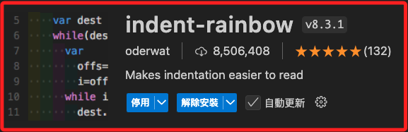

___

_END：持續補充_
