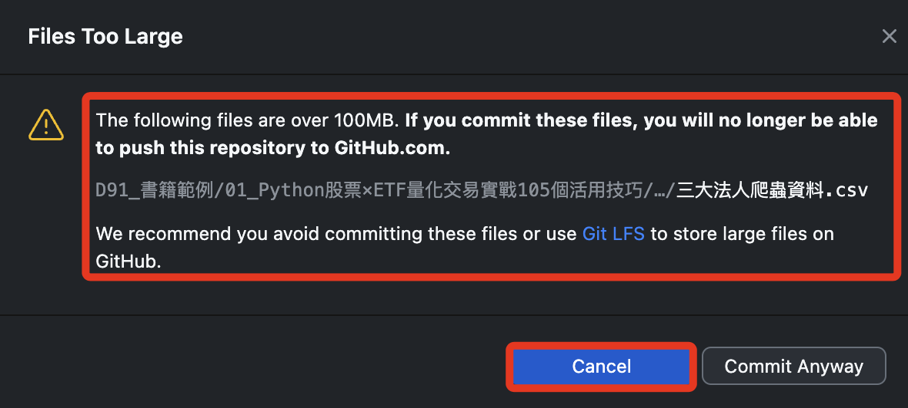
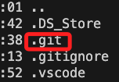
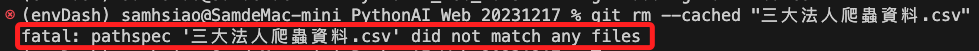

# 過大檔案

_透過 lfs 上傳大型檔案，以 `D50_書籍範例` 為例。_

<br>

## 狀況

1. Git 對於單一同步檔案預設的容量上限為 `100MB`，當同步檔案過大時會顯示如下圖的警告與說明。

    

<br>

2. 切記要 _取消上傳_，再進行以下步驟。

<br>

## 處理步驟

1. 先退到 Git 根目錄，務必確保 `.git` 存在當前目錄。

    

<br>

2. 安裝 `lfs`。

    ```bash
    git lfs install
    ```

<br>

3. 追蹤指定的大型檔案。

    ```bash
    git lfs track "三大法人爬蟲資料.csv"
    ```

<br>

4. 透過指令將設定添加到設定檔案 `.gitattributes`。

    ```bash
    git add .gitattributes
    ```

<br>

5. 假如大型檔案的同步已經提交，透過指令進行移除。

    ```bash
    git rm --cached "三大法人爬蟲資料.csv"
    ```

<br>

6. 在這個實務操作中顯示如下訊息，代表並未找到符合的文件，這只是本次操作介紹的特例，無須理會。

    

<br>

7. 提交。

    ```bash
    git commit -m "Remove large file"
    ```

<br>

8. 再次推送即可完成，前往 Github 查看，可看到這個檔案是有被上傳的。

    

<br>

---

_END_