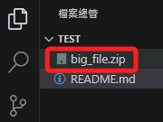

# 過大檔案

_透過 lfs 上傳大型檔案，以 `D50_書籍範例` 為例。_

<br>

## 狀況

1. Git 對於單一同步檔案預設的容量上限為 `100MB`，當同步檔案過大時會顯示如下圖的警告與說明。

    

<br>

2. 切記要 _取消上傳_，再進行以下步驟。

<br>

## 處理步驟

1. 先退到 Git 根目錄，務必確保 `.git` 存在當前目錄。

    

<br>

2. 安裝 `lfs`。

    ```bash
    git lfs install
    ```

<br>

3. 追蹤指定的大型檔案。

    ```bash
    git lfs track "三大法人爬蟲資料.csv"
    ```

<br>

4. 透過指令將設定添加到設定檔案 `.gitattributes`。

    ```bash
    git add .gitattributes
    ```

<br>

5. 假如大型檔案的同步已經提交，透過指令進行移除。

    ```bash
    git rm --cached "三大法人爬蟲資料.csv"
    ```

<br>

6. 在這個實務操作中顯示如下訊息，代表並未找到符合的文件，這只是本次操作介紹的特例，無須理會。

    

<br>

7. 提交。

    ```bash
    git commit -m "Remove large file"
    ```

<br>

8. 再次推送即可完成，前往 Github 查看，可看到這個檔案是有被上傳的。

    

<br>

## 實務運作

1. 加入一個超大型檔案。

    

<br>

2. 提交後一段時間會跳出警告視窗。

    

<br>

3. 開啟 Git 紀錄，其中紀錄了錯誤 `error`，顯示 `this exceeds GitHub's file size limit of 100.00 MB`。

    

<br>

4. 假如直接刪除大型檔案後再次提交，_依舊會出現相同警告_，因為一旦文件提交到版本庫，即使在後續的提交中將其刪除，該文件的歷史記錄仍然會保留在版本庫中，這表示即使在最新的提交中刪除了大文件，該文件的先前版本仍然存在於歷史提交中，因此總體倉庫大小不會因為刪除操作而減少。

<br>

5. 透過指令返回提交前的狀態，其中 `1` 代表的是前一個。特別注意，這個指令會使工作目錄恢復到前一次提交時的狀態。

    ```bash
    git reset --hard HEAD~1
    ```

<br>

6. 假如只想從 Git 版本控制中移除文件但保留本地工作目錄的文件，可透過以下指令從 Git 索引中移除指定檔案 `big_file.zip`。

    ```bash
    git rm --cached big_file.zip
    ```

<br>

7. 會顯示如下結果。

    

<br>

8. 接著進行提交，註明 `Remove large file from repository`。

    ```bash
    git commit -m "Remove large file from repository"
    ```

<br>

9. 得到以下訊息，表示本地分支比遠端 `origin/main` 領先 `2` 次提交，這包括了移除大檔案的提交。

    

<br>

10. 將指定檔案添加到 `.gitignore`。

    

<br>

11. 將更新後的添加到 Git。

    ```bash
    git add .gitignore
    ```

<br>

12. 提交。

    ```bash
    git commit -m "Update .gitignore to exclude big_file.zip"
    ```

<br>

13. 推送。

    ```bash
    git push origin main
    ```

<br>

---

_END_