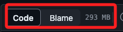

# 過大檔案

_透過 lfs 上傳大型檔案，以 `D50_書籍範例` 為例。_

<br>

## 狀況

1. 顯示說明。

    

<br>

2. 切記要取消上傳，進行以下步驟。

<br>

## 處理步驟

1. 先退到 Git 根目錄，務必確保 .git 存在當前目錄。

    

<br>

2. 安裝 `lfs`。

    ```bash
    git lfs install
    ```

<br>

3. 追蹤大型檔案。

    ```bash
    git lfs track "三大法人爬蟲資料.csv"
    ```

<br>

4. 添加 `.gitattributes`。

    ```bash
    git add .gitattributes
    ```

<br>

5. 假如已經提交，進行移除。

    ```bash
    git rm --cached "三大法人爬蟲資料.csv"
    ```

<br>

6. 在這個實務操作中，顯示如下。

    

<br>

7. 提交。

    ```bash
    git commit -m "Remove large file"
    ```

<br>

8. 再次推送即可完成，前往 Github 查看，可看到這個檔案是有被上傳的。

    

<br>

---

_END_