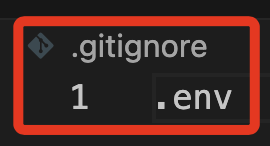

# 敏感資訊

_說明敏感資訊，假設已經在 Github 中集成了 [GitGuardian](https://www.gitguardian.com/)。_

<br>

## 以 Line 為例

1. 在腳本中寫入 Secret 及 Token。

    

<br>

2. 提交並同步後會 _立即_ 收到來自 GitGuardian 的警告郵件。

    

<br>

## 處置方式

_以使用 dotenv 為例。_

<br>

1. 安裝套件。

    ```bash
    pip install python-dotenv
    ```

<br>

2. 在專案內根目錄自建立一格隱藏檔案 `.env` 並編輯內容。

    ```bash
    _CHANNEL_ACCESS_TOKEN_ = <貼上 TKOKEN>
    _CHANNEL_SECRET_ = <貼上 SECRET>
    ```

<br>

3. 特別注意， `.env` 檔案內的字串無需加上引號，與等號間有無間隔皆可。
    
    

<br>

4. 在根目錄添加 `.gitignore` 檔案，並將 `.env` 寫入其中。

    

<br>

5. 在主腳本 `index.py` 導入 dotenv。

    ```python
    import os
    from dotenv import load_dotenv
    load_dotenv()
    ```

<br>

6. 在程序中使用 `os` 來取得 Token 及 Secret。

    _取得_
    ```python
    CHANNEL_ACCESS_TOKEN = os.getenv("_CHANNEL_ACCESS_TOKEN_")
    CHANNEL_SECRET = os.getenv("_CHANNEL_SECRET_")
    ```
    _使用_
    ```
    configuration = Configuration(access_token=CHANNEL_ACCESS_TOKEN)
    handler = WebhookHandler(CHANNEL_SECRET)
    ```

<br>

___

_以上簡單展示如何保護敏感資訊。_