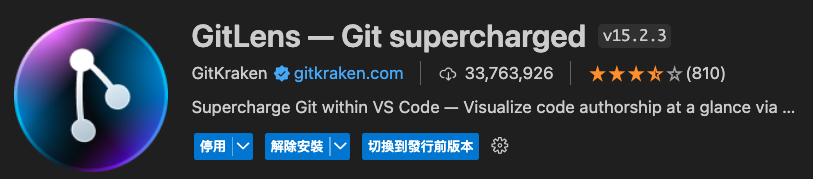
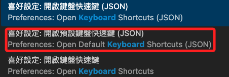
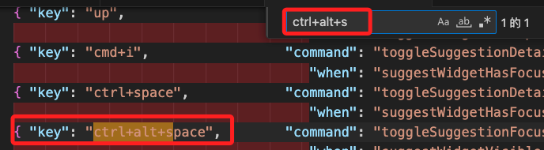
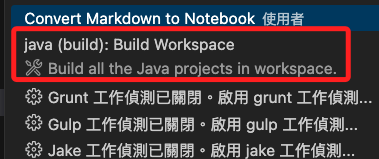

# 快速提交

_使用內建的快捷鍵功能和擴展來實現快速提交當前變更，並自動將時間寫入作為提交訊息_

## 安裝擴展

1. 進入延伸模組，搜索並安裝 `GitLens` 擴展，這個擴展提供豐富的 Git 功能。

    

## 檢查是否衝突

1. 在 VSCode 中，按 `Ctrl+Shift+P` 打開 `命令選擇區`，輸入 `Preferences: Open Default Keyboard Shortcuts (JSON)`，檢查預設的快速鍵是否與想要設定的組合衝突。



2. 確認沒有衝突。



## 配置快捷鍵

3. 打開 `命令選擇區` 輸入 `Preferences: Open Keyboard Shortcuts (JSON)`，點擊後會打開設定文件 `keybindings.json`。

4. 添加以下內容到 `keybindings.json` 文件中來定義一個快捷鍵；`atl` 在 MacOS 就是 `option`，所以組合鍵是 `ctrl + option + s`。

```json
[
    {
        // 自定義快捷鍵：提交
        "key": "ctrl+alt+s",
        "command": "workbench.action.tasks.runTask",
        "args": "Commit with DateTime"
    }
]
```

## 配置任務

1. 打開 `命令選擇區` 輸入 `Tasks: Configure Task`，然後選擇 `Build Workspace`。



2. 在文件中添加新的內容。

```json
{
        // 僅列出添加部分
        {
            "label": "Commit with DateTime",
            "type": "shell",
            // 僅提交
            // "command": "git add . && git commit -m \"Commit on $(date '+%Y-%m-%d %H:%M:%S')\"",
            // 提交並變更
            "command": "git add . && git commit -m \"Commit on $(date '+%Y-%m-%d %H:%M:%S')\" && git push",
            "group": {
                "kind": "build",
                "isDefault": true
            },
            "problemMatcher": []
        }
}
```

## 使用擴展或自定義腳本


### 使用快捷鍵
6. 配置完後，您可以使用 `Ctrl+Alt+S` (根據您設置的快捷鍵) 快速提交當前變更，並自動將當前時間作為提交訊息。

這樣，您就可以在 VSCode 中通過快捷鍵快速提交當前變更，並自動將時間寫入作為提交訊息。