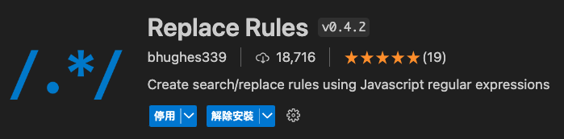
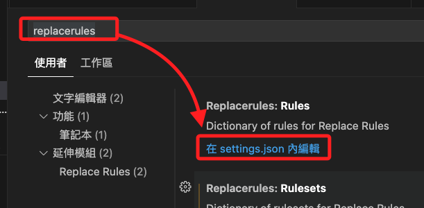
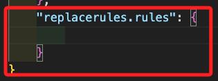
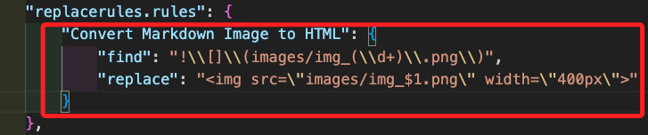
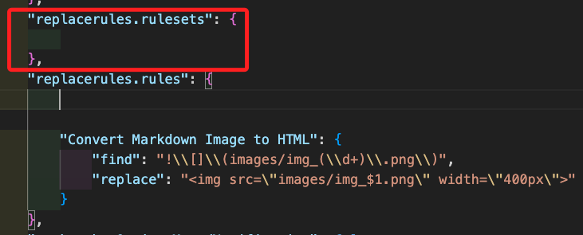
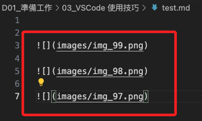
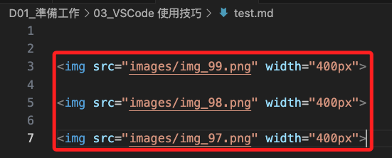

# MD 圖片轉 HTML

_將 Markdown 圖片語法轉換為 HTML 圖片標籤，並設置寬度為 400px_

<br>

## 安裝插件

1. 開啟市集（`Ctrl+Shift+X`）安裝 VSCode 插件 `Replace Rules`，這個插件允許定義自動替換規則。

    

<br>

## 建立規則

1. 使用快速鍵（`command + ,`）開啟 VSCode 的設定，搜尋並點擊 `settings.json` 來配置 Replace Rules規則。

    

<br>

2. 這會自動展開設定文件所在的位置。

    

<br>

3. 寫入設定。

    ```json
    "replacerules.rules": {
        "Convert Markdown Image to HTML": {
            "find": "!\\[]\\(images/img_(\\d+)\\.png\\)",
            "replace": ""
        }
    }
    ```

<br>

4. 務必確保格式正確。

    

<br>

5. 可將 `replacerules` 插件的配置寫在工作區的 `.vscode` 文件夾內，這樣可以使配置對於特定的工作區有效。

<br>

6. `"replacerules.rulesets": {}` 是為了將來可能會添加的規則集進行預留，也就是可以創建多個規則集，每個規則集包含多個規則，然後通過快捷鍵一次性運行這些規則集中的所有規則，這樣可方便地對文本進行複雜的多步替換操作。

    

<br>

## 設定快速鍵

1. 先查詢預計使用的組合鍵 `ctrl+alt+m` 與系統預設組合鍵沒有衝突；在命令選擇區，搜尋並開啟 `Open Keyboard Default Shortcuts (JSON)`。

<br>

2. 設定快捷鍵：開啟命令選擇區，搜尋並開啟 `Open Keyboard Shortcuts (JSON)`，添加以下快捷鍵配置。

    ```json
    {
        "key": "ctrl+alt+m",
        "command": "replacerules.runRule",
        "when": "editorTextFocus && !editorReadonly",
        "args": {
            "ruleName": "Convert Markdown Image to HTML"
        }
    }
    ```

<br>

## 實測

1. 編輯三個圖片。

    

<br>

2. 在 VSCode 中按下 `control + option + m` 組合快捷鍵，VSCode 會自動將當前文件中的 `` 代碼轉換為 ``，其中 `XX` 可以是任何數字。

    

<br>

___

_END_
