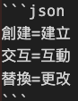
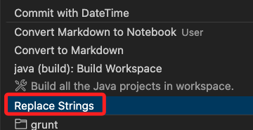

# 批次更改字串

_在 VSCode 中建立轉換指定字串的腳本，並透過組合鍵來快速運行_

<br>

## 編寫腳本

_這就是透過組合鍵調用的腳本_

<br>

1. 先建立一個文件 `.replace` 以定義要置換的字串，使用等號 `=` 將新舊字串進行定義，格式如下，這裡是圖片表示，因為使用字串的話會被轉換。

    

<br>

2. 接著在專案資料夾中建立一個 Python 腳本並命名為 `replace_script.py`，腳本名稱可以自訂，並根據前項文件 `.replace` 中的規則進行字串轉換。

    ```python
    import os

    def load_replacement_rules(file_path):
        rules = {}
        with open(file_path, 'r', encoding='utf-8') as file:
            for line in file:
                line = line.strip()
                if not line or '=' not in line:
                    continue
                old, new = line.split('=', 1)
                rules[old.strip()] = new.strip()
        return rules

    def replace_in_file(file_path, rules):
        with open(file_path, 'r', encoding='utf-8') as file:
            content = file.read()
        for old, new in rules.items():
            content = content.replace(old, new)
        with open(file_path, 'w', encoding='utf-8') as file:
            file.write(content)

    def process_project_files(project_path, rules):
        for root, _, files in os.walk(project_path):
            for file in files:
                # 可根據需求調整匹配的文件類型
                if file.endswith(('.txt', '.md', '.py', '.js')):
                    file_path = os.path.join(root, file)
                    replace_in_file(file_path, rules)

    if __name__ == '__main__':
        project_root = os.getcwd()
        replace_file = os.path.join(project_root, '.replace')
        if not os.path.exists(replace_file):
            print("在根目錄中未找到匹配文件。")
            exit(1)
        rules = load_replacement_rules(replace_file)
        process_project_files(project_root, rules)
        print("更改作業完成。")
    ```

<br>

## 快速鍵

_在 VSCode 中設置快捷鍵_

<br>

1. 開啟根目錄中的 `tasks.json` 文件進行編輯，假如文件不存在則手動建立；這個文件是 `Tasks` 功能的設定檔。

<br>

2. 在 `tasks.json` 文件中新增以下內容，特別注意其中的 `label`，這裡定義為 `Replace Strings`。

    ```json
    {
        "version": "2.0.0",
        "tasks": [
            {
                // 任務名稱
                "label": "Replace Strings",
                // 使用命令行執行
                "type": "shell",
                // 執行 Python 解譯器
                "command": "python",
                // 腳本名稱
                "args": ["replace_script.py"],
                "presentation": {
                    // 顯示終端輸出
                    "reveal": "always",
                    // 終端面板共享
                    "panel": "shared"

                },
                "group": {
                    // 任務分組
                    "kind": "build",
                    // 設為默認任務
                    "isDefault": true
                },
                "problemMatcher": []
            }
        ]
    }
    ```

3. 編輯後，點擊 `SHIFT + command + p`，選取其中的 `Tasks: Run Task` 便可看到這個 Task。

    

<br>

3. 保存後可以通過快速鍵 `shift+ctrl+cmd+r` 執行該任務。

<br>

## 其他設定

_在 `settings.json` 中進行相關設置_

1. 全局設置 Python 路徑。

    ```json
    {
        // Python 解譯器路徑
        "python.defaultInterpreterPath": "<Python-的全局路徑>/python",
        // 預設終端類型
        "terminal.integrated.defaultProfile.windows": "Command Prompt",
        // 儲存時整理導入
        "editor.codeActionsOnSave": {
            "source.organizeImports": true
        }
    }
    ```

<br>

___

_END_