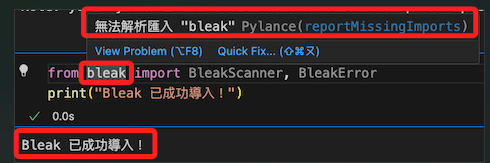

# 忽略特定警告

_以套件 `bleak` 為例_

<br>

## 說明

1. 已經正確安裝，透過腳本並顯示成功導入，卻顯示警告。

    

<br>

2. 編輯 `settings.json` 排除指定警告，以下設定當 `Pylance` 找不到模組的解析路徑時，設定診斷報告如何觸發此，設置為 `none` 將完全隱藏該診斷報告。

    ```json
    {
        // 忽略特定警告
        "python.analysis.diagnosticSeverityOverrides": {
            "reportMissingImports": "none"
        }
    }
    ```

<br>

___

_END_