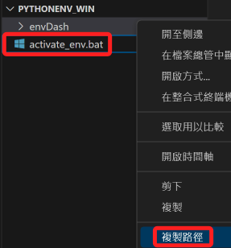

# 開機啟動虛擬環境

<br>

## Windows

<br>

### 步驟

1. 建立虛擬環境統一管理資料夾。

<br>

2. 建立虛擬環境。

<br>

3. 在管理資料夾內建立一格批次處理檔案，命名為 `activate_env.bat`。

    ```ini
    @echo off
    call "<虛擬環境路徑>\Scripts\activate"
    ```

<br>

4. 在終端機圖標上點擊右鍵選取 `開啟檔案位置`。

     

<br>

5. 在捷徑上點擊右鍵選取 `內容`。

    

<br>

6. 複製批次檔檔案的路徑。

    

<br>

7. 在 `目標` 的指令前面加上批次腳本路徑，並以 `&&` 串接原本的指令。

    

<br>

8. 再次啟動命令提示字元就會啟動預設的虛擬環境。

    

<br>

## MacOS

<br>

### 步驟

<br>

---

_END_