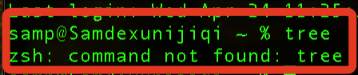

# MacOS 指令 tree

<br>

## 說明

1. 在 MacOS 的終端機中並未預設該指令，進行開發時，這是個好用的指令。

    

<br>

2. 以下示範透過 Homebrew 進行安裝。

<br>

## 安裝 Homebrew

1. 查詢當前 Homebrew 版本。

    ```bash
    brew -v
    ```

<br>

2. 假如尚未安裝 Homebrew，可執行以下指令進行安裝。

    ```bash
    /bin/bash -c "$(curl -fsSL https://raw.githubusercontent.com/Homebrew/install/HEAD/install.sh)"
    ```

<br>

3. 安裝 tree。

    ```bash
    brew install tree
    ```

<br>

## brew 報錯

_若有報錯可執行對應指令排除。_

<br>

1. 修理。

    ```bash
    brew tap --repair
    ```

<br>

2. 更新。

    ```bash
    brew update
    ```

<br>

3. 檢查。

    ```bash
    brew doctor
    ```


<br>

---

_END_