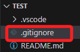

# 排除項目

_排除不必要被版本控制系統追踪的文件和目錄_

<br>

## 常見排除項目

1. 編譯文件，如 `.exe`、`.o`、`.class` 等檔案。
2. 套件目錄，如 `node_modules/`。
3. 敏感資訊，如金鑰、密碼、權杖等。
4. 日誌文件或執行階段文件，如 `.log`、`.tmp`。
5. 大型文件或壓縮檔案，如超過 100 MB 的文件或 `.zip` 等檔案。

<br>

## 建立步驟

1. 在根目錄中手動建立 `.gitignore` 文件。

    

<br>

2. 常見設定範例。

    ```bash
    # 日誌文件
    *.log

    # 特定目錄
    node_modules/
    bin/
    obj/
    build/
    dist/

    # 指定檔案類型
    *.tmp
    *.temp

    # 特定系統產生的文件夾
    .DS_Store

    # 特定配置文件
    config.json

    # 其他指定文件
    # ...

    ```

<br>

## 移除已追蹤檔案

1. 先停止追蹤，特別注意，這個指令只是從目前的版本庫中移除文件的追蹤狀態，但是如果不在 `.gitignore` 中明確指定忽略這個文件，Git 在未來的操作中仍然會識別並提出添加這個文件。

    ```bash
    git rm --cached <要忽略的文件>
    ```

<br>

2. 編輯 `.gitignore` 並加入要忽略的文件。

<br>

3. 一旦修改了 `.gitignore` 就需要提交這個更新，以便 Git 可以使用新的規則。

    ```bash
    git add .gitignore
    git commit -m "Update .gitignore"
    ```

<br>

___

_END_