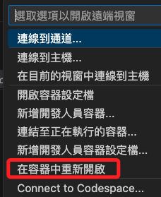
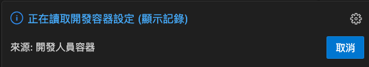
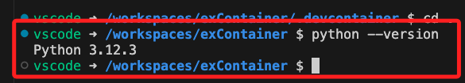
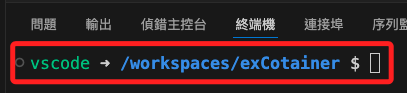

# 建立容器

_在 VScode 中建立，以下分解各階段步驟並說明_

<br>

## 基礎建置

1. 在電腦（本機）上建立一個專案資料夾，這裡範例命名為 `exContaiber`，並在此啟動 VSCode。

    

<br>

2. 在左下角 `命令選擇區` 中 `新增開發人員容器設定檔`。

   

<br>

3. 選擇 `將設定新增至工作區` 或使用者資料夾皆可，這裡示範添加到工作區。

   

<br>

4. 選取 `Python`。

   

<br>

5. 容器底層的操作系統是 Debian，所以提供選取其版本號，這裡使用新版的 `bullseye`。

   

<br>

6. 其他功能先不選取，這裡點擊 `確定` 跳過即可。

   

<br>

7. 接著點擊右下方的 `在容器中重新開啟` 按鈕。

   

<br>

8. 在工作區中會添加兩個資料夾並各有一個文件，分別是 `.devcontainer ` 中有文件 `devcontainer.json`，`.github` 中有文件 `dependabot.yml`。

   

<br>

9. 倘若有修改設定文件，都要提示進行重建 `Rebuild`，或手動透過選單重建也可以 。

   

<br>

10. 查看左下角連線設置會顯示連線容器，假如尚未連線，可點擊進行設置，已連線則跳至第 `14` 點說明。

    

<br>

11. 啟動。

    

<br>

12. 右下角會出現當前狀態訊息。

    

<br>

13. 允許。

    

<br>

14. 完成後左下角會出現容器資訊。

    

<br>

15. 在終端機中查詢，會顯示容器的相關版本訊息。

    

<br>

16. 建立容器時會自動生成容器設定文件 `devcontainer.json`，其中版本號 `1-3.12-bullseye` 是 VSCode 依據選取的版本自動生成的。

    ```json
    // For format details, see https://aka.ms/devcontainer.json. For config options, see the
    // README at: https://github.com/devcontainers/templates/tree/main/src/python
    {
        "name": "Python 3",
        // Or use a Dockerfile or Docker Compose file. More info: https://containers.dev/guide/dockerfile
        "image": "mcr.microsoft.com/devcontainers/python:1-3.12-bullseye"

        // Features to add to the dev container. More info: https://containers.dev/features.
        // "features": {},

        // Use 'forwardPorts' to make a list of ports inside the container available locally.
        // "forwardPorts": [],

        // Use 'postCreateCommand' to run commands after the container is created.
        // "postCreateCommand": "pip3 install --user -r requirements.txt",

        // Configure tool-specific properties.
        // "customizations": {},

        // Uncomment to connect as root instead. More info: https://aka.ms/dev-containers-non-root.
        // "remoteUser": "root"
    }
    ```

<br>

17. 將註解無用的內容刪除，另外添加了參數 `postCreateCommand` 以指定要執行的安裝指令，文件簡化如下。

    ```json
    {
        "name": "Python 3.12.3",
        "image": "mcr.microsoft.com/devcontainers/python:1-3.12-bullseye",
        "postCreateCommand": "pip install --upgrade pip"
    }
    ```

<br>

18. 補充說明，可依據自己 `settings.json` 中常用的設置融入到容器的設置文件，以下是我自己常用的設置，主要是針對插件 `pasteImage`、`flake8` 等進行設置，同學參考即可、不用修改。

    ```json
    {
        "name": "Python 3.12.3",
        "image": "mcr.microsoft.com/devcontainers/python:1-3.12-bullseye",
        "postCreateCommand": "pip install --upgrade pip",
        "customizations": {
            "vscode": {
                "settings": {
                    "pasteImage.path": "${currentFileDir}/images/",
                    "pasteImage.namePrefix": "img_",
                    "pasteImage.defaultName": "0",
                    "pasteImage.showFilePathConfirmInputBox": true,
                    "flake8.args": [
                        "--max-line-length=200",
                        "--ignore=E402"
                    ]
                },
                "extensions": ["ms-python.python"]
            }
        }
    }
    ```

<br>

19. 設定文件修改後，右下角會提示進行重建 `rebuild`，也可手動點擊左下角的連線進行重建。

    

<br>

20. 完成後會出現以下訊息。

    

<br>

21. 按下任意鍵回到終端機。

    

<br>
___

_END：以上完成容器的建立_