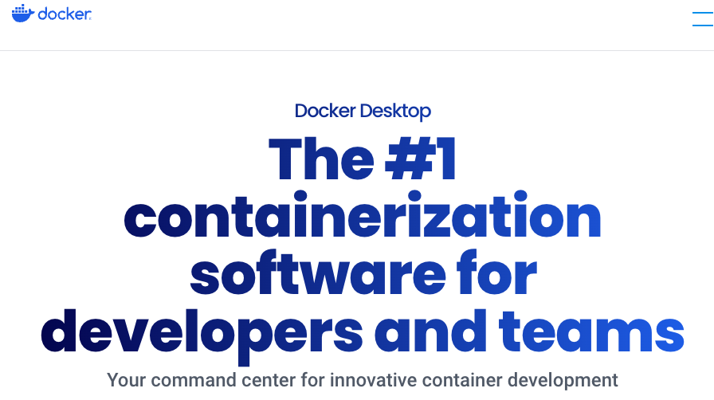
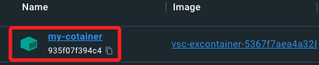

## Docker Desktop

_觀察容器_

<br>

1. 安裝 [Docker Desktop](https://www.docker.com/products/docker-desktop/) 後可查看並管理容器。

   

<br>

2. 在 Dashboard 可查看前面步驟所建立的容器，其中 Name 就是容器名稱。

   

<br>

3. 觀察容器詳情。

   

<br>

4. 特別注意，容器的 `Name` 是自動分配且隨機生成的，由一對 `形容詞＋名詞` 組成，可透過以下指令進行自訂。

   ```bash
   docker rename <原本名字> my-container
   ```

<br>

5. 會自動刷新為新的名稱 `Name`。

   

<br>

___

_以上是 Docker Desktop 的基本操作_