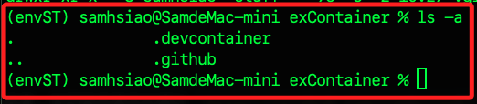
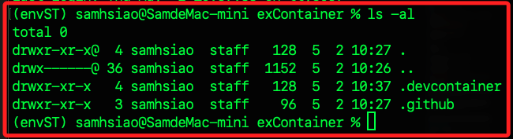

# 版本控制

_或稱原始碼控制，以下示範使用 CLI_

<br>

## 基本步驟

1. 在本機的容器資料夾所在根目錄中開啟終端機，這很重要，務必確保位置正確。

    

<br>

2. 除了位置，也透過 `ls -al` 指令查詢當前資料夾內的所有檔案，避免有殘存的隱藏設定。

    

<br>

3. 建立 Git 倉庫基礎步驟。

   ```bash
   # 初始化
   git init
   # 添加當前倉庫文件
   git add .
   # 提交
   git commit -m "init"
   # 指定分支
   git branch -M main
   ```

<br>

4. 關於 `git commit` 的參數 `-m` 是指 `message` 提交訊息的意思，除此之外還有一些其他的用法簡列如下。

    ```bash
    # `--amend` 這個參數不會建立新的提交，而是指定修改最後一次提交
    # 在沒有文件修改的情況下， `--amend` 參數可用作修改前次提交描述的目的
    git commit --amend -m "New commit message"

    # `--amend` 搭配 `--no-edit` 使用可保留原本的提交訊息，所以無需編輯字串
    git commit --amend --no-edit

    # `-v` 或 `--verbose` 將提交訊息指定為顯示自動編輯的差異訊息
    git commit -v

    # `-a` 或 `--all` 可自動暫存所有已修改或刪除但尚未添加的文件並提交
    # `-a -m` 合併使用可省去 `git add` 步驟
    git commit -a -m "Commit all changed files"
    ```

<br>

6. 關於 `git branch -M` 中的 `-M` 用於重新命名分支 `branch`，如果分支存在，透過參數 `-M` 將會強制且無提示覆蓋；在分支已經存在的情況下，若更換為 `-m` 參數則不會強制覆蓋，而是提示錯誤。

<br>
   
7. 在 Github 上建立一個新的倉庫，並記錄所提供的網址 `https://github.com/samhsiao6238/_container_.git`。

   

<br>


8. 特別注意，這個階段在遠端倉庫中先不要建立 README，避免可能導致後續推送時產生衝突，該文件也不是這階段的重點，所以建議省略。

<br>

9. 另外，之後有更新時都要再次進行 `添加` 與 `提交`。

   ```bash
   # 添加當前倉庫文件
   git add .
   # 提交
   git commit -m "update"
   ```

<br>

10. 連線遠程倉庫，使用前面步驟取得的網址，同學務必換為自己的網址。

    ```bash
    git remote add origin <遠端倉庫網址>
    ```

<br>

11. 推送到倉庫。

   ```bash
   git push -u origin main
   ```

<br>

12. 完成。

   

<br>

13. 可為容器配置的重要版本的 Git 標籤，或使用分支來管理不同的配置版本，這有助於重建特定版本的容器。

   ```bash
   # 建立標籤與註解
   git tag -a "v1.0-container-setup" -m "Version 1.0 of container setup"
   # 推送
   git push --tags
   ```

<br>

___

_以上是將容器推送到倉庫的說明_