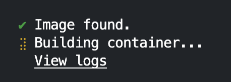
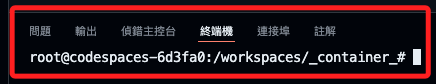
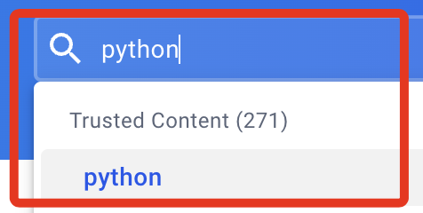
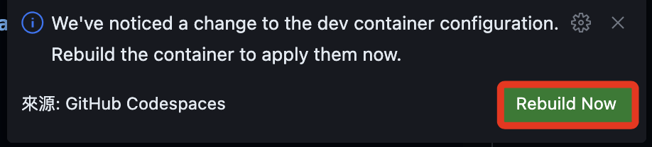
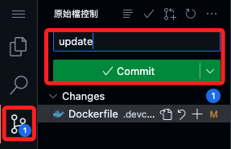
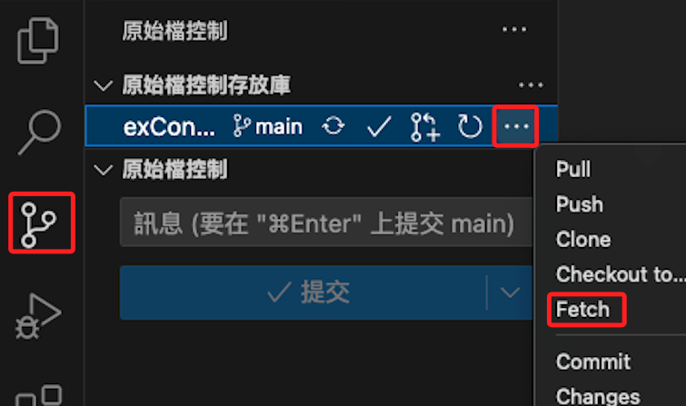
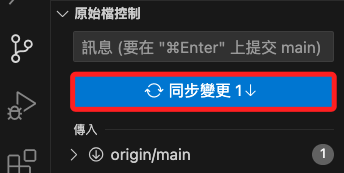
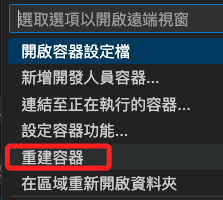
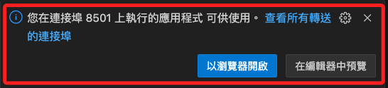
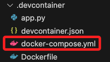

# 重建容器

_以下展示在遠端重建倉庫_

<br>

## 啟動 Codespace

1. 初次建立。

   

<br>

2. Codespace 會自動識別倉庫中的 `.devcontainer` 配置來建立開發環境，這包含 `devcontainer.json` 和 `Dockerfile` 。

   

<br>

3. 運行後等待完成連線會顯示如下視窗，接著可能會跳出關於插件安裝的視窗，特別注意，由於 Codespace 可能會有些限制導致插件未能正確安裝或使用。

   

<br>

## 在遠端修改倉庫

_以更換 Python 版本號為例_

<br>

1. 進入 [Docker Hub](https://hub.docker.com/) 查詢 Python 映像的版本號。

   

<br>

2. 在倉庫中開啟 `Dockerfile`，當前版本號是 `3.10-bullseye`，修改為 `3-12-bullseye`；特別注意，若參考官網的  `Dockerfile`  進行標準安裝會太耗時，以下採用簡易的自動化文件進行安裝即可。

   ```dockerfile
   # 使用指定映像
   FROM python:3.12-bullseye

   # 安裝必要庫
   RUN apt-get update && apt-get install -y git zsh && rm -rf /var/lib/apt/lists/*
   ```

<br>

3. 嘗試重新建立。

   

<br>

4. 查詢後會顯示新的版本號 `3.12.3`。

   

<br>

5. 提交更新後的文件並完成同步。

   

<br>

_回到 VSCode 中_

<br>

6. 在本機的 VSCode 中點擊 `Fetch`，假如點不到顯示更多 `...`，將導覽列橫向拉寬即可。

   

<br>

7. 完成同步。

   

<br>

8. 這時 Dockerfile 的版本已經更新。

   

<br>

9. 假如沒有連線容器，下選取 `在容器中重新開啟`。

   

<br>

10. 然後再次 `重建容器`。

   

<br>

11. 如此便完成容器的同步，版本號重新回到 `3.12.3`。

   

<br>

## 端口映射

_這裡展示一個 Streamlit 專案來說明端口映射_

<br>

1. 在項目的 `.devcontainer` 資料夾內建立一個 Streamlit 腳本 `app.py`，內容如下。

   ```python
   import streamlit as st

   st.title('Hello Streamlit in Docker!')
   st.write("這是在容器中的 Streamlit 服務範例。")
   ```

<br>

2. 開啟容器的終端機，運行以下指令安裝套件。

   ```bash
   pip install streamlit
   ```

<br>

3. 運行腳本。

   ```bash
   streamlit run app.py
   ```

<br>

4. 會提示輸入電子郵件，也可以按下 `ENTER` 留白即可。

   

<br>

5. 右下角出現視窗，但是不用點擊，自動會啟動瀏覽器。

   

<br>

6. 點擊 `查看所有轉送的連接埠` ，目前可透過 `localhost:8501` 或 `127.0.0.1:8501` 進行訪問。

   

<br>

7. 另外，終端機會出現兩個 URL 如下，其中 `Local URL` 是指容器內部的 `localhost`，也就是 `127.0.0.1` ，它只能從容器內部訪問，即只有容器內的進程可以使用這個位址存取 Streamlit 應用；另外 ` Network URL`，這是容器在 Docker 內部網路中的 IP 位址，這位址在容器之間是可存取的，兩者若無映射，都無透過從外部或主機上訪問。

   

<br>

8. 補充說明，倘若應用綁定的是 `0.0.0.0`，表示監聽所有可用的網路接口，包含了公有和私有的 IP，所以也能接收所有來自同一個區網其他設備的訪問，可透過以下指令運行腳本。

   ```bash
   streamlit run app.py --server.address=0.0.0.0
   ```

<br>


9. 特別說明，在 Mac 系統中使用 Docker Desktop 時，雖然容器被視為獨立的主機，但彼此的 localhost 是共享的，所以透過 MacOS 的溜覽器將可以訪問容器運行的 Streamlit 應用。

<br>

## 建立 docker-compose.yml

_定義和管理多個容器配置的文件，如 `services`、`networks`、`volumes` 等，其中包含了 `端口映射` 。_

<br>

1. 先前所使用的 `devcontainer.json` 文件主要用於配置 `VSCode` 如何與容器互動，包括 _設定開發環境_、_安裝 VSCode 擴充功能_ 等，雖然在這個文件中也可以 _指定連接埠轉送的規則_ ，但這通常用於開發時的連接埠轉送需求，而不是容器服務之間的連接埠對映，所以在端口管理上，`docker-compose.yml` 文件會是更好的選擇，而 `devcontainer.json` 文件則專注在配置與 VSCode 直接相關的設置。

<br>

_以下開始實作_

<br>

2. 在 `.devcontainer` 資料夾中建立文件 `docker-compose.yml`。

   

<br>

3. 假設該容器將用於 Streamlit 專案使用，並將使用 MariaDB 以及 MongoDM，其端口預設分別為 `8501`、`3306`、`27017`，列舉一個相對詳盡的設置範例如下，特別注意，文件中的 _version_ 是 `Docker Compose` 的版本，當前最新的是 `version 3`，相關資訊可參考 [官網](https://docs.docker.com/compose/compose-file/) 。

   ```yaml
   version: '3'

   services:
      streamlit:
         build: # 使用 Dockerfile

         context: .
         dockerfile: Dockerfile
         # 當前目錄掛載位置
         volumes:
               - .:/app
         working_dir: /app
         ports:
               - "8501:8501"
         # 先安裝依賴庫再啟動服務
         command: sh -c "pip install -r requirements.txt && streamlit run app.py"
         # 確保服務在兩者之後啟動
         depends_on:
               - mariadb
               - mongodb

      mariadb:
         # 使用官方鏡像
         image: mariadb
         # 需要手動設置這些數值
         environment:
               MYSQL_ROOT_PASSWORD: rootpassword
               MYSQL_DATABASE: exampledb
               MYSQL_USER: user
               MYSQL_PASSWORD: userpassword
         volumes:
               - mariadb_data:/var/lib/mysql
         ports:
               - "3306:3306"

      mongodb:
         image: mongo
         environment:
               MONGO_INITDB_ROOT_USERNAME: mongouser
               MONGO_INITDB_ROOT_PASSWORD: mongopassword
         volumes:
               - mongodb_data:/data/db
         ports:
               - "27017:27017"

   volumes:
      mariadb_data:
      mongodb_data:
   ```

<br>

4. 暫時僅測試 Streamlit，所以先簡化 `docker-compose.yml`。
   
   ```yaml
   version: '3'

   services:
      streamlit:
         build:
               # 使用 Dockerfile
               context: .
               dockerfile: Dockerfile
         # 當前目錄掛載位置
         volumes:
               - .:/app
         working_dir: /app
         ports:
               - "8501:8501"
   ```

<br>

5. 透過查詢版本來驗證本機系統中是否已經安裝了 `docker-compose`，若尚未安裝，請參考 `4_安裝docker-compose`。

   ```bash
   docker-compose --version
   ```

<br>

6. 在腳本所在路徑執行這個指令以依照設置運行容器。

   ```bash
   docker-compose up -d
   ```

<br>

7. 透過這樣的設置，便可允許外部設備通過訪問主機來訪問容器中的服務。

   

<br>

## 從外部訪問容器

_以 Streamlit 為例_

<br>

1. 建立一個範例腳本 `app.py`。

   ```python
   import streamlit as st

   st.title('Hello Streamlit in Docker!')
   st.write("這是在容器中的 Streamlit 服務範例。")
   ```

<br>

2. 修改 Dockerfile。

   ```dockerfile
   # 使用指定映像
   FROM python:3.12-bullseye

   # 安裝必要庫，並清理快取以減少鏡像體積
   RUN apt-get update && \
       apt-get install -y git zsh && \
       rm -rf /var/lib/apt/lists/*

   # 建立一個新用戶 'appuser' 並切換到此用戶
   RUN useradd -m appuser
   USER appuser

   # 設定工作目錄
   WORKDIR /app

   # 複製目前目錄內容到容器中的 /app
   COPY . /app

   # 安裝 Streamlit
   RUN pip install --no-cache-dir streamlit

   # 使得 8501 連接埠在容器外部可存取
   EXPOSE 8501

   # 在容器啟動時執行 Streamlit
   CMD ["streamlit", "run", "app.py"]
   ```

<br>

3. 簡化 `docker-compose.yml`。

   ```yaml
   version: '3'

   services:
   # streamlit
   streamlit:
       build:
       # 使用 Dockerfile
       context: .
       dockerfile: Dockerfile
       # 當前目錄掛載位置
       volumes:
       - .:/app
       working_dir: /app
       ports:
       - "8501:8501"
   ```

<br>

4. 在項目資料夾內運行。

   ```bash
   docker-compose up --build --no-cache
   ```

<br>

5. 完成時會顯示。

   

<br>

6. 透過瀏覽器訪問。

   

<br>


---

_END_