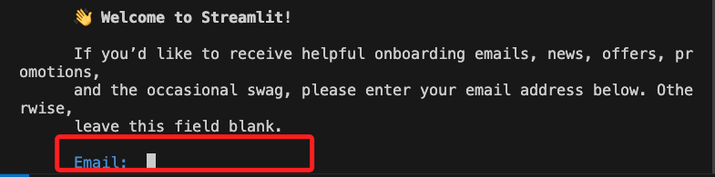

# 端口映射

<br>

## 前提說明

1. 編程領域中，英文的 `Port` 就稱為 _端口_ ，繁體中文稱為 _轉接埠_ ，基於輸入法便於自動選字，相關筆記中皆將使用 `端口` 一詞。

<br>

2. Docker 容器的運行環境是被隔離的，所以要從容器外部的其他 _容器或主機_ 訪問容器運行的服務時，必須透過 _端口映射_。

<br>

3. 端口的映射（Mapping）也稱為端口轉接、轉送或轉發（Forwarding）等，僅僅都是翻譯上的差異。

<br>

4. 容器的服務透過端口映射可以實現訪問權限的管理，限制了可被訪問的服務，也可實現在同一宿主機上同時運行多個容器來提供相同服務的需求情境。

<br>

## 簡單服務範例

_這裡展示一個 Streamlit 專案來說明端口映射_

<br>

1. 在項目資料夾 `.devcontainer` 內建立一個 Streamlit 腳本 `app.py`，內容如下。

   ```python
   import streamlit as st

   st.title('Hello Streamlit in Docker!')
   st.write("這是在容器中的 Streamlit 服務範例。")
   ```

<br>

2. 開啟容器的終端機，運行以下指令安裝套件。

   ```bash
   pip install streamlit
   ```

<br>

3. 在容器中運行腳本。

   ```bash
   streamlit run app.py
   ```

<br>

4. 會提示輸入電子郵件，也可以按下 `ENTER` 留白即可。

   

<br>

5. 右下角出現視窗，但是不用點擊，自動會啟動瀏覽器。

   

<br>

6. 點擊 `查看所有轉送的連接埠` ，目前容器的可透過 `localhost:8501` 或 `127.0.0.1:8501` 進行訪問，其中 `8501` 代表容器將監聽 `8501` 端口用於提供服務， `localhost:8501` 是 VSCode 或 Docker Desktop 自動為宿主機配置的轉發端口，也就是宿主機的 `localhost` 上的 `8501` 已經被設置轉發到容器的 `8501` ，如此訪問 `localhost:8501` 時便會訪問容器內的服務。

   

<br>

7. 終端機也會顯示兩個 URL 如下，其中 `Local URL` 綁定到宿主機的 `localhost`，也就是 `127.0.0.1` ，透過轉發可以訪問容器的指定端口；另外 ` Network URL`，這是容器內部虛擬網路的 IP 與端口，這位址不是綁定在宿主機的，而是允許同一個 Docker 內部網路中的其他容器透過這個位址進行訪問。

   

<br>

8. 補充說明一，倘若應用綁定的是 `0.0.0.0`，表示監聽所有可用的網路接口，包含了公有和私有的 IP，所以也能接收所有來自同一個區網其他設備的訪問，可透過以下指令運行腳本。

   ```bash
   streamlit run app.py --server.address=0.0.0.0
   ```

<br>


9. 補充說明二，在 Mac 系統中使用 Docker Desktop 時，雖然容器被視為獨立的主機，但彼此的 localhost 是共享的，所以透過 MacOS 的瀏覽器將可以訪問容器運行的 Streamlit 應用，另外 VSCode 也會提供相關服務。

<br>

10. 補充說明三，可透過在容器內運行反向代理工具 `ngrok` 實現從外部訪問容器且無需通過宿主機的網路配置，其原理是將容器內部網路暴露到公共網路上，也是一種轉發的概念，兩者不同的是轉發的目的是公網或宿主機，此部分會再做說明。

<br>

___

_以下分別使用指令 `docker run` 與透過文件 `docker-compose` 兩種方式說明 。_