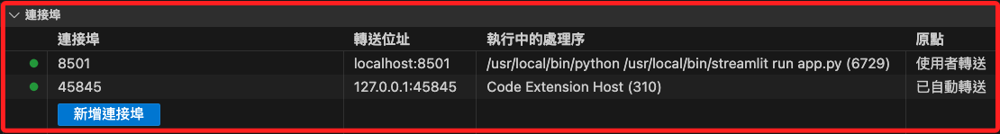
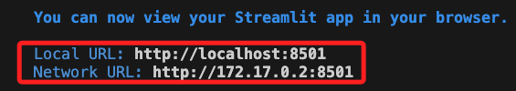

# 端口映射

_以下分別使用指令 `docker run` 與透過文件 `docker-compose` 兩種方式說明 。_

<br>

## 說明

1. 編程領域中，英文的 `Port` 就稱為 _端口_ ，繁體中文稱為 _轉接埠_ ，基於輸入法便於自動選字，相關筆記中皆將使用 `端口` 一詞。
2. Docker 容器的運行環境是被隔離的，所以要從容器外部的其他 _容器或主機_ 訪問容器運行的服務時，必須透過 _端口映射_。
3. 容器的服務透過端口映射可以實現訪問權限的管理，限制了可被訪問的服務，也可實現同一宿主機運型透過多個容器提供相同服務的需求。

<br>

## 使用 `docker run`

- 使用參數 `-p` 來映射，以下這個指令代表的是將宿主機的 `8080` 轉發到容器的 `80` 端口。

    ```bash
    docker run -p 8080:80 my_web_app
    ```

<br>

## 使用 docker-compose

_這裡展示一個 Streamlit 專案來說明端口映射_

<br>

1. 在項目資料夾 `.devcontainer` 內建立一個 Streamlit 腳本 `app.py`，內容如下。

   ```python
   import streamlit as st

   st.title('Hello Streamlit in Docker!')
   st.write("這是在容器中的 Streamlit 服務範例。")
   ```

<br>

2. 開啟容器的終端機，運行以下指令安裝套件。

   ```bash
   pip install streamlit
   ```

<br>

3. 運行腳本。

   ```bash
   streamlit run app.py
   ```

<br>

4. 會提示輸入電子郵件，也可以按下 `ENTER` 留白即可。

   

<br>

5. 右下角出現視窗，但是不用點擊，自動會啟動瀏覽器。

   

<br>

6. 點擊 `查看所有轉送的連接埠` ，目前容器的可透過 `localhost:8501` 或 `127.0.0.1:8501` 進行訪問，其中 `8501` 代表容器將監聽 `8501` 端口用於提供服務， `localhost:8501` 是 VSCode 或 Docker Desktop 自動為宿主機配置的轉發端口，也就是宿主機的 `localhost` 上的 `8501` 已經被設置轉發到容器的 `8501` ，如此訪問 `localhost:8501` 時便會訪問容器內的服務。

   

<br>

7. 終端機也會顯示兩個 URL 如下，其中 `Local URL` 綁定到宿主機的 `localhost`，也就是 `127.0.0.1` ，透過轉發可以訪問容器的指定端口；另外 ` Network URL`，這是容器內部虛擬網路的 IP 與端口，這位址不是綁定在宿主機的，而是允許同一個 Docker 內部網路中的其他容器透過這個位址進行訪問。

   

<br>

8. 補充說明一，倘若應用綁定的是 `0.0.0.0`，表示監聽所有可用的網路接口，包含了公有和私有的 IP，所以也能接收所有來自同一個區網其他設備的訪問，可透過以下指令運行腳本。

   ```bash
   streamlit run app.py --server.address=0.0.0.0
   ```

<br>


9. 補充說明二，在 Mac 系統中使用 Docker Desktop 時，雖然容器被視為獨立的主機，但彼此的 localhost 是共享的，所以透過 MacOS 的瀏覽器將可以訪問容器運行的 Streamlit 應用，另外 VSCode 也會提供相關服務。

<br>

10. 補充說明三，可透過在容器內運行反向代理工具 `ngrok` 實現從外部訪問容器且無需通過宿主機的網路配置，其原理是將容器內部網路暴露到公共網路上，也是一種轉發的概念，兩者不同的是轉發的目的是公網或宿主機，此部分會再做說明。

<br>

## 建立 docker-compose.yml

_定義和管理多個容器配置的文件，如 `services`、`networks`、`volumes` 等，其中包含了 `端口映射` 。_

<br>

1. 先前所使用的 `devcontainer.json` 文件主要用於配置 `VSCode` 如何與容器互動，包括 _設定開發環境_、_安裝 VSCode 擴充功能_ 等，雖然在這個文件中也可以 _指定連接埠轉送的規則_ ，但這通常用於開發時的連接埠轉送需求，而不是容器服務之間的連接埠對映，所以在端口管理上，`docker-compose.yml` 文件會是更好的選擇，而 `devcontainer.json` 文件則專注在配置與 VSCode 直接相關的設置。

<br>

_以下開始實作_

<br>

2. 在 `.devcontainer` 資料夾中建立文件 `docker-compose.yml`。

   

<br>

3. 假設該容器將用於 Streamlit 專案使用，並將使用 MariaDB 以及 MongoDM，其端口預設分別為 `8501`、`3306`、`27017`，列舉一個相對詳盡的設置範例如下，相關資訊可參考 [官網](https://docs.docker.com/compose/compose-file/) 。

   ```yaml
   services:
      streamlit:
         build: # 使用 Dockerfile

         context: .
         dockerfile: Dockerfile
         # 當前目錄掛載位置
         volumes:
               - .:/app
         working_dir: /app
         ports:
               - "8501:8501"
         # 先安裝依賴庫再啟動服務
         command: sh -c "pip install -r requirements.txt && streamlit run app.py"
         # 確保服務在兩者之後啟動
         depends_on:
               - mariadb
               - mongodb

      mariadb:
         # 使用官方鏡像
         image: mariadb
         # 需要手動設置這些數值
         environment:
               MYSQL_ROOT_PASSWORD: rootpassword
               MYSQL_DATABASE: exampledb
               MYSQL_USER: user
               MYSQL_PASSWORD: userpassword
         volumes:
               - mariadb_data:/var/lib/mysql
         ports:
               - "3306:3306"

      mongodb:
         image: mongo
         environment:
               MONGO_INITDB_ROOT_USERNAME: mongouser
               MONGO_INITDB_ROOT_PASSWORD: mongopassword
         volumes:
               - mongodb_data:/data/db
         ports:
               - "27017:27017"

   volumes:
      mariadb_data:
      mongodb_data:
   ```

<br>

4. 暫時僅測試 Streamlit，所以先簡化 `docker-compose.yml`。   

    ```yaml
    services:
    streamlit:
        build:
            # 使用 Dockerfile
            context: .
            dockerfile: Dockerfile
        # 當前目錄掛載位置
        volumes:
            - .:/app
        working_dir: /app
        ports:
            - "8501:8501"
        command: streamlit run app.py
    ```

<br>

5. 透過查詢版本來驗證本機系統中是否已經安裝了 `docker-compose`，若尚未安裝，請參考 `4_安裝docker-compose`。

   ```bash
   docker-compose --version
   ```

    

<br>

6. 在宿主機的腳本所在路徑內執行以下指令，這將根據 `docker-compose.yml` 文件的設置啟動並在後台運行服務，其中參數 `-d` 表示分離模式 `detached mode`，也就是在後台運行，特別注意，運行前請確認運行中的 streamlit 服務已經停止。

   ```bash
   docker-compose up -d
   ```

<br>

7. 透過這樣的設置，便可允許外部設備通過訪問主機來訪問容器中的服務。

   

<br>

## 從外部訪問容器

_以 Streamlit 為例_

<br>

1. 建立一個範例腳本 `app.py`。

   ```python
   import streamlit as st

   st.title('Hello Streamlit in Docker!')
   st.write("這是在容器中的 Streamlit 服務範例。")
   ```

<br>

2. 修改 Dockerfile。

   ```dockerfile
   # 使用指定映像
   FROM python:3.12-bullseye

   # 安裝必要庫，並清理快取以減少鏡像體積
   RUN apt-get update && \
       apt-get install -y git zsh && \
       rm -rf /var/lib/apt/lists/*

   # 建立一個新用戶 'appuser' 並切換到此用戶
   RUN useradd -m appuser
   USER appuser

   # 設定工作目錄
   WORKDIR /app

   # 複製目前目錄內容到容器中的 /app
   COPY . /app

   # 安裝 Streamlit
   RUN pip install --no-cache-dir streamlit

   # 使得 8501 連接埠在容器外部可存取
   EXPOSE 8501

   # 在容器啟動時執行 Streamlit
   CMD ["streamlit", "run", "app.py"]
   ```

<br>

3. 簡化 `docker-compose.yml`。

   ```yaml
   version: '3'

   services:
   # streamlit
   streamlit:
       build:
       # 使用 Dockerfile
       context: .
       dockerfile: Dockerfile
       # 當前目錄掛載位置
       volumes:
       - .:/app
       working_dir: /app
       ports:
       - "8501:8501"
   ```

<br>

4. 在項目資料夾內運行。

   ```bash
   docker-compose up --build --no-cache
   ```

<br>

5. 完成時會顯示。

   

<br>

6. 透過瀏覽器訪問。

   

<br>


---

_END_