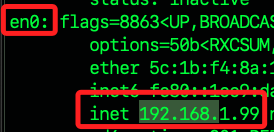

# docker-compose

_需建立 docker-compose.yml 作為設定文件，內容定義和管理多個容器配置參數如 `services`、`networks`、`volumes` 等，其中包含了 `端口映射` 。_

<br>

## 說明 

1. 先前所使用的 `devcontainer.json` 文件主要用於配置 `VSCode` 如何與容器互動，包括 _設定開發環境_、_安裝 VSCode 擴充功能_ 等，雖然在這個文件中也可以 _指定連接埠轉送的規則_ ，但這通常用於開發時的連接埠轉送需求，而不是容器服務之間的連接埠對映，所以在端口管理上，`docker-compose.yml` 文件會是更好的選擇，而 `devcontainer.json` 文件則專注在配置與 VSCode 直接相關的設置。

___

_以下開始實作_

<br>

1. 在 `.devcontainer` 資料夾中建立文件 `docker-compose.yml`。

   

<br>

3. 假設該容器將用於 Streamlit 專案使用，並將使用 MariaDB 以及 MongoDM，其端口預設分別為 `8501`、`3306`、`27017`，列舉一個相對詳盡的設置範例如下，相關資訊可參考 [官網](https://docs.docker.com/compose/compose-file/) 。

   ```yaml
   services:
      streamlit:
         build: # 使用 Dockerfile

         context: .
         dockerfile: Dockerfile
         # 當前目錄掛載位置
         volumes:
               - .:/app
         working_dir: /app
         ports:
               - "8501:8501"
         # 先安裝依賴庫再啟動服務
         command: sh -c "pip install -r requirements.txt && streamlit run app.py"
         # 確保服務在兩者之後啟動
         depends_on:
               - mariadb
               - mongodb

      mariadb:
         # 使用官方鏡像
         image: mariadb
         # 需要手動設置這些數值
         environment:
               MYSQL_ROOT_PASSWORD: rootpassword
               MYSQL_DATABASE: exampledb
               MYSQL_USER: user
               MYSQL_PASSWORD: userpassword
         volumes:
               - mariadb_data:/var/lib/mysql
         ports:
               - "3306:3306"

      mongodb:
         image: mongo
         environment:
               MONGO_INITDB_ROOT_USERNAME: mongouser
               MONGO_INITDB_ROOT_PASSWORD: mongopassword
         volumes:
               - mongodb_data:/data/db
         ports:
               - "27017:27017"

   volumes:
      mariadb_data:
      mongodb_data:
   ```

<br>

4. 暫時僅測試 Streamlit，所以先簡化 `docker-compose.yml`。   

    ```yaml
    services:
    streamlit:
        build:
            # 使用 Dockerfile
            context: .
            dockerfile: Dockerfile
        # 當前目錄掛載位置
        volumes:
            - .:/app
        working_dir: /app
        ports:
            - "8501:8501"
        command: streamlit run app.py
    ```

<br>

5. 透過查詢版本來驗證本機系統中是否已經安裝了 `docker-compose`。

   ```bash
   docker-compose --version
   ```

    

<br>

6. 在宿主機的腳本所在路徑內執行以下指令，這將根據 `docker-compose.yml` 文件的設置啟動並在後台運行服務，其中參數 `-d` 表示分離模式 `detached mode`，也就是在後台運行；特別注意，運行前請確認運行中的 streamlit 服務已經停止。

   ```bash
   docker-compose up -d
   ```

<br>

7. 完成時，會顯示如下訊息。

   

<br>

8. 此時可在宿主機上訪問 `localhost:8501`。

   

<br>

9. 特別注意，透過 `docker-compose` 啟動的服務與 VSCode 啟動時不同，這時從 `127.0.0.1:8501` 是無法訪問的，透過在終端機中運行 `netstat` 指令可觀察到宿主機的網路端口 `8501` 沒有任何服務進行監聽。

   ```bash
   netstat -tuln | grep 8501
   ```
   
   

<br>

10. 假如是使用 `docker-compose up` 啟動的容器，可透過指令 `docker-compose down` 停止所有相關的容器。


   ```bash
   docker-compose down
   ```

   

<br>

11. 假如只是想停止容器而不是移除，可使用以下指令，其中 `名稱` 或 `ID` 可透過指令 `docker ps` 查詢。

   ```bash
   docker-compose stop
   ```
   _或_
   ```bash
   docker-compose stop <容器名或容器ID>
   ```

<br>

12. 除了在 `docker-compose.yml` 文件中直接指定啟動命令外，也可在 `Dockerfile` 中進行指定，這樣的設置將在每次啟動容器時，都會執行 `streamlit run app.py` 指令，具體使用哪一種方式取決於容器所要提供的服務； _特別注意_ ，無論在 `Dockerfile` 中如何設置， `docker-compose.yml` 文件中的參數 `command` 將會覆蓋 `Dockerfile` 中的任何 `CMD` 指令。

    ```Dockerfile
    # 使用指定映像
    FROM python:3.12-bullseye

    # 安裝必要庫
    RUN apt-get update && apt-get install -y git zsh && rm -rf /var/lib/apt/lists/*

    # 添加指令
    CMD ["streamlit", "run", "app.py"]
    ```

<br>

13. 透過指令 `docker-compose config` 可以解析並查看配置結果。

   ```bash
   docker-compose config
   ```

   

<br>

14. 透過指令 `docker-compose ps` 可查詢透過文件啟動的容器的狀態。

   ```bash
   docker-compose ps
   ```

   

   _文字內容如下_

   ```txt
   NAME                       IMAGE                    COMMAND                  SERVICE     CREATED         STATUS         PORTS
   devcontainer-streamlit-1   devcontainer-streamlit   "streamlit run app.py"   streamlit   7 minutes ago   Up 7 minutes   0.0.0.0:8501->8501/tcp
   ```

<br>

15. 若要查看當前所有的容器。

   ```bash
   docker ps
   ```

   _顯示以下結果_

   

   _文字內容_

   ```txt
   CONTAINER ID   IMAGE                                                                              COMMAND                   CREATED          STATUS          PORTS                    NAMES
   41fd21cd3d7a   devcontainer-streamlit                                                             "streamlit run app.py"    19 minutes ago   Up 19 minutes   0.0.0.0:8501->8501/tcp   devcontainer-streamlit-1
   052ccf9ee248   vsc-excontainer-5367f7aea4a328ea5aa8b4d166c23c797996c07d4917937db93cb1dd01c58356   "/bin/sh -c 'echo Co…"   13 hours ago     Up 13 hours                              kind_chebyshev
   ```

<br>

17. 檢查容器日誌。

   ```bash
   docker-compose logs
   ```

   

<br>

### 在容器內部停止服務。

_以  Streamlit 為例_

1. 進入容器。

   ```bash
   docker exec -it <容器名或容器ID> /bin/bash
   ```

<br>

2. 找查 Streramlit 進程。

   ```bash
   ps aux | grep streamlit
   ```

<br>

3. 停止 Streamlit 進程。

   ```bash
   kill <Streamlit进程ID>
   ```

<br>

## 從外部訪問容器

_以 Streamlit 為例，使用之前的相同範例腳本 `app.py` 。_

<br>

1. 修改 `Dockerfile`，在容器建立時就啟動服務。

   ```Dockerfile
   # 使用指定映像
   FROM python:3.12-bullseye

   # 安裝必要庫，並清理快取以減少鏡像體積
   RUN apt-get update && \
       apt-get install -y git zsh && \
       rm -rf /var/lib/apt/lists/*

   # 設定工作目錄
   WORKDIR /app

   # 複製目前目錄內容到容器中的 /app
   COPY . /app

   # 安裝 Streamlit
   RUN pip install --no-cache-dir streamlit

   # 使得 8501 連接埠在容器外部可存取
   EXPOSE 8501

   # 在容器啟動時執行 Streamlit
   CMD ["streamlit", "run", "app.py"]
   ```

<br>

2. 修改 `docker-compose.yml`，因為文件中的 `command` 會覆蓋 `Dockerfile` 的 `cmd`，所以對其進行註解。

   ```yaml
   services:
   streamlit:
      build:
         # 使用 Dockerfile
         context: .
         dockerfile: Dockerfile
      # 當前目錄掛載位置
      volumes:
         - .:/app
      working_dir: /app
      ports:
         - "8501:8501"
      # command: streamlit run app.py
   ```

<br>

3. 可在 VSCode 中重建容器。

   

<br>

4. 如果想要禁用緩存，可先透過以下指令指定在建構鏡像的時候不使用緩存；特別注意，如果確實需要禁用緩存，就必須分開兩步驟運行，就是先 `build` 然後 `up`。

   ```bash
   docker-compose build --no-cache
   ```

<br>

5. 透過 `up` 啟動服務。

   ```bash
   docker-compose up -d
   ```

<br>

6. 完成時會顯示。

   

<br>

7. 透過宿主機的瀏覽器訪問。

   

<br>

8. 查詢宿主機的 IP。
   
   _MacOS_
   
   ```bash
   ifconfig
   ```

   _Windows_
   ```bash
   ipconfig
   ```

   

<br>

9. 從區網中的手機中訪問。

   

<br>

---

_END_