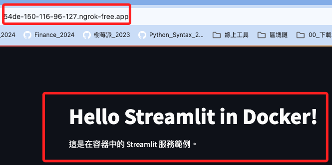
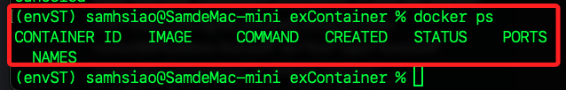

# Docker 使用 ngrok

_參考 [官方說明](https://ngrok.com/docs/using-ngrok-with/docker/)_

<br>

## 步驟

_說明如何使用 Docker 及 Docker Compose 來運行 ngrok 連接到 Docker 容器中運行的 Streamlit 服務，並使該服務可以從外部訪問。_


<br>

1. 準備好 Streamlit 應用 `app.py`。

    ```python
    import streamlit as st

    st.title('Hello Streamlit in Docker!')
    st.write("這是在容器中的 Streamlit 服務範例。")
    ```

<br>

2. 建立一個 Dockerfile 來定義如何建置 Streamlit 應用程式的 Docker 映像。

    ```dockerfile
    # 使用官方 Python 鏡像作為基礎鏡像
    FROM python:3.8-slim

    # 設定工作目錄
    WORKDIR /app

    # 安裝 Streamlit
    RUN pip install streamlit

    # 複製您的 Streamlit 腳本到容器中
    COPY app.py /app

    # 暴露 Streamlit 預設端口
    EXPOSE 8501

    # 啟動 Streamlit 應用
    CMD ["streamlit", "run", "app.py", "--server.address=0.0.0.0"]
    ```

<br>

5. 在包含 Dockerfile 和 `app.py` 的目錄中執行以下命令來建立 Docker 映像：

    ```bash
    docker build -t my-streamlit-app .
    ```

<br>

6. 使用 Docker Compose 整合 ngrok，所以先建立一個 `docker-compose.yml` 檔案來定義 Streamlit 和 ngrok 服務；特別注意，配置中 `ngrok` 服務將連接到 `streamlit` 服務的 8501 連接埠， 然後將 `your_ngrok_auth_token` 替換為自己的 `ngrok auth token`。

    ```yaml
    services:
        streamlit:
            image: my-streamlit-app
            ports:
            - "8501:8501"

        ngrok:
            image: ngrok/ngrok:latest
            environment:
            - NGROK_AUTHTOKEN=your_ngrok_auth_token
            command: [ "http", "--log=stdout", "streamlit:8501" ]
            depends_on:
            - streamlit
    ```

<br>

## 啟動服務

1. 在包含 `docker-compose.yml` 檔案的目錄中執行以下命令來啟動服務。

    ```bash
    docker-compose up
    ```

<br>

2. 終端機輸出訊息的最後一行會看到 ngrok 配發的公網網址。

    

<br>

3. 複製網址並透過瀏覽器訪問，點擊 `Visit Site`。

    

<br>

4. 正確顯示網頁內容。

    

<br>

## 關閉服務

1. 在終端機中按下組合鍵 `control`+`c` 可結束服務。

    

<br>

2. 透過 `docker ps` 指令查詢當前服務狀態。

    

<br>

3. 同樣也可觀察容器 ID。

    

<br>

4. 可透過 ID 查詢日誌。

    ```bash
    docker logs <容器ID>
    ```

<br>

5. 這裡也有網址等資訊。

    

<br>

6. 也可以另外開啟一個終端執行以下指令停止服務。

    ```bash
    docker-compose down
    ```

<br>

5. 同樣會顯示結束並移除服務的訊息。

    

<br>

___

_END_
