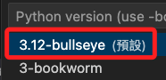
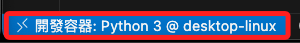
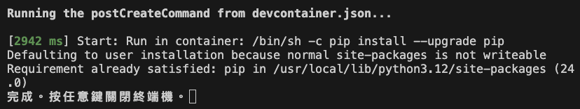

# 介紹與說明

_分別在 Codespace 中安裝與本地安裝_

<br>

## Codespace

_關於在 Codespace 中建立容器，參考其他的章節中的 [詳細說明](https://github.com/samhsiao6238/RaspberryPi_20231015/blob/main/D02_Git_&_GitHub/3_整合_GitHub/1_Codespaces/3_使用_Docker_容器.md) 。_

<br>

## VScode

_以下紀錄簡化的步驟，詳細步驟可參考前面說明，大致上是一樣的。_

<br>

1. 建立一個專案資料夾並啟動 VSCode。
2. 新增容器設定檔。


3. 選擇新增至工作區或使用者資料夾皆可，這裡示範添加到工作區。


4. 選取 `Python`。


5. 容器底層的操作系統是 Debian，所以提供選取其版本號，這裡使用新版的 `bullseye`。



6. 其他功能先不選取，這裡點擊 `確定` 跳過即可。


7. 接著點擊右下方的 `在容器中重新開啟` 按鈕。


8. 點擊重建 `Rebuild` 。


9. 在工作區中會添加兩個資料夾並各有一個文件，分別是 `.devcontainer ` 中有文件 `devcontainer.json`，`.github` 中有文件 `dependabot.yml`。


10. 點擊左下角的連線。


    
11. 啟動。

    

12. 右下角會出現當前狀態訊息。
    
    

13. 允許。


 
14. 完成後左下角會出現容器資訊。




15. 在終端機中查詢，會顯示容器的相關版本訊息。

z

<br>

16. 預設的容器設定文件 `devcontainer.json` 內容如下。
```json
// For format details, see https://aka.ms/devcontainer.json. For config options, see the
// README at: https://github.com/devcontainers/templates/tree/main/src/python
{
	"name": "Python 3",
	// Or use a Dockerfile or Docker Compose file. More info: https://containers.dev/guide/dockerfile
	"image": "mcr.microsoft.com/devcontainers/python:1-3.12-bullseye"

	// Features to add to the dev container. More info: https://containers.dev/features.
	// "features": {},

	// Use 'forwardPorts' to make a list of ports inside the container available locally.
	// "forwardPorts": [],

	// Use 'postCreateCommand' to run commands after the container is created.
	// "postCreateCommand": "pip3 install --user -r requirements.txt",

	// Configure tool-specific properties.
	// "customizations": {},

	// Uncomment to connect as root instead. More info: https://aka.ms/dev-containers-non-root.
	// "remoteUser": "root"
}
```

17. 修改如下。
```json
//
{
	"name": "Python 3.12.3",
	"image": "mcr.microsoft.com/devcontainers/python:1-3.12-bullseye",
	"postCreateCommand": "pip install --upgrade pip"
}

```

18. 將我自己原本的 settings.json 融入到容器的設置文件中。
```json
{
    "name": "Python 3.12.3",
    "image": "mcr.microsoft.com/devcontainers/python:1-3.12-bullseye",
    "postCreateCommand": "pip install --upgrade pip",
    "customizations": {
        "vscode": {
            "settings": {
                "pasteImage.path": "${currentFileDir}/images/",
                "pasteImage.namePrefix": "img_",
                "pasteImage.defaultName": "0",
                "pasteImage.showFilePathConfirmInputBox": true,
                "flake8.args": [
                    "--max-line-length=200",
                    "--ignore=E402"
                ]
            }
        }
    }
}
```
19. 修改過設定文件後要重新 rebuild。


20. 完成後會出現以下訊息。


<br>

## 測試

1. 在資料夾中建立文件 `Dockerfile`。


2. 依照指示安裝 Docker。


3. 編輯文件。
```dockerfile
FROM mcr.microsoft.com/devcontainers/python:1-3.12-bullseye

# 安裝 Docker CLI
RUN apt-get update \
    && apt-get install -y apt-transport-https ca-certificates curl gnupg lsb-release \
    && curl -fsSL https://download.docker.com/linux/debian/gpg | gpg --dearmor -o /usr/share/keyrings/docker-archive-keyring.gpg \
    && echo "deb [arch=$(dpkg --print-architecture) signed-by=/usr/share/keyrings/docker-archive-keyring.gpg] https://download.docker.com/linux/debian $(lsb_release -cs) stable" > /etc/apt/sources.list.d/docker.list \
    && apt-get update \
    && apt-get install -y docker-ce-cli
```

4. 修改配置文件 `devcontainer.json`。
```json
{
    "name": "Python 3.12.3",
    // "image": "mcr.microsoft.com/devcontainers/python:1-3.12-bullseye",
    "build": {
        "dockerfile": "Dockerfile"
     },
    "postCreateCommand": "pip install --upgrade pip",
    "customizations": {
        "vscode": {
            "settings": {
                "pasteImage.path": "${currentFileDir}/images/",
                "pasteImage.namePrefix": "img_",
                "pasteImage.defaultName": "0",
                "pasteImage.showFilePathConfirmInputBox": true,
                "flake8.args": [
                    "--max-line-length=200",
                    "--ignore=E402"
                ]
            }
        }
    }
}

```

5. 再次重建，完成後依照指示按下 `ENTER`。




---

_END_
