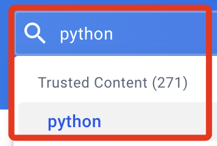

# 建立容器 

_在 VScode 中建立，以下紀錄簡化的步驟_

<br>

## 基礎建置

1. 建立本機一個專案資料夾並啟動 VSCode。

2. 新增容器設定檔。


3. 選擇新增至工作區或使用者資料夾皆可，這裡示範添加到工作區。


4. 選取 `Python`。


5. 容器底層的操作系統是 Debian，所以提供選取其版本號，這裡使用新版的 `bullseye`。


6. 其他功能先不選取，這裡點擊 `確定` 跳過即可。


7. 接著點擊右下方的 `在容器中重新開啟` 按鈕。


8. 點擊重建 `Rebuild` 。


9. 在工作區中會添加兩個資料夾並各有一個文件，分別是 `.devcontainer ` 中有文件 `devcontainer.json`，`.github` 中有文件 `dependabot.yml`。


10. 假如容器尚未連線，可點擊左下角的連線。


    
11. 啟動。

    

12. 右下角會出現當前狀態訊息。
    
    

13. 允許。


 
14. 完成後左下角會出現容器資訊。


15. 在終端機中查詢，會顯示容器的相關版本訊息。

z

<br>

16. 預設的容器設定文件 `devcontainer.json` 內容如下。
```json
// For format details, see https://aka.ms/devcontainer.json. For config options, see the
// README at: https://github.com/devcontainers/templates/tree/main/src/python
{
	"name": "Python 3",
	// Or use a Dockerfile or Docker Compose file. More info: https://containers.dev/guide/dockerfile
	"image": "mcr.microsoft.com/devcontainers/python:1-3.12-bullseye"

	// Features to add to the dev container. More info: https://containers.dev/features.
	// "features": {},

	// Use 'forwardPorts' to make a list of ports inside the container available locally.
	// "forwardPorts": [],

	// Use 'postCreateCommand' to run commands after the container is created.
	// "postCreateCommand": "pip3 install --user -r requirements.txt",

	// Configure tool-specific properties.
	// "customizations": {},

	// Uncomment to connect as root instead. More info: https://aka.ms/dev-containers-non-root.
	// "remoteUser": "root"
}
```

17. 修改如下。
```json
{
	"name": "Python 3.12.3",
	"image": "mcr.microsoft.com/devcontainers/python:1-3.12-bullseye",
	"postCreateCommand": "pip install --upgrade pip"
}

```

18. 將我自己原本的 settings.json 融入到容器的設置文件 `devcontainer.json` 中。
```json
{
    "name": "Python 3.12.3",
    "image": "mcr.microsoft.com/devcontainers/python:1-3.12-bullseye",
    "postCreateCommand": "pip install --upgrade pip",
    "customizations": {
        "vscode": {
            "settings": {
                "pasteImage.path": "${currentFileDir}/images/",
                "pasteImage.namePrefix": "img_",
                "pasteImage.defaultName": "0",
                "pasteImage.showFilePathConfirmInputBox": true,
                "flake8.args": [
                    "--max-line-length=200",
                    "--ignore=E402"
                ]
            }
        }
    }
}
```
19. 修改過設定文件後要重新 rebuild。


20. 完成後會出現以下訊息。


<br>

## 建立 Dockerfile

1. 在資料夾 `.devcontainer` 中建立文件 `Dockerfile`。


2. 依照指示安裝 Docker。


3. 編輯文件。
```dockerfile
# 使用指定映像
FROM python:1-3.12-bullseye

# 安裝必要庫
RUN apt-get update && apt-get install -y \
    git \
    zsh \
    # ㄏㄟ
    && rm -rf /var/lib/apt/lists/*
```

4. 關於 Docker 文件，可以參考 [Docker Hub](https://hub.docker.com/) 的官方版本，進入後搜尋 `python`。


5. 找到對應的版本，點擊進入後檔案內容很多，也可以使用這個版本來建立，但非常耗時，尤其在建立 Codespace 的時候，所以這裡省略。


6. 修改配置文件 `devcontainer.json` ，將 `image` 註解起來，並指向 `Dockerfile`。
```json
{
    "name": "Python 3.12.3",
    // "image": "mcr.microsoft.com/devcontainers/python:1-3.12-bullseye",
    "build": {
        "dockerfile": "Dockerfile"
    },
    "postCreateCommand": "pip install --upgrade pip",
    "customizations": {
        "vscode": {
            "settings": {
                "pasteImage.path": "${currentFileDir}/images/",
                "pasteImage.namePrefix": "img_",
                "pasteImage.defaultName": "0",
                "pasteImage.showFilePathConfirmInputBox": true,
                "flake8.args": [
                    "--max-line-length=200",
                    "--ignore=E402"
                ]
            },
            "extensions": ["ms-python.python"]
        }
    }
}

```

5. 再次重建 `Rebuild` ，完成後依照指示按下 `ENTER`。


## Docker Desktop

1. 安裝桌面版 Docker 後可看到所建立的容器。


2. 觀察容器詳情。


## 進行版本控制

_以下示範使用 CLI_

1. 建立 Git 倉庫基礎步驟。
```bash
# 初始化
git init
# 添加當前倉庫文件
git add .
# 提交
git commit -m "init"
# 指定分支
git branch -M main
```

2. 在 Github 上建立一個新的倉庫，並記錄所提供的網址 `https://github.com/samhsiao6238/_container_.git`。


3. 特別注意，不要初始化帶有 README 的遠端倉庫，這可能導致後續推送時產生衝突。

4. 另外，之後有更新時都要再次進行添加與提交。
```bash
# 添加當前倉庫文件
git add .
# 提交
git commit -m "update"
```

5. 添加遠程倉庫，使用前面步驟取得的網址。
```bash
git remote add origin https://github.com/samhsiao6238/_container_.git
```

6. 推送到倉庫。
```bash
git push -u origin main
```

7. 完成。


8. 可為容器配置的重要版本的 Git 標籤，或使用分支來管理不同的配置版本，這有助於重建特定版本的容器。
```bash
# 建立標籤與註解
git tag -a "v1.0-container-setup" -m "Version 1.0 of container setup"
git push --tags
```

## 啟動 Codespace

1. 初次建立。


2. Codespace 會自動識別倉庫中的 `.devcontainer` 配置來建立開發環境，這包含 `devcontainer.json` 和 `Dockerfile` 。

3. 運行後跳出關於插件安裝的視窗，特別注意，由於 Codespace 可能會有些限制導致插件未能正確安裝或使用。

## 在遠端重建

1. 進入 [Docker Hub](https://hub.docker.com/) 查詢版本號。


2. 搜尋 Python 版本號，這裡示範使用 `3.10`。


3. 在雲端開啟 Dockerfile 並修改 Python 版本號，標準安裝太耗時，這裡試試使用簡易的文件。
```dockerfile
# 使用指定映像
FROM python:3.10-bullseye

# 安裝必要庫
RUN apt-get update && apt-get install -y git zsh && rm -rf /var/lib/apt/lists/*
```

4. 重新建立。

---

_END_