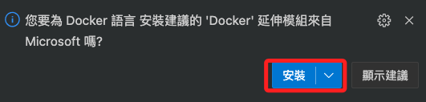
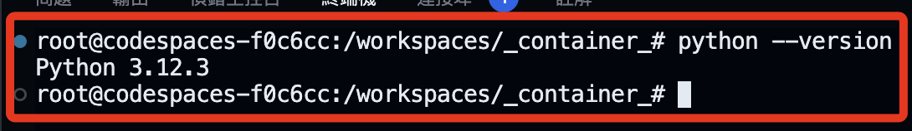
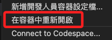
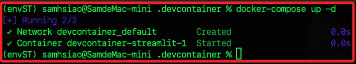

# 建立容器

_在 VScode 中建立，以下分解各階段步驟並說明_

<br>

## 基礎建置

1. 在電腦（本機）上建立一個專案資料夾，這裡範例命名為 `exContaiber`，並在此啟動 VSCode。

    

<br>

2. 在左下角 `命令選擇區` 中 `新增開發人員容器設定檔`。

   

<br>

3. 選擇 `將設定新增至工作區` 或使用者資料夾皆可，這裡示範添加到工作區。

   

<br>

4. 選取 `Python`。

   

<br>

5. 容器底層的操作系統是 Debian，所以提供選取其版本號，這裡使用新版的 `bullseye`。

   

<br>

6. 其他功能先不選取，這裡點擊 `確定` 跳過即可。

   

<br>

7. 接著點擊右下方的 `在容器中重新開啟` 按鈕。

   

<br>

8. 在工作區中會添加兩個資料夾並各有一個文件，分別是 `.devcontainer ` 中有文件 `devcontainer.json`，`.github` 中有文件 `dependabot.yml`。

   

<br>

9. 倘若有修改設定文件，都要提示進行重建 `Rebuild`，或手動透過選單重建也可以 。

   

<br>

10. 查看左下角連線設置會顯示連線容器，假如尚未連線，可點擊進行設置，已連線則跳至第 `14` 點說明。

    

<br>

11. 啟動。

    

<br>

12. 右下角會出現當前狀態訊息。

    

<br>

13. 允許。

    

<br>

14. 完成後左下角會出現容器資訊。

    

<br>

15. 在終端機中查詢，會顯示容器的相關版本訊息。

    

<br>

16. 建立容器時會自動生成容器設定文件 `devcontainer.json`，其中版本號 `1-3.12-bullseye` 是 VSCode 依據選取的版本自動生成的。

    ```json
    // For format details, see https://aka.ms/devcontainer.json. For config options, see the
    // README at: https://github.com/devcontainers/templates/tree/main/src/python
    {
        "name": "Python 3",
        // Or use a Dockerfile or Docker Compose file. More info: https://containers.dev/guide/dockerfile
        "image": "mcr.microsoft.com/devcontainers/python:1-3.12-bullseye"

        // Features to add to the dev container. More info: https://containers.dev/features.
        // "features": {},

        // Use 'forwardPorts' to make a list of ports inside the container available locally.
        // "forwardPorts": [],

        // Use 'postCreateCommand' to run commands after the container is created.
        // "postCreateCommand": "pip3 install --user -r requirements.txt",

        // Configure tool-specific properties.
        // "customizations": {},

        // Uncomment to connect as root instead. More info: https://aka.ms/dev-containers-non-root.
        // "remoteUser": "root"
    }
    ```

<br>

17. 將註解無用的內容刪除，另外添加了參數 `postCreateCommand` 以指定要執行的安裝指令，文件簡化如下。

    ```json
    {
        "name": "Python 3.12.3",
        "image": "mcr.microsoft.com/devcontainers/python:1-3.12-bullseye",
        "postCreateCommand": "pip install --upgrade pip"
    }
    ```

<br>

18. 補充說明，可依據自己 `settings.json` 中常用的設置融入到容器的設置文件，以下是我自己常用的設置，主要是針對插件 `pasteImage`、`flake8` 等進行設置，同學參考即可、不用修改。

    ```json
    {
        "name": "Python 3.12.3",
        "image": "mcr.microsoft.com/devcontainers/python:1-3.12-bullseye",
        "postCreateCommand": "pip install --upgrade pip",
        "customizations": {
            "vscode": {
                "settings": {
                    "pasteImage.path": "${currentFileDir}/images/",
                    "pasteImage.namePrefix": "img_",
                    "pasteImage.defaultName": "0",
                    "pasteImage.showFilePathConfirmInputBox": true,
                    "flake8.args": [
                        "--max-line-length=200",
                        "--ignore=E402"
                    ]
                },
                "extensions": ["ms-python.python"]
            }
        }
    }
    ```

<br>

19. 設定文件修改後，右下角會提示進行重建 `rebuild`，也可手動點擊左下角的連線進行重建。

    

<br>

20. 完成後會出現以下訊息。

    

<br>

21. 按下任意鍵回到終端機。

    

<br>

_以上完成容器的建立_

<br>

## 使用 Dockerfile

_以下展示透過自動化腳本建立容器的步驟，可接續已完成的容器進行修改使用 。_

<br>

1. 在資料夾 `.devcontainer` 中手動新增文件 `Dockerfile`， _無副檔名_ 。

   

<br>

2. 依照指示安裝 Docker 到容器中。

   

<br>

3. 編輯文件 `Dockerfile`，這裡要觀察變化，所以將版本號改為 `3.10-bullseye`。

   ```dockerfile
   # 使用指定映像
   FROM python:3.10-bullseye

   # 安裝必要庫
   RUN apt-get update && apt-get install -y git zsh && rm -rf /var/lib/apt/lists/*
   ```

<br>

4. 關於 Docker 說明文件及相關映像的版本號，可以參考 [Docker Hub](https://hub.docker.com/) 的官方版本，進入後搜尋 `python`。

   

<br>

5. 找到對應的版本，點擊進入後檔案內容很多，也可以使用這個版本來建立，但非常耗時，尤其在建立 Codespace 的時候，所以這裡省略。

   

<br>

6. 修改配置文件 `devcontainer.json` ，依據新的版本號修改 `name`，將 `image` 註解起來，並添加 `build` 設置來指向 `Dockerfile`。

   ```json
    {
        "name": "Python 3.10.14",
        //"image": "mcr.microsoft.com/devcontainers/python:1-3.12-bullseye",
        "build": {
            "dockerfile": "Dockerfile"
        },
        "postCreateCommand": "pip install --upgrade pip"
    }
   ```

<br>

7. 再次重建 `Rebuild`，順利完成表示以上設置都正確，依照指示按下 `ENTER`。

   

<br>

8. 透過查詢版本確認變更。

    

<br>

_以上完成透過 Dockerfile 安裝容器 。_

<br>

## Docker Desktop

_觀察容器_

<br>

1. 安裝 [Docker Desktop](https://www.docker.com/products/docker-desktop/) 後可查看並管理容器。

   

<br>

2. 在 DashBoard 可查看前面步驟所建立的容器，其中 Name 就是容器名稱。

   

<br>

3. 觀察容器詳情。

   

<br>

4. 特別注意，容器的 `Name` 是自動分配且隨機生成的，由一對 `形容詞＋名詞` 組成，可透過以下指令進行自訂。

   ```bash
   docker rename <原本名字> my-cotainer
   ```

<br>

5. 刷新就可看到。

   

<br>

_以上是 Docker Desktop 的基本操作_

<br>

## 進行版本控制

_以下示範使用 CLI_

<br>

1. 建立 Git 倉庫基礎步驟。

   ```bash
   # 初始化
   git init
   # 添加當前倉庫文件
   git add .
   # 提交
   git commit -m "init"
   # 指定分支
   git branch -M main
   ```

<br>

2. 在 Github 上建立一個新的倉庫，並記錄所提供的網址 `https://github.com/samhsiao6238/_container_.git`。

   

<br>

3. 特別注意，這個階段在遠端倉庫中先不要建立 README，避免可能導致後續推送時產生衝突，該文件也不是這階段的重點，所以建議省略。

<br>

4. 另外，之後有更新時都要再次進行 `添加` 與 `提交`。

   ```bash
   # 添加當前倉庫文件
   git add .
   # 提交
   git commit -m "update"
   ```

<br>

5. 連線遠程倉庫，使用前面步驟取得的網址，同學務必換為自己的網址。

```bash
git remote add origin <遠端倉庫網址>
```

<br>

6. 推送到倉庫。

   ```bash
   git push -u origin main
   ```

<br>

7. 完成。

   

<br>

8. 可為容器配置的重要版本的 Git 標籤，或使用分支來管理不同的配置版本，這有助於重建特定版本的容器。

   ```bash
   # 建立標籤與註解
   git tag -a "v1.0-container-setup" -m "Version 1.0 of container setup"
   # 推送
   git push --tags
   ```

<br>

## 啟動 Codespace

_以下展示在遠端重建倉庫_

1. 初次建立。

   

<br>

2. Codespace 會自動識別倉庫中的 `.devcontainer` 配置來建立開發環境，這包含 `devcontainer.json` 和 `Dockerfile` 。

   

<br>

3. 運行後等待完成連線會顯示如下視窗，接著可能會跳出關於插件安裝的視窗，特別注意，由於 Codespace 可能會有些限制導致插件未能正確安裝或使用。

   

<br>

## 在遠端修改倉庫

_以更換 Python 版本號為例_

<br>

1. 進入 [Docker Hub](https://hub.docker.com/) 查詢 Python 映像的版本號。

   

<br>

2. 在倉庫中開啟 `Dockerfile`，當前版本號是 `3.10-bullseye`，修改為 `3-12-bullseye`；特別注意，若參考官網的  `Dockerfile`  進行標準安裝會太耗時，以下採用簡易的自動化文件進行安裝即可。

   ```dockerfile
   # 使用指定映像
   FROM python:3.12-bullseye

   # 安裝必要庫
   RUN apt-get update && apt-get install -y git zsh && rm -rf /var/lib/apt/lists/*
   ```

<br>

3. 嘗試重新建立。

   

<br>

4. 查詢後會顯示新的版本號 `3.12.3`。

   

<br>

5. 提交更新後的文件並完成同步。

   

<br>

_回到 VSCode 中_

<br>

6. 在本機的 VSCode 中點擊 `Fetch`，假如點不到顯示更多 `...`，將導覽列橫向拉寬即可。

   

<br>

7. 完成同步。

   

<br>

8. 這時 Dockerfile 的版本已經更新。

   

<br>

9. 假如沒有連線容器，下選取 `在容器中重新開啟`。

   

<br>

10. 然後再次 `重建容器`。

   

<br>

11. 如此便完成容器的同步，版本號重新回到 `3.12.3`。

   

<br>

## 端口映射

_這裡展示一個 Streamlit 專案來說明端口映射_

<br>

1. 在項目的 `.devcontainer` 資料夾內建立一個 Streamlit 腳本 `app.py`，內容如下。

   ```python
   import streamlit as st

   st.title('Hello Streamlit in Docker!')
   st.write("這是在容器中的 Streamlit 服務範例。")
   ```

<br>

2. 開啟容器的終端機，運行以下指令安裝套件。

   ```bash
   pip install streamlit
   ```

<br>

3. 運行腳本。

   ```bash
   streamlit run app.py
   ```

<br>

4. 會提示輸入電子郵件，也可以按下 `ENTER` 留白即可。

   

<br>

5. 右下角出現視窗，但是不用點擊，自動會啟動瀏覽器。

   

<br>

6. 點擊 `查看所有轉送的連接埠` ，目前可透過 `localhost:8501` 或 `127.0.0.1:8501` 進行訪問。

   

<br>

7. 另外，終端機會出現兩個 URL 如下，其中 `Local URL` 是指容器內部的 `localhost`，也就是 `127.0.0.1` ，它只能從容器內部訪問，即只有容器內的進程可以使用這個位址存取 Streamlit 應用；另外 ` Network URL`，這是容器在 Docker 內部網路中的 IP 位址，這位址在容器之間是可存取的，兩者若無映射，都無透過從外部或主機上訪問。

   

<br>

8. 補充說明，倘若應用綁定的是 `0.0.0.0`，表示監聽所有可用的網路接口，包含了公有和私有的 IP，所以也能接收所有來自同一個區網其他設備的訪問，可透過以下指令運行腳本。

   ```bash
   streamlit run app.py --server.address=0.0.0.0
   ```

<br>


9. 特別說明，在 Mac 系統中使用 Docker Desktop 時，雖然容器被視為獨立的主機，但彼此的 localhost 是共享的，所以透過 MacOS 的溜覽器將可以訪問容器運行的 Streamlit 應用。

<br>

## 建立 docker-compose.yml

_定義和管理多個容器配置的文件，如 `services`、`networks`、`volumes` 等，其中包含了 `端口映射` 。_

<br>

1. 先前所使用的 `devcontainer.json` 文件主要用於配置 `VSCode` 如何與容器互動，包括 _設定開發環境_、_安裝 VSCode 擴充功能_ 等，雖然在這個文件中也可以 _指定連接埠轉送的規則_ ，但這通常用於開發時的連接埠轉送需求，而不是容器服務之間的連接埠對映，所以在端口管理上，`docker-compose.yml` 文件會是更好的選擇，而 `devcontainer.json` 文件則專注在配置與 VSCode 直接相關的設置。

<br>

2. 在 `.devcontainer` 資料夾中建立文件 `docker-compose.yml`。

   

<br>

3. 假設該容器將用於 Streamlit 專案使用，並將使用 MariaDB 以及 MongoDM，其端口預設分別為 `8501`、`3306`、`27017`，列舉一個相對詳盡的設置範例如下。

   ```yaml
   version: '1'

   services:
      streamlit:
         build:
         # 使用 Dockerfile
         context: .
         dockerfile: Dockerfile
         # 當前目錄掛載位置
         volumes:
            - .:/app
         working_dir: /app
         ports:
            - "8501:8501"
         # 先安裝依賴庫再啟動服務
         command: sh -c "pip install -r requirements.txt && streamlit run app.py"
         # 確保服務在兩者之後啟動
         depends_on:
            - mariadb
            - mongodb

      mariadb:
         # 使用官方鏡像
         image: mariadb
         # 需要手動設置這些數值
         environment:
            MYSQL_ROOT_PASSWORD: rootpassword
            MYSQL_DATABASE: exampledb
            MYSQL_USER: user
            MYSQL_PASSWORD: userpassword
         volumes:
            - mariadb_data:/var/lib/mysql
         ports:
            - "3306:3306"

      mongodb:
         image: mongo
         environment:
            MONGO_INITDB_ROOT_USERNAME: mongouser
            MONGO_INITDB_ROOT_PASSWORD: mongopassword
         volumes:
            - mongodb_data:/data/db
         ports:
            - "27017:27017"

   volumes:
      mariadb_data:
      mongodb_data:
   ```

<br>

4. 暫時僅測試 Streamlit，所以先簡化 `docker-compose.yml`。
   
   ```yaml
   version: '1'

   services:
      streamlit:
         build:
            # 使用 Dockerfile
            context: .
            dockerfile: Dockerfile
         # 當前目錄掛載位置
         volumes:
            - .:/app
         working_dir: /app
         ports:
            - "8501:8501"
            - "37621:37621"
            - "38377:38377"
   ```

<br>

5. _在容器中_ 安裝 `docker-compose`，以下是三行指令，可以一次貼上運行。

   ```bash
   apt update && apt install -y curl
   curl -L "https://github.com/docker/compose/releases/download/v2.5.0/docker-compose-$(uname -s)-$(uname -m)" -o /usr/local/bin/docker-compose
   chmod +x /usr/local/bin/docker-compose
   ```

<br>

6. 透過查詢版本來驗證安裝。

   ```bash
   docker-compose --version
   ```

<br>

7. _回到本機中_ 開啟終端機，並執行這個腳本來依照設置運行容器。

   ```bash
   docker-compose up -d
   ```

<br>

8. 透過這樣的設置，便可允許外部設備通過訪問主機來訪問容器中的服務。



<br>

## 從外部訪問容器

_以 STreamlit 為例_

<br>

1. 建立一個範例腳本 `app.py`。

   ```python
   import streamlit as st

   st.title('Hello Streamlit in Docker!')
   st.write("這是在容器中的 Streamlit 服務範例。")
   ```

<br>

2. 修改 Dockerfile。

   ```dockerfile
   # 使用指定映像
   FROM python:3.10-bullseye

   # 安裝必要庫，並清理快取以減少鏡像體積
   RUN apt-get update && \
       apt-get install -y git zsh && \
       rm -rf /var/lib/apt/lists/*

   # 建立一個新用戶 'appuser' 並切換到此用戶
   RUN useradd -m appuser
   USER appuser

   # 設定工作目錄
   WORKDIR /app

   # 複製目前目錄內容到容器中的 /app
   COPY . /app

   # 安裝 Streamlit
   RUN pip install --no-cache-dir streamlit

   # 使得 8501 連接埠在容器外部可存取
   EXPOSE 8501

   # 在容器啟動時執行 Streamlit
   CMD ["streamlit", "run", "app.py"]
   ```

<br>

3. 簡化 `docker-compose.yml`。

   ```yaml
   version: '3.10'

   services:
   # streamlit
   streamlit:
       build:
       # 使用 Dockerfile
       context: .
       dockerfile: Dockerfile
       # 當前目錄掛載位置
       volumes:
       - .:/app
       working_dir: /app
       ports:
       - "8501:8501"
   ```

<br>

4. 在項目資料夾內運行。

   ```bash
   docker-compose up --build
   ```

<br>

5. 完成時會顯示。

   

<br>

6. 透過瀏覽器訪問。

   

<br>


---

_END_
