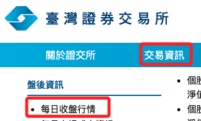
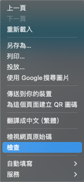
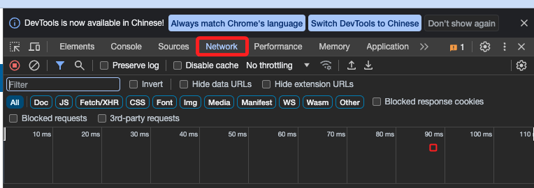
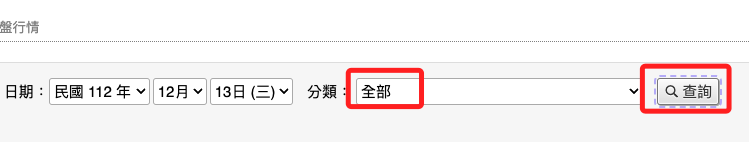
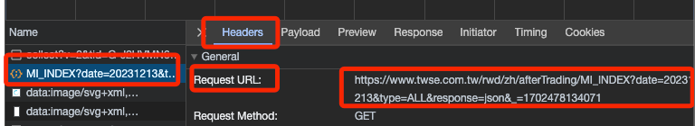
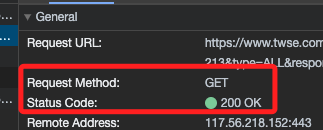
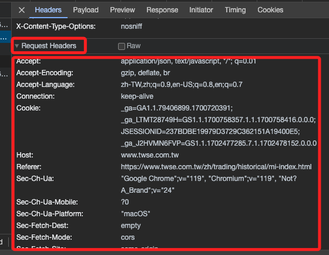
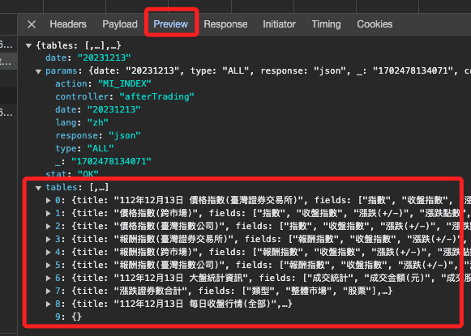
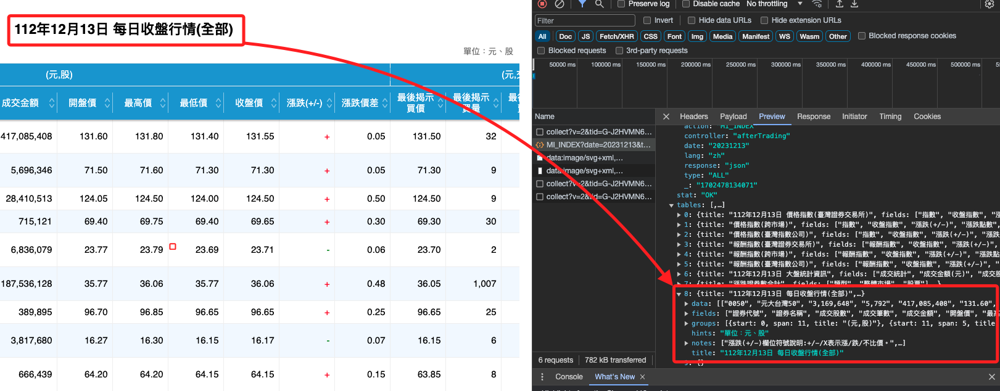

# 台灣證券交易所

## 步驟記錄

1. 進入 [官網](https://www.twse.com.tw/zh/index.html)

2. 進入 [每日收盤行情](https://www.twse.com.tw/zh/trading/historical/mi-index.html)

3. 在網頁上點擊右鍵再點擊檢查。

4. 點擊 Network。

5. 選取任一項目如 `全部` ，點擊 ` 查詢` 進行觀察。

6. 可觀察 `Headers`，逐一選取查看哪個是發送請求，應該是 `MI_INDEX` 這個。

7. 使用的是 `GET` 方法，狀態是 200 OK。

8. 另外 `Request Headers` 在之後的腳本中也會用到。

9. `Preview` 是取得資料的內容。

10. 滑動到 `美日收盤行情`，進一步查看資料位在 `tables` 中的第幾個 index 中。

11. [程式碼參考](https://github.com/FinMind/FinMindBook/blob/master/DataEngineering/Chapter5/5.2/src/twse_crawler.py)