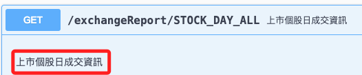
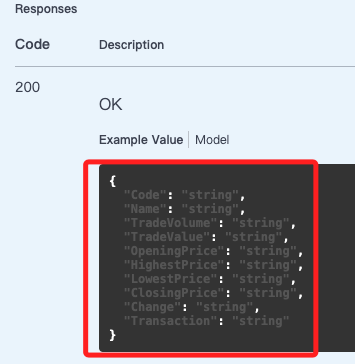
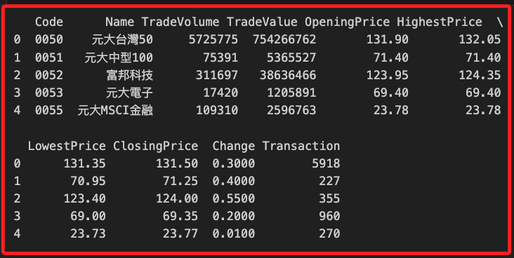
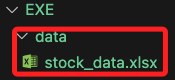

# 證交所 API

<br>

## 說明

1. [官網](https://openapi.twse.com.tw/)

<br>

2. 使用 `上市個股日成交資訊`

    

<br>

3. 複製其中的 `Request URL`

    ```bash
    https://openapi.twse.com.tw/v1/exchangeReport/STOCK_DAY_ALL
    ```

<br>

4. 資料結構如下
    ```json
    {
    "Code": "string",
    "Name": "string",
    "TradeVolume": "string",
    "TradeValue": "string",
    "OpeningPrice": "string",
    "HighestPrice": "string",
    "LowestPrice": "string",
    "ClosingPrice": "string",
    "Change": "string",
    "Transaction": "string"
    }
    ```

    

<br>

## 範例

1. 完整程式碼。
    ```python
    import requests
    import pandas as pd


    def get_stock_data():
        url = "https://openapi.twse.com.tw/v1/exchangeReport/STOCK_DAY_ALL"
        response = requests.get(url)
        if response.status_code == 200:
            data = response.json()
            return pd.DataFrame(data)
        else:
            print("Failed to retrieve data:", response.status_code)
            return None


    def save_to_excel(df, filename):
        df.to_excel(filename, index=False)


    # 取得數據
    df = get_stock_data()

    # 顯示數據
    if df is not None:
        # 展示前幾行數據
        print(df.head())

        # 將資料儲存到Excel文件
        save_to_excel(df, "./data/stock_data.xlsx")
    ```

<br>

2. 輸出結果。

    

<br>

3. 另外也會儲存檔案

    

<br>

---

_END_