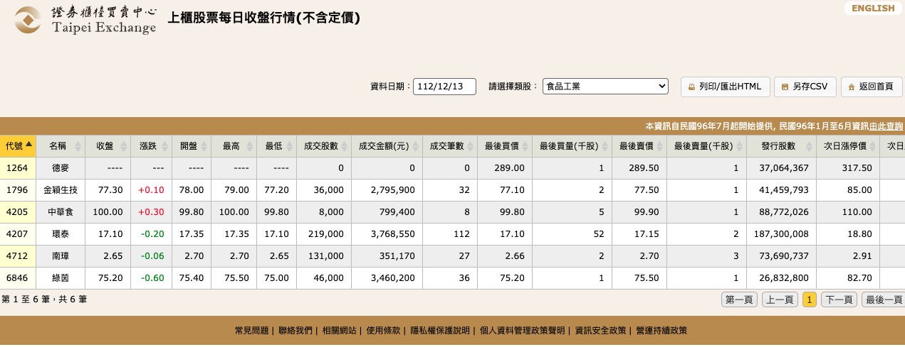

# 櫃檯買賣中心


[網址](https://www.tpex.org.tw/web/stock/aftertrading/otc_quotes_no1430/stk_wn1430.php?l=zh-tw)



<br>

## 說明

1. 假如在終端機中執行。

    ```python
    if __name__ == "__main__":
        start_date, end_date = sys.argv[1:]
        main(start_date, end_date)
    ```

<br>

2. 指令：假設腳本名稱為 `app.py`。

    ```bash
    python app.py 2023-12-01 2023-12-05
    ```

<br>

3. 假如在 Jupyter Notebook 中運行。

    ```python
    if __name__ == "__main__":
        # 在 Jupyter Notebook 中直接賦值或使用 input() 函數提示用戶輸入
        start_date = input("請輸入起始日期 (格式 YYYY-MM-DD): ")
        end_date = input("請輸入結束日期 (格式 YYYY-MM-DD): ")
        main(start_date, end_date)
    ```

<br>

## 範例

1. [參考網址](https://github.com/FinMind/FinMindBook/blob/master/DataEngineering/Chapter5/5.2/src/tpex_crawler.py
)。

<br>

2. 程式碼。

_在 Jupyter 中執行_

    ```python
    import datetime
    import sys
    import time
    import typing

    import pandas as pd
    import requests
    from loguru import logger
    from pydantic import BaseModel


    def clear_data(
        df: pd.DataFrame,
    ) -> pd.DataFrame:
        """資料清理, 將文字轉成數字"""
        for col in [
            "TradeVolume",
            "Transaction",
            "TradeValue",
            "Open",
            "Max",
            "Min",
            "Close",
            "Change",
        ]:
            df[col] = (
                df[col]
                .astype(str)
                .str.replace(",", "")
                .str.replace("X", "")
                .str.replace("+", "")
                .str.replace("----", "0")
                .str.replace("---", "0")
                .str.replace("--", "0")
                .str.replace(" ", "")
                .str.replace("除權息", "0")
                .str.replace("除息", "0")
                .str.replace("除權", "0")
            )
        return df


    def set_column(
        df: pd.DataFrame,
    ) -> pd.DataFrame:
        """設定資料欄位名稱"""
        df.columns = [
            "StockID",
            "Close",
            "Change",
            "Open",
            "Max",
            "Min",
            "TradeVolume",
            "TradeValue",
            "Transaction",
        ]
        return df


    def tpex_header():
        """網頁瀏覽時, 所帶的 request header 參數, 模仿瀏覽器發送 request"""
        return {
            "Accept": "application/json, text/javascript, */*; q=0.01",
            "Accept-Encoding": "gzip, deflate",
            "Accept-Language": "zh-TW,zh;q=0.9,en-US;q=0.8,en;q=0.7",
            "Connection": "keep-alive",
            "Host": "www.tpex.org.tw",
            "Referer": "https://www.tpex.org.tw/web/stock/aftertrading/otc_quotes_no1430/stk_wn1430.php?l=zh-tw",
            "User-Agent": "Mozilla/5.0 (Windows NT 10.0; Win64; x64) AppleWebKit/537.36 (KHTML, like Gecko) Chrome/73.0.3683.103 Safari/537.36",
            "X-Requested-With": "XMLHttpRequest",
        }


    def convert_date(date: str) -> str:
        year, month, day = date.split("-")
        year = int(year) - 1911
        return f"{year}/{month}/{day}"


    def crawler_tpex(
        date: str,
    ) -> pd.DataFrame:
        """
        櫃買中心網址
        https://www.tpex.org.tw/web/stock/aftertrading/otc_quotes_no1430/stk_wn1430.php?l=zh-tw
        """
        # headers 中的 Request url
        url = (
            "https://www.tpex.org.tw/web/stock/aftertrading/"
            "otc_quotes_no1430/stk_wn1430_result.php?"
            "l=zh-tw&d={date}&se=AL"
        )
        url = url.format(date=convert_date(date))
        # 避免被櫃買中心 ban ip, 在每次爬蟲時, 先 sleep 5 秒
        time.sleep(5)
        # request method
        res = requests.get(url, headers=tpex_header())
        data = res.json().get("aaData", "")
        if not data:
            return pd.DataFrame()
        df = pd.DataFrame(data)

        if len(df) == 0:
            return pd.DataFrame()
        # 櫃買中心回傳的資料, 並無資料欄位, 因此這裡直接用 index 取特定欄位
        df = df[[0, 2, 3, 4, 5, 6, 7, 8, 9]]
        # 欄位中英轉換
        df = set_column(df.copy())
        df["date"] = date
        return df


    class TaiwanStockPrice(BaseModel):
        StockID: str
        TradeVolume: int
        Transaction: int
        TradeValue: int
        Open: float
        Max: float
        Min: float
        Close: float
        Change: float
        date: str


    def check_schema(
        df: pd.DataFrame,
    ) -> pd.DataFrame:
        """檢查資料型態, 確保每次要上傳資料庫前, 型態正確"""
        df_dict = df.to_dict("records")
        df_schema = [TaiwanStockPrice(**dd).__dict__ for dd in df_dict]
        df = pd.DataFrame(df_schema)
        return df


    def gen_date_list(start_date: str, end_date: str) -> typing.List[str]:
        """建立時間列表, 用於爬取所有資料"""
        start_date = datetime.datetime.strptime(start_date, "%Y-%m-%d").date()
        end_date = datetime.datetime.strptime(end_date, "%Y-%m-%d").date()
        days = (end_date - start_date).days + 1
        date_list = [str(start_date + datetime.timedelta(days=day)) for day in range(days)]
        return date_list


    def main(start_date: str, end_date: str):
        """櫃買中心寫明, 本資訊自民國96年7月起開始提供"""
        date_list = gen_date_list(start_date, end_date)
        for date in date_list:
            logger.info(date)
            df = crawler_tpex(date)
            if len(df) > 0:
                # 資料清理
                df = clear_data(df.copy())
                # 檢查資料型態
                df = check_schema(df.copy())
                # 這邊先暫時存成 file，下個章節將會上傳資料庫
                df.to_csv(
                    f"taiwan_stock_price_tpex_{date}.csv",
                    index=False,
                )


    if __name__ == "__main__":
        # 在 Jupyter Notebook 中直接賦值或使用 input() 函數提示用戶輸入
        start_date = input("請輸入起始日期 (格式 YYYY-MM-DD): ")
        end_date = input("請輸入結束日期 (格式 YYYY-MM-DD): ")
        main(start_date, end_date)
    ```


<br>

---

_END_