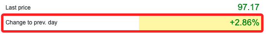

# 美債


## 法蘭克福

[官網](https://www.boerse-frankfurt.de/en)

ISIN
```txt
US872898AJ06
```


搜尋之後出現


把 Request URL 複製起來
```txt
https://api.boerse-frankfurt.de/v1/data/price_information?isin=US872898AJ06&mic=XFRA
```

Request Headers
```txt
Accept:
*/*
Accept-Encoding:
gzip, deflate, br
Accept-Language:
zh-TW,zh;q=0.9,en-US;q=0.8,en;q=0.7
Access-Control-Request-Headers:
cache-control,client-date,expires,ngsw-bypass,pragma,x-client-traceid,x-security
Access-Control-Request-Method:
GET
Origin:
https://www.boerse-frankfurt.de
Referer:
https://www.boerse-frankfurt.de/
Sec-Fetch-Dest:
empty
Sec-Fetch-Mode:
cors
Sec-Fetch-Site:
same-site
User-Agent:
Mozilla/5.0 (Macintosh; Intel Mac OS X 10_15_7) AppleWebKit/537.36 (KHTML, like Gecko) Chrome/120.0.0.0 Safari/537.36
```

Last price

```txt
/html/body/app-root/app-wrapper[@class='ng-star-inserted']/div[@class='widget-container']/div[@class='content-wrapper']/app-bond[@class='ng-star-inserted']/div[@class='ng-star-inserted']/div[@class='row'][2]/div[@class='col-12 col-lg-6 ar-half-pl-lg ar-mt']/div[@class='h-100 widget']/div[1]/app-widget-price-box/div[@class='widget ar-p']/div[@class='table-responsive widget-table-responsive']/table[@class='table table-borderless widget-table']/tbody/tr[@class='widget-table-row'][1]/td[@class='widget-table-cell text-right last-price text-color-green']
```


Change to prev. day

```txt
/html/body/app-root/app-wrapper[@class='ng-star-inserted']/div[@class='widget-container']/div[@class='content-wrapper']/app-bond[@class='ng-star-inserted']/div[@class='ng-star-inserted']/div[@class='row'][2]/div[@class='col-12 col-lg-6 ar-half-pl-lg ar-mt']/div[@class='h-100 widget']/div[1]/app-widget-price-box/div[@class='widget ar-p']/div[@class='table-responsive widget-table-responsive']/table[@class='table table-borderless widget-table']/tbody/tr[@class='widget-table-row'][2]/td[@class='widget-table-cell text-right change-percent text-color-green']
```


Bid

```txt
/html/body/app-root/app-wrapper[@class='ng-star-inserted']/div[@class='widget-container']/div[@class='content-wrapper']/app-bond[@class='ng-star-inserted']/div[@class='ng-star-inserted']/div[@class='row'][2]/div[@class='col-12 col-lg-6 ar-half-pl-lg ar-mt']/div[@class='h-100 widget']/div[@class='ar-bt']/app-widget-quote-box/div[@class='widget app-loading-spinner-parent ar-p h-100']/div[@class='table-responsive widget-table-responsive']/table[@class='table table-borderless widget-table']/tbody/tr[@class='widget-table-row'][3]/td[@class='widget-table-cell askBidLimit']
```

Ask

```txt
/html/body/app-root/app-wrapper[@class='ng-star-inserted']/div[@class='widget-container']/div[@class='content-wrapper']/app-bond[@class='ng-star-inserted']/div[@class='ng-star-inserted']/div[@class='row'][2]/div[@class='col-12 col-lg-6 ar-half-pl-lg ar-mt']/div[@class='h-100 widget']/div[@class='ar-bt']/app-widget-quote-box/div[@class='widget app-loading-spinner-parent ar-p h-100']/div[@class='table-responsive widget-table-responsive']/table[@class='table table-borderless widget-table']/tbody/tr[@class='widget-table-row'][3]/td[@class='widget-table-cell askBidLimit text-right']
```

取回發行條件看看再來整理

```txt
/html/body/app-root/app-wrapper[@class='ng-star-inserted']/div[@class='widget-container']/div[@class='content-wrapper']/app-bond[@class='ng-star-inserted']/div[@class='ng-star-inserted']/div[@class='row'][5]/div[@class='col-12 ar-col-lg-1-3 ar-mr-lg ar-mt'][1]/app-widget-master-data-bond[@class='d-block']/div[@class='widget app-loading-spinner-parent ar-p']
```