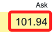

# 美債

<br>

## 法蘭克福

1. [官網](https://www.boerse-frankfurt.de/en)

<br>

2. ISIN

    ```txt
    US872898AJ06
    ```
    

<br>

3. 搜尋指定的 ISIN_CODE 之後，檢視網頁會出現以下訊息。

    

<br>

## 網頁重要資訊

1. Request URL。

    ```txt
    https://api.boerse-frankfurt.de/v1/data/price_information?isin=US872898AJ06&mic=XFRA
    ```

<br>

2. Request Headers
    
    ```txt
    Accept:
    */*
    Accept-Encoding:
    gzip, deflate, br
    Accept-Language:
    zh-TW,zh;q=0.9,en-US;q=0.8,en;q=0.7
    Access-Control-Request-Headers:
    cache-control,client-date,expires,ngsw-bypass,pragma,x-client-traceid,x-security
    Access-Control-Request-Method:
    GET
    Origin:
    https://www.boerse-frankfurt.de
    Referer:
    https://www.boerse-frankfurt.de/
    Sec-Fetch-Dest:
    empty
    Sec-Fetch-Mode:
    cors
    Sec-Fetch-Site:
    same-site
    User-Agent:
    Mozilla/5.0 (Macintosh; Intel Mac OS X 10_15_7) AppleWebKit/537.36 (KHTML, like Gecko) Chrome/120.0.0.0 Safari/537.36
    ```

<br>

## 假如要使用 Selenium+XPATH 

1. Last price

    

    ```txt
    /html/body/app-root/app-wrapper[@class='ng-star-inserted']/div[@class='widget-container']/div[@class='content-wrapper']/app-bond[@class='ng-star-inserted']/div[@class='ng-star-inserted']/div[@class='row'][2]/div[@class='col-12 col-lg-6 ar-half-pl-lg ar-mt']/div[@class='h-100 widget']/div[1]/app-widget-price-box/div[@class='widget ar-p']/div[@class='table-responsive widget-table-responsive']/table[@class='table table-borderless widget-table']/tbody/tr[@class='widget-table-row'][1]/td[@class='widget-table-cell text-right last-price text-color-green']
    ```

<br>

2. Change to prev. day

    

    ```txt
    /html/body/app-root/app-wrapper[@class='ng-star-inserted']/div[@class='widget-container']/div[@class='content-wrapper']/app-bond[@class='ng-star-inserted']/div[@class='ng-star-inserted']/div[@class='row'][2]/div[@class='col-12 col-lg-6 ar-half-pl-lg ar-mt']/div[@class='h-100 widget']/div[1]/app-widget-price-box/div[@class='widget ar-p']/div[@class='table-responsive widget-table-responsive']/table[@class='table table-borderless widget-table']/tbody/tr[@class='widget-table-row'][2]/td[@class='widget-table-cell text-right change-percent text-color-green']
    ```

<br>

3. Bid

    

    ```txt
    /html/body/app-root/app-wrapper[@class='ng-star-inserted']/div[@class='widget-container']/div[@class='content-wrapper']/app-bond[@class='ng-star-inserted']/div[@class='ng-star-inserted']/div[@class='row'][2]/div[@class='col-12 col-lg-6 ar-half-pl-lg ar-mt']/div[@class='h-100 widget']/div[@class='ar-bt']/app-widget-quote-box/div[@class='widget app-loading-spinner-parent ar-p h-100']/div[@class='table-responsive widget-table-responsive']/table[@class='table table-borderless widget-table']/tbody/tr[@class='widget-table-row'][3]/td[@class='widget-table-cell askBidLimit']
    ```

<br>

4. Ask

    

    ```txt
    /html/body/app-root/app-wrapper[@class='ng-star-inserted']/div[@class='widget-container']/div[@class='content-wrapper']/app-bond[@class='ng-star-inserted']/div[@class='ng-star-inserted']/div[@class='row'][2]/div[@class='col-12 col-lg-6 ar-half-pl-lg ar-mt']/div[@class='h-100 widget']/div[@class='ar-bt']/app-widget-quote-box/div[@class='widget app-loading-spinner-parent ar-p h-100']/div[@class='table-responsive widget-table-responsive']/table[@class='table table-borderless widget-table']/tbody/tr[@class='widget-table-row'][3]/td[@class='widget-table-cell askBidLimit text-right']
    ```

<br>

5. 取回發行條件看看再來整理

    

    ```txt
    /html/body/app-root/app-wrapper[@class='ng-star-inserted']/div[@class='widget-container']/div[@class='content-wrapper']/app-bond[@class='ng-star-inserted']/div[@class='ng-star-inserted']/div[@class='row'][5]/div[@class='col-12 ar-col-lg-1-3 ar-mr-lg ar-mt'][1]/app-widget-master-data-bond[@class='d-block']/div[@class='widget app-loading-spinner-parent ar-p']
    ```

<br>

## 程式碼

1. 特別注意，腳本執行的時候，有時候會出現兩組 `data:`，有時候會出現三組，接著就是一直出現 `event:health_event data:health_event`，所以腳本必須對這個問題作出處理，不然程序會一直卡在 `request`。

    

<br>

2. 完整程式碼。

    ```python
    import requests
    import json
    import pandas as pd
    import pytz

    # 指定 ISIN 代碼和 URL
    _ISIN_CODE = 'US872898AJ06'
    url = f"https://api.boerse-frankfurt.de/v1/data/price_information?isin={_ISIN_CODE}&mic=XFRA"

    # 定義英文欄位名稱到中文的映射
    column_mapping = {
        'isin': '證券編碼',
        'lastPrice': '最新價格',
        'timestampLastPrice': '最新價格時間戳',
        'changeToPrevDayAbsolute': '今日漲跌價格',
        'changeToPrevDayInPercent': '今日漲跌幅度',
        'closingPricePrevTradingDay': '前日收盤價',
        'mic': '市場識別碼',
        'dayHigh': '最高價',
        'dayLow': '最低價',
        'priceFixings': '價格定點',
        'tradedInPercent': '以百分比交易',
        'tradingTimeEnd': '交易結束時間',
        'tradingTimeStart': '交易開始時間',
        'turnoverInEur': '成交額（歐元）',
        'turnoverInPieces': '成交量（件數）',
        'turnoverNominal': '名義成交額',
        'weeks52High': '52週最高價',
        'weeks52Low': '52週最低價',
        'currency': '貨幣',
        'minimumTradableUnit': '最小可交易單位'
    }

    # 使用 with 語句發送請求並獲取響應
    with requests.get(url, stream=True) as response:
        # 確保響應成功
        if response.status_code == 200:
            data_count = 0
            data_json = None
            for line in response.iter_lines():
                # 解碼每一行
                line = line.decode('utf-8')
                # 檢查行是否包含 'data:'
                if 'data:' in line:
                    data_count += 1
                    if data_count == 1:
                        # 提取第一次出現 'data:' 之後的內容
                        data_json = line.split('data:', 1)[1].strip()
                    elif data_count == 2:
                        # 當第二次出現 'data:' 時終止循環
                        break
        else:
            print(f"發生錯誤：無法取得資料：{response.status_code}")

    # 檢查是否有獲取到數據
    if data_json:
        try:
            # 解析 JSON 數據
            data = json.loads(data_json)

            # 轉換為 pandas DataFrame
            df = pd.DataFrame([data])
            # 轉換 DataFrame 的列名
            df.rename(columns=column_mapping, inplace=True)

            # 將 '最新價格時間戳' 轉換為台灣時間 (UTC+8) 並格式化
            df['最新價格時間戳'] = pd.to_datetime(df['最新價格時間戳'])
            taipei_tz = pytz.timezone('Asia/Taipei')
            df['最新價格時間戳'] = df['最新價格時間戳'].dt.tz_convert(taipei_tz)
            df['最新價格時間戳'] = df['最新價格時間戳'].dt.strftime('%Y-%m-%d %H:%M')
            
            # 原始數據為中歐時間（CET/CEST）
            frankfurt_tz = pytz.timezone('Europe/Berlin')
            # 將 '交易開始時間' 和 '交易結束時間' 從字串轉換為 datetime 對象
            # 並轉換為當地時間
            df['交易開始時間'] = pd.to_datetime(df['交易開始時間']).dt.tz_localize(frankfurt_tz)
            df['交易結束時間'] = pd.to_datetime(df['交易結束時間']).dt.tz_localize(frankfurt_tz)
            # 轉換為台灣時間 (UTC+8)
            df['交易開始時間'] = df['交易開始時間'].dt.tz_convert(taipei_tz).dt.strftime('%Y-%m-%d %H:%M')
            df['交易結束時間'] = df['交易結束時間'].dt.tz_convert(taipei_tz).dt.strftime('%Y-%m-%d %H:%M')

            # 保存為 Excel 文件
            excel_file = 'price_information.xlsx'
            df.to_excel(excel_file, index=False)

            print(f"資料已保存為 {excel_file}")
        except json.JSONDecodeError as e:
            print(f"JSON 無法解析： {e}")
    else:
        print("未找到有效的 'data:' 資料")

    df
    ```

<br>

3. 會儲存為 EXCEL 文件

    

<br>

---

_END_