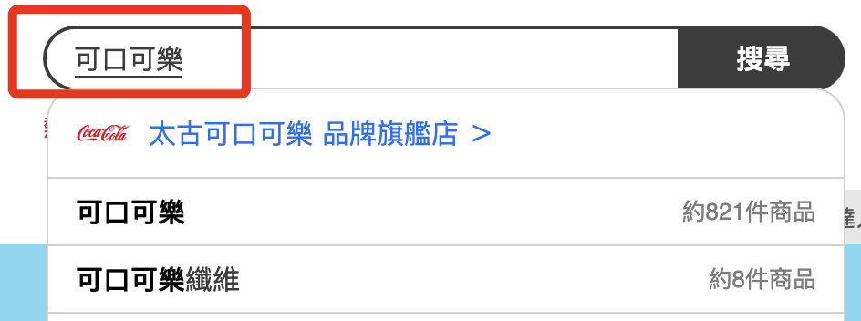

# MOMO

進入 MOMO [官網首頁](https://www.momoshop.com.tw/main/Main.jsp)

<br>

在搜尋欄位輸入要查詢的商品名稱


<br>

觀察網址列的內容

```html
https://www.momoshop.com.tw/search/searchShop.jsp?keyword=%E5%8F%AF%E5%8F%A3%E5%8F%AF%E6%A8%82&searchType=1&curPage=1&_isFuzzy=0&showType=chessboardType&isBrandCategory=N&serviceCode=MT01
```

<br>

在 `keyword` 參數之後會接著搜尋的字串


<br>

為了快速查詢網頁內容的 `Xpath` 路徑，先進行安裝 `Chrome` 套件


<br>

點擊開啟


<br>

先進行資料展開，將格狀顯示換為條列式


<br>

確定是所要查詢的資料，按著鍵盤 `SHIFT` 並移動到網頁元件上，此時 `XPATH` 插件的對話框內便會顯示 `XPATH` 以及元件在網頁上所顯示的內容。ａ


<br>

`QUERY` 就是所請求的路徑


<br>

右側 `RESULT` 會顯示網頁上元件顯示的內容


