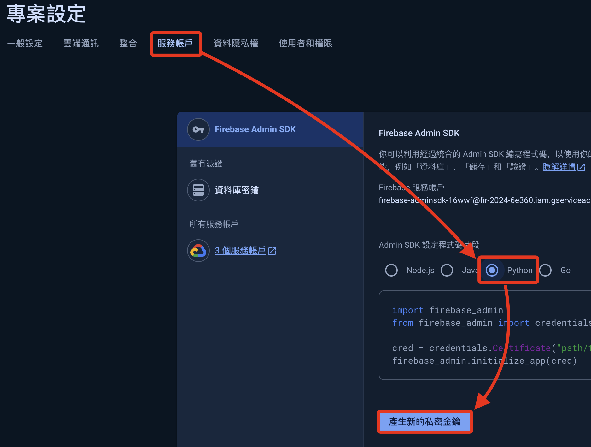
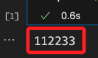

# MOMO

進入 MOMO [官網首頁](https://www.momoshop.com.tw/main/Main.jsp)

<br>


## 觀察網址

1. 在 `搜尋` 欄位輸入要查詢的商品名稱，這裡示範使用 `可口可樂`。

    

<br>

2. 觀察網址列的內容

    ```html
    https://www.momoshop.com.tw/search/searchShop.jsp?keyword=可口可樂&searchType=1&curPage=1&_isFuzzy=0&showType=chessboardType&isBrandCategory=N&serviceCode=MT01
    ```

<br>

3. 在 `keyword` 參數之後會接著搜尋的字串

    

<br>

4. 複製貼上會出現如下的 `網址編碼(URL Encoding)` 格式，也稱為 `百分比編碼(Percent-Encoding)`，每個字符會被一個百分比符號 `%` 跟隨兩位十六進制數替代，這樣編碼可以使得這些字符在網址中被安全地傳輸與識別。

    ```html
    https://www.momoshop.com.tw/search/searchShop.jsp?keyword=%E5%8F%AF%E5%8F%A3%E5%8F%AF%E6%A8%82&searchType=1&curPage=1&_isFuzzy=0&showType=chessboardType&isBrandCategory=N&serviceCode=MT01
    ```

<br>

5. 在這個範例中的 `可口可樂` 顯示如下。

    ```txt
    %E5%8F%AF：代表「可」
    %E5%8F%A3：代表「口」
    %E6%A8%82：代表「樂」
    ```

<br>

6. 接下來，為了快速查詢網頁內容的 `Xpath` 路徑，先進行安裝 `Chrome` 套件。

    

<br>

7. 點擊插件的 `icon` 開啟，對話框會出現在畫面中指定的位置上。

    

<br>

8. 先進行資料展開，將 `格狀` 顯示換為 `條列式`。

    

<br>

9. 觀察網頁所顯示的內容是所要查詢的資料，這時可按下鍵盤的 `SHIFT`，並將滑鼠指標移動到網頁元件上，此時 `XPATH` 插件的對話框內便會顯示 `XPATH` 以及元件在網頁上所顯示的內容。

    

<br>

10. 左側 `QUERY` 就是所請求的路徑。

    

<br>

11. 右側 `RESULT` 會顯示網頁上元件顯示的內容。

    

<br>

## 編寫腳本

1. 導入 `selenium` 庫相關套件。

    ```python
    from selenium import webdriver
    from selenium.webdriver.chrome.options import Options
    # 新版
    from selenium.webdriver.common.by import By
    from selenium.webdriver import Chrome
    ```

<br>

2. 導入 `時間` 相關庫，用以處理 `Timestamp` 時間戳。

    ```python
    import datetime
    import dateutil.tz
    import time
    ```

<br>

3. 自訂要搜尋的關鍵字，並且依據前面的說明，宣告搜尋網址。

    ```python
    # 關鍵字
    _keyword = '可口可樂'
    # 網址
    URL = f'https://www.momoshop.com.tw/search/searchShop.jsp?keyword={_keyword}&searchType=1&curPage=1&_isFuzzy=0&showType=chessboardType&isBrandCategory=N&serviceCode=MT01'
    ```

<br>

4. 建立瀏覽器物件。

    ```python
    # 假如有任何設定，可透過 Option 物件調用方法進行
    options = Options()
    options.add_argument("--disable-notifications")
    # 新版語法，瀏覽網址
    chrome = Chrome()
    chrome.get(URL)
    ```

<br>

5. 切換為清單（條列）模式。

    ```python
    # 要點擊按鍵的 XPATH
    _button_xpath = "/html/body/div[@id='BodyBase']/div[@class='bt_2_layout searchbox searchListArea selectedtop']/div[@class='searchPrdListArea bookList']/section[@class='menuArea']/div[@class='viewType']/label[@class='columnType']"
    # 透過 XPATH 取得按鍵
    button_list = chrome.find_element(By.XPATH, _button_xpath)
    # 點擊
    button_list.click()
    ```

<br>

6. 確認搜尋結果的筆數。

    ```python
    # 數量的 XPATH
    _xpath_count = "/html/body/div[@id='BodyBase']/div[@class='bt_2_layout searchbox searchListArea selectedtop']/div[@class='pageArea topPage']/dl/dt/span[@class='totalTxt']/b" 
    # 找到按鈕
    _count = chrome.find_element(By.XPATH, _xpath_count)
    # 點擊
    _count = int(_count.text)
    # 可輸出看一下
    print(_count)
    ```

<br>

7. 初步先不處理 `翻頁`，所以顯示 `30` 筆資料即可。

    ```python
    if _count > 30:
        _count = 30
    ```

<br>

8. 將結果輸出查看一下。

    ```python
    # 建立一個 Dict 來存放結果
    _datas = {}
    # 依據資料筆數進行遍歷
    for i in range(_count):
        _i = str(i+1)
        # 商品名稱的 XPATH
        xpath_name = f"/html/body/div[@id='BodyBase']/div[@class='bt_2_layout searchbox searchListArea selectedtop']/div[@class='searchPrdListArea bookList']/div[@id='columnType']/ul[@class='clearfix']/li[{_i}]/a[@class='goodsUrl']/div[@class='prdInfoWrap']/div[@class='prdNameTitle']/h3[@class='prdName']"
        # 新版改用 Slogan Title，但變數名暫時不變
        xpath_info = f"/html/body/div[@id='BodyBase']/div[@class='bt_2_layout searchbox searchListArea selectedtop']/div[@class='searchPrdListArea bookList']/div[@id='columnType']/ul[@class='clearfix']/li[{_i}]/a[@class='goodsUrl']/div[@class='prdInfoWrap']/p[@class='sloganTitle']"
        # 商品價格
        xpath_price = f"/html/body/div[@id='BodyBase']/div[@class='bt_2_layout searchbox searchListArea selectedtop']/div[@class='searchPrdListArea bookList']/div[@id='columnType']/ul[@class='clearfix']/li[{_i}]/a[@class='goodsUrl']/div[@class='prdInfoWrap']/p[@class='money']/span[@class='price']/b"
        # 找到資料
        _name = chrome.find_element(By.XPATH, xpath_name)
        _info = chrome.find_element(By.XPATH, xpath_info)
        _price = chrome.find_element(By.XPATH, xpath_price)
        # 輸出查看
        print(_name.text)
        print(_info.text)
        print(_price.text)
    ```

<br>

## 存入 Firebase

[Firebase 官網](https://firebase.google.com/)

<br>

1. 右上角點擊進入主控台 `console`。

    

<br>

2. 新增專案。

    

<br>

3. 自訂名稱，如 `Firebase2024`。

    

<br>

4. 關閉 `Analytics` 選項，然後建立專案。

    

<br>

5. 點擊繼續，完成新建專案。

    

<br>

6. 展開左側導覽中的 `建構`，點選 `Realtime Database`。

    

<br>

7. 建立資料庫。

    

<br>

8. 使用預設資料庫位置，點擊 `下一步`。

    

<br>

9. 使用預設的安全模式後 `啟用`。

    

<br>

10. 點擊 `規則`，暫時不管安全性問題，將參數設置為 `true`，並且 `發布`。

    

<br>

11. 這時會有警告訊息，暫時不予理會

    

<br>

12. 回到總覽，點擊 `專案設定`。

    

<br>

13. 切換到 `服務帳戶`，改用 `Python`，接著 `產生新的私密金鑰`。

    

<br>

14. 點擊後會下載金鑰檔案，然後暫且將這個 `.json` 檔案拖曳到專案所在目錄。

    

<br>

15. 複製畫面中範例腳本，後續將提供腳本編輯使用。

    

<br>

16. 要修改路徑及檔案名稱，因為在同層路徑，可直接貼上檔名。

    ```python
    import firebase_admin
    from firebase_admin import credentials
    # 要替換為自己的金鑰名稱
    cred = credentials.Certificate("fir-2024-6e360-firebase-adminsdk-16wwf-d2983e1f68.json")
    firebase_admin.initialize_app(cred)
    ```

<br>

17. 點擊右上方 `文件` 查看官方說明。

    

<br>

18. 選取 `建構`，點擊 `Realtime Database`。

    

<br>

19. 建議切換到英文介面比較清楚。

    

<br>

20. 選擇 `Admin`，然後從 `Get Started` 開始。

    

<br>

21. 滑動到下方，切換到 `Python`。

    

<br>

22. 複製並修改範例腳本如下。

```python
import firebase_admin
from firebase_admin import credentials
from firebase_admin import db

# 更換為自己的金鑰檔案名稱
cred = credentials.Certificate(
    'fir-2024-6e360-firebase-adminsdk-16wwf-d2983e1f68.json'
)
# 下面這個網址要更換為自己的，在後面步驟會進行查詢
firebase_admin.initialize_app(
    cred, {
    'databaseURL': 'https://databaseName.firebaseio.com'
})
# 這是資料庫節點，查看後續引導
ref = db.reference('restricted_access/secret_document')
print(ref.get())
```

<br>

23. 回到資料庫去複製資料庫網址。

    

<br>

24. 替換腳本中的網址。

    

<br>

25. 在 Firebase 資料庫中任意添加一個節點來測試連線。

    

<br>

26. 修改腳本來進行連線測試。

    ```python
    import firebase_admin
    from firebase_admin import credentials
    from firebase_admin import db

    #
    cred = credentials.Certificate(
        'fir-2024-6e360-firebase-adminsdk-16wwf-d2983e1f68.json'
    )
    #
    firebase_admin.initialize_app(
        cred, {
        'databaseURL': 'https://fir-2024-6e360-default-rtdb.firebaseio.com/'
    })

    #
    ref = db.reference('Test/ABC')
    print(ref.get())
    ```

<br>
27. 回傳自訂內容表示正確讀取節點資訊。

    

<br>

待續