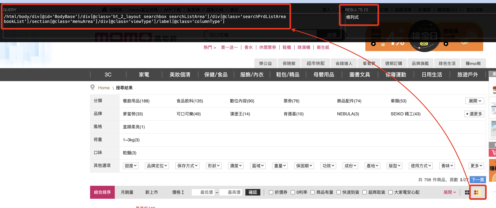

# MOMO

進入 MOMO [官網首頁](https://www.momoshop.com.tw/main/Main.jsp)

<br>


## 觀察網址

1. 在 `搜尋` 欄位輸入要查詢的商品名稱，這裡示範使用 `可口可樂`。

    

<br>

2. 觀察網址列的內容

    ```html
    https://www.momoshop.com.tw/search/searchShop.jsp?keyword=可口可樂&searchType=1&curPage=1&_isFuzzy=0&showType=chessboardType&isBrandCategory=N&serviceCode=MT01
    ```

<br>

3. 在 `keyword` 參數之後會接著搜尋的字串

    

<br>

4. 複製貼上會出現如下的 `網址編碼(URL Encoding)` 格式，也稱為 `百分比編碼(Percent-Encoding)`，每個字符會被一個百分比符號 `%` 跟隨兩位十六進制數替代，這樣編碼可以使得這些字符在網址中被安全地傳輸與識別。

    ```html
    https://www.momoshop.com.tw/search/searchShop.jsp?keyword=%E5%8F%AF%E5%8F%A3%E5%8F%AF%E6%A8%82&searchType=1&curPage=1&_isFuzzy=0&showType=chessboardType&isBrandCategory=N&serviceCode=MT01
    ```

<br>

5. 在這個範例中的 `可口可樂` 顯示如下。

    ```txt
    %E5%8F%AF：代表「可」
    %E5%8F%A3：代表「口」
    %E6%A8%82：代表「樂」
    ```

<br>

6. 接下來，為了快速查詢網頁內容的 `Xpath` 路徑，先進行安裝 `Chrome` 套件。

    

<br>

7. 點擊插件的 `icon` 開啟，對話框會出現在畫面中指定的位置上。

    

<br>

8. 先進行資料展開，將 `格狀` 顯示換為 `條列式`。

    

<br>

9. 觀察網頁所顯示的內容是所要查詢的資料，這時可按下鍵盤的 `SHIFT`，並將滑鼠指標移動到網頁元件上，此時 `XPATH` 插件的對話框內便會顯示 `XPATH` 以及元件在網頁上所顯示的內容。

    

<br>

10. 左側 `QUERY` 就是所請求的路徑。

    

<br>

11. 右側 `RESULT` 會顯示網頁上元件顯示的內容。

    

<br>

## 編寫腳本

1. 導入 `selenium` 庫相關套件。

    ```python
    from selenium import webdriver
    from selenium.webdriver.chrome.options import Options
    # 新版
    from selenium.webdriver.common.by import By
    from selenium.webdriver import Chrome
    ```

<br>

2. 導入 `時間` 相關庫，用以處理 `Timestamp` 時間戳。

    ```python
    import datetime
    import dateutil.tz
    import time
    ```

<br>

3. 自訂要搜尋的關鍵字，並且依據前面的說明，宣告搜尋網址。

    ```python
    # 關鍵字
    _keyword = '可口可樂'
    # 網址
    URL = f'https://www.momoshop.com.tw/search/searchShop.jsp?keyword={_keyword}&searchType=1&curPage=1&_isFuzzy=0&showType=chessboardType&isBrandCategory=N&serviceCode=MT01'
    ```

<br>

4. 建立瀏覽器物件。

    ```python
    # 假如有任何設定，可透過 Option 物件調用方法進行
    options = Options()
    options.add_argument("--disable-notifications")
    # 新版語法，瀏覽網址
    chrome = Chrome()
    chrome.get(URL)
    ```

<br>

5. 切換為清單（條列）模式。

    ```python
    # 要點擊按鍵的 XPATH
    _button_xpath = "/html/body/div[@id='BodyBase']/div[@class='bt_2_layout searchbox searchListArea selectedtop']/div[@class='searchPrdListArea bookList']/section[@class='menuArea']/div[@class='viewType']/label[@class='columnType']"
    # 透過 XPATH 取得按鍵
    button_list = chrome.find_element(By.XPATH, _button_xpath)
    # 點擊
    button_list.click()
    ```

<br>

6. 確認搜尋結果的筆數。

    ```python
    # 數量的 XPATH
    _xpath_count = "/html/body/div[@id='BodyBase']/div[@class='bt_2_layout searchbox searchListArea selectedtop']/div[@class='pageArea topPage']/dl/dt/span[@class='totalTxt']/b" 
    # 找到按鈕
    _count = chrome.find_element(By.XPATH, _xpath_count)
    # 點擊
    _count = int(_count.text)
    # 可輸出看一下
    print(_count)
    ```

<br>

7. 初步先不處理 `翻頁`，所以顯示 `30` 筆資料即可。

    ```python
    if _count > 30:
        _count = 30
    ```

<br>

8. 將結果輸出查看一下。

    ```python
    # 建立一個 Dict 來存放結果
    _datas = {}
    # 依據資料筆數進行遍歷
    for i in range(_count):
        _i = str(i+1)
        # 商品名稱的 XPATH
        xpath_name = f"/html/body/div[@id='BodyBase']/div[@class='bt_2_layout searchbox searchListArea selectedtop']/div[@class='searchPrdListArea bookList']/div[@id='columnType']/ul[@class='clearfix']/li[{_i}]/a[@class='goodsUrl']/div[@class='prdInfoWrap']/div[@class='prdNameTitle']/h3[@class='prdName']"
        # 新版改用 Slogan Title，但變數名暫時不變
        xpath_info = f"/html/body/div[@id='BodyBase']/div[@class='bt_2_layout searchbox searchListArea selectedtop']/div[@class='searchPrdListArea bookList']/div[@id='columnType']/ul[@class='clearfix']/li[{_i}]/a[@class='goodsUrl']/div[@class='prdInfoWrap']/p[@class='sloganTitle']"
        # 商品價格
        xpath_price = f"/html/body/div[@id='BodyBase']/div[@class='bt_2_layout searchbox searchListArea selectedtop']/div[@class='searchPrdListArea bookList']/div[@id='columnType']/ul[@class='clearfix']/li[{_i}]/a[@class='goodsUrl']/div[@class='prdInfoWrap']/p[@class='money']/span[@class='price']/b"
        # 找到資料
        _name = chrome.find_element(By.XPATH, xpath_name)
        _info = chrome.find_element(By.XPATH, xpath_info)
        _price = chrome.find_element(By.XPATH, xpath_price)
        # 輸出查看
        print(_name.text)
        print(_info.text)
        print(_price.text)
    ```

<br>

## 存入 Firebase

[官網](https://firebase.google.com/)

<br>

右上角點擊進入主控台 `console`


<br>

建立專案


<br>

自訂名稱


<br>

不用這個選項，然後建立專案


<br>

完成


<br>

點擊


<br>

建立


<br>

使用預設


<br>

啟用


<br>

先將規則開啟，並且 `發布`


<br>

這時會有警告訊息，暫時不予理會


<br>

進入專案設定


<br>

建立金鑰


<br>

點擊後會下載，然後暫且將 `.json` 檔案拖曳到專案所在目錄。


<br>

複製這個腳本，準備進行腳本編輯


<br>

要修改路徑及檔案名稱，因為在同層路徑，所以直接貼上檔名即可。

```python
import firebase_admin
from firebase_admin import credentials

cred = credentials.Certificate("fir-2024-6e360-firebase-adminsdk-16wwf-d2983e1f68.json")
firebase_admin.initialize_app(cred)
```

