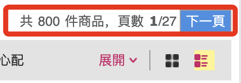
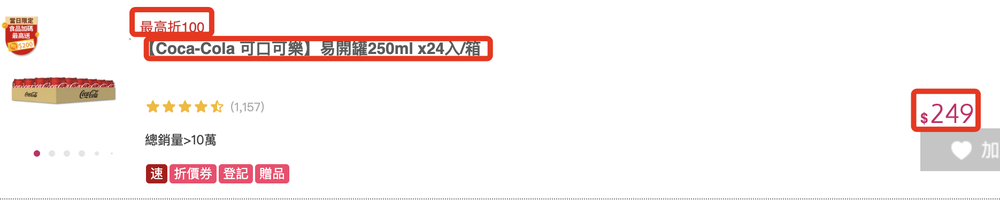
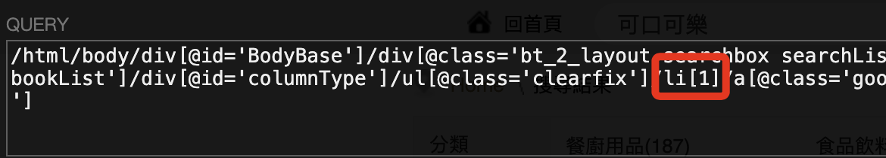

# 網站瀏覽

進入 MOMO [官網首頁](https://www.momoshop.com.tw/main/Main.jsp)

<br>


## 步驟說明

1. 在 `搜尋` 欄位輸入要查詢的商品名稱，這裡示範使用 `可口可樂`。

    

<br>

2. 觀察網址列的內容。

    ```html
    https://www.momoshop.com.tw/search/searchShop.jsp?keyword=可口可樂&searchType=1&curPage=1&_isFuzzy=0&showType=chessboardType&isBrandCategory=N&serviceCode=MT01
    ```

<br>

3. 在 `keyword` 參數之後會接著搜尋的字串

    

<br>

4. 若將網址複製貼上，會出現如下的 `網址編碼(URL Encoding)` 格式，也稱為 `百分比編碼(Percent-Encoding)`，每個字元會被一個百分比符號 `%` 加上兩位十六進制數字的組成所替代，這樣編碼可以使得這些字元在網址中被安全地傳輸與識別，無需再深入理解編碼方式。

    ```html
    https://www.momoshop.com.tw/search/searchShop.jsp?keyword=%E5%8F%AF%E5%8F%A3%E5%8F%AF%E6%A8%82&searchType=1&curPage=1&_isFuzzy=0&showType=chessboardType&isBrandCategory=N&serviceCode=MT01
    ```

<br>

5. 舉例來說，在這個範例中的 `可口可樂` 的每個字元顯示如下。

    ```txt
    %E5%8F%AF：代表「可」
    %E5%8F%A3：代表「口」
    %E6%A8%82：代表「樂」
    ```

<br>

6. 接下來，為了快速查詢網頁內容的 `Xpath` 路徑，先進行安裝以下 `Chrome` 套件。

    

<br>

_安裝好之後_

<br>

7. 點擊插件的 `icon` 開啟應用，`XPATH Helper` 對話框會出現在畫面中預設的位置上，一般是在上方，左側是 `QUERY` 對話框、右側是 `RESULT` 對話框。

    

<br>

8. 回到 `MOMO` 搜尋的產品列表，先進行資料展開，將 `棋盤式` 顯示換為 `條列式`。

    

<br>

9. 依據插件的操作指南，按下鍵盤的 `SHIFT`，同時將滑鼠指標移動到網頁元件上，此時 `XPATH Helper` 插件的對話框內便會顯示 `XPATH` 以及元件在網頁上所顯示的內容。

    

<br>

10. 左側 `QUERY` 就是所請求的路徑。

    

<br>

11. 右側 `RESULT` 會顯示網頁上元件顯示的內容。

    

<br>

12. 切換按鍵的上方會顯示搜尋到的商品總數，另外有會顯示當前頁數與總頁數，這些也都是可能使用到的資訊。

    

<br>

13. 依據當前 `MOMO` 版面配置，在範例後續的演繹中，也會使用到 `Slogan`、`Title`、`Price`等資訊，`XPATH`查詢方式與前述步驟相同。

    

<br>

14. 但是商品列表的 `XPATH` 與頁面其他資訊略有不同之處在於它會有 `項次` 的資訊，必須透過觀察 `XPATH` 來確認，這就是後續透過腳本進行遞迴的對象。

    

<br>

_網頁瀏覽部分先介紹到這_

___

_END_