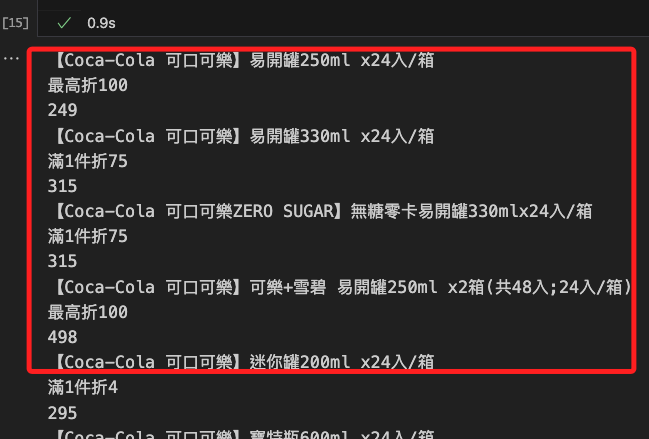

# 爬蟲

_使用 Jupyter Notebook 編輯即可_

<br>

## 相關前置作業

1. 安裝 `selenium` 套件。

    ```bash
    python -m pip install selenium
    ```

<br>

## 編寫腳本

1. 導入 `selenium` 庫相關套件。

    ```python
    from selenium import webdriver
    from selenium.webdriver.chrome.options import Options
    # 新版
    from selenium.webdriver.common.by import By
    from selenium.webdriver import Chrome
    ```

<br>

2. 導入 `時間` 相關庫，用以處理 `Timestamp` 時間戳。

    ```python
    import datetime
    import dateutil.tz
    import time
    ```

<br>

3. 自訂要搜尋的關鍵字，這裡是 `可口可樂`，在搜尋網址部分，使用 `Python` 的 `f-string` 將變數 `_keyword` 代入，這個用意是便於後續透過變數替換其他的搜尋關鍵字。

    ```python
    # 關鍵字
    _keyword = '可口可樂'
    # 網址
    URL = f'https://www.momoshop.com.tw/search/searchShop.jsp?keyword={_keyword}&searchType=1&curPage=1&_isFuzzy=0&showType=chessboardType&isBrandCategory=N&serviceCode=MT01'
    ```

<br>

4. 建立瀏覽器物件，運行後會開啟 `Selenium` 瀏覽器，並自動代入關鍵字進行查詢，此時保持這個瀏覽器的狀態，不要手動關閉；另外，這裡透過了 `options` 參數設定了 `禁用通知`，這是避免網站彈出的通知視窗干擾腳本的自動化流程；假如不使用任何參數，建立瀏覽器物件時可不用顯式代入參數。

    ```python
    # 假如有任何設定，可透過 Option 物件調用方法進行
    options = Options()
    # 禁用通知
    options.add_argument("--disable-notifications")
    # 使用 options
    chrome = Chrome(options)
    chrome.get(URL)
    ```

<br>

5. 除了 `禁用通知` 以外，還有一些常用的選項如 `啟用無頭模式`，此時便不會看到瀏覽器，另外若有兼容性問題，可以 `關閉 GPU 加速`，在這裡為了方便觀察，不要開啟 `無頭模式`。

    ```python
    # 啟用無頭模式
    options.add_argument("--headless")
    # 禁用GPU加速，某些情況下可以提高兼容性
    options.add_argument("--disable-gpu")
    ```

<br>

6. 切換為清單（條列）模式，此時可觀察瀏覽器中顯示方式的變化。

    ```python
    # 要點擊按鍵的 XPATH
    _button_xpath = "/html/body/div[@id='BodyBase']/div[@class='bt_2_layout searchbox searchListArea selectedtop']/div[@class='searchPrdListArea bookList']/section[@class='menuArea']/div[@class='viewType']/label[@class='columnType']"
    # 透過 XPATH 取得按鍵
    button_list = chrome.find_element(By.XPATH, _button_xpath)
    # 點擊
    button_list.click()
    ```

<br>

7. 確認搜尋結果的筆數，此時會顯示總筆數 `800`，這個數據可能因為查詢項目以及網站資訊變更而不同。

    ```python
    # 數量的 XPATH
    _xpath_count = "/html/body/div[@id='BodyBase']/div[@class='bt_2_layout searchbox searchListArea selectedtop']/div[@class='pageArea topPage']/dl/dt/span[@class='totalTxt']/b" 
    # 找到按鈕
    _count = chrome.find_element(By.XPATH, _xpath_count)
    # 點擊
    _count = int(_count.text)
    # 可輸出看一下
    print(_count)
    ```

<br>

8. 初步先不處理 `翻頁`，所以顯示 `30` 筆資料即可。

    ```python
    if _count > 30:
        _count = 30
    ```

<br>

9. 將結果輸出查看一下。

    ```python
    # 建立一個 Dict 來存放結果
    _datas = {}
    # 依據資料筆數進行遍歷
    for i in range(_count):
        _i = str(i+1)
        # 商品名稱的 XPATH
        xpath_name = f"/html/body/div[@id='BodyBase']/div[@class='bt_2_layout searchbox searchListArea selectedtop']/div[@class='searchPrdListArea bookList']/div[@id='columnType']/ul[@class='clearfix']/li[{_i}]/a[@class='goodsUrl']/div[@class='prdInfoWrap']/div[@class='prdNameTitle']/h3[@class='prdName']"
        # 新版改用 Slogan Title，但變數名暫時不變
        xpath_info = f"/html/body/div[@id='BodyBase']/div[@class='bt_2_layout searchbox searchListArea selectedtop']/div[@class='searchPrdListArea bookList']/div[@id='columnType']/ul[@class='clearfix']/li[{_i}]/a[@class='goodsUrl']/div[@class='prdInfoWrap']/p[@class='sloganTitle']"
        # 商品價格
        xpath_price = f"/html/body/div[@id='BodyBase']/div[@class='bt_2_layout searchbox searchListArea selectedtop']/div[@class='searchPrdListArea bookList']/div[@id='columnType']/ul[@class='clearfix']/li[{_i}]/a[@class='goodsUrl']/div[@class='prdInfoWrap']/p[@class='money']/span[@class='price']/b"
        # 找到資料
        _name = chrome.find_element(By.XPATH, xpath_name)
        _info = chrome.find_element(By.XPATH, xpath_info)
        _price = chrome.find_element(By.XPATH, xpath_price)
        # 輸出查看
        print(_name.text)
        print(_info.text)
        print(_price.text)
    ```

<br>

10. 觀察 Jupyter NB 顯示的結果，並可比對與網站資訊是否相同。

    

<br>

_這個腳本先演繹到這，接下來將資料寫入雲端資料庫。_

___

_END_