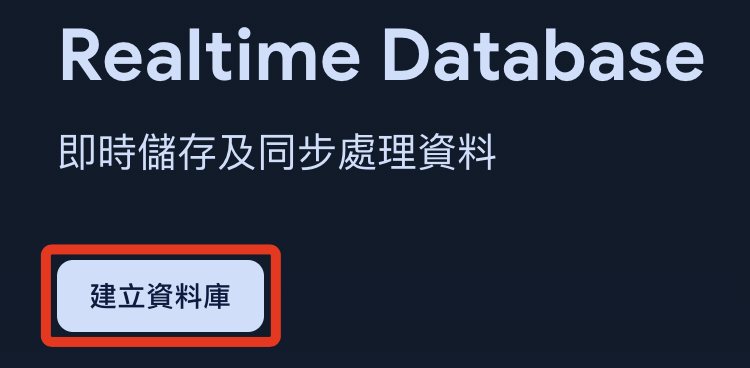
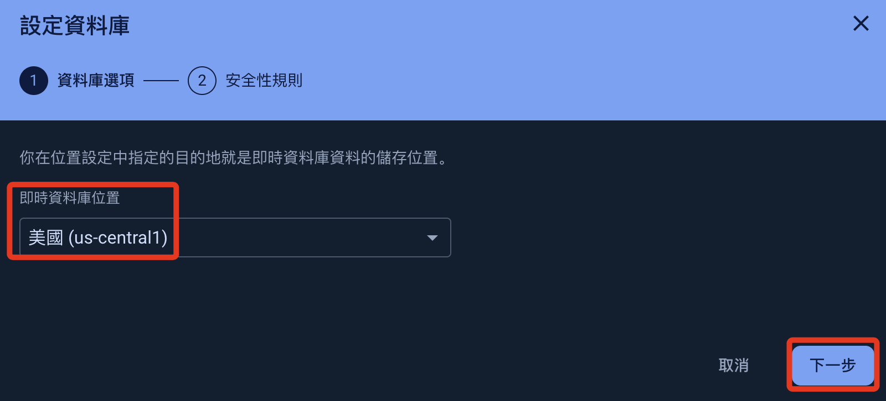
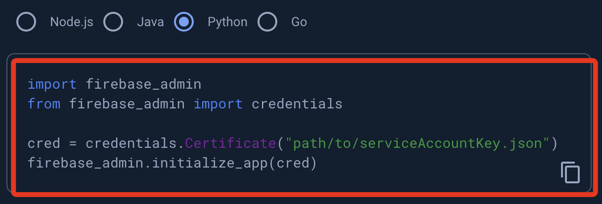
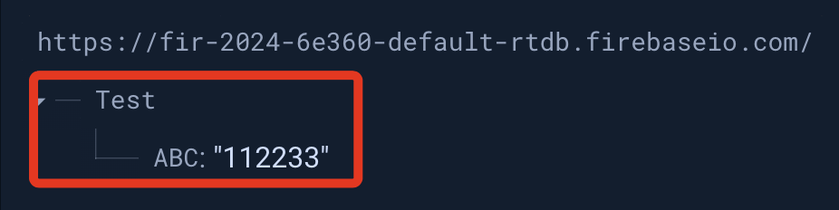

# 存入 Firebase

[Firebase 官網](https://firebase.google.com/)

<br>

## 步驟說明

1. 右上角點擊進入主控台 `console`。

    

<br>

2. 新增專案。

    

<br>

3. 自訂名稱，如 `Firebase2024`。

    

<br>

4. 關閉 `Analytics` 選項，然後建立專案。

    

<br>

5. 點擊繼續，完成新建專案。

    

<br>

6. 展開左側導覽中的 `建構`，點選 `Realtime Database`。

    

<br>

7. 建立資料庫。

    

<br>

8. 使用預設資料庫位置，點擊 `下一步`。

    

<br>

9. 使用預設的安全模式後 `啟用`。

    

<br>

10. 點擊 `規則`，暫時不管安全性問題，將參數設置為 `true`，並且 `發布`。

    

<br>

11. 這時會有警告訊息，暫時不予理會

    

<br>

12. 回到總覽，點擊 `專案設定`。

    

<br>

13. 切換到 `服務帳戶`，改用 `Python`，接著 `產生新的私密金鑰`。

    

<br>

14. 點擊後會下載金鑰檔案，然後暫且將這個 `.json` 檔案拖曳到專案所在目錄。

    

<br>

15. 複製畫面中範例腳本，後續將提供腳本編輯使用。

    

<br>

16. 要修改路徑及檔案名稱，因為在同層路徑，可直接貼上檔名。

    ```python
    import firebase_admin
    from firebase_admin import credentials
    # 要替換為自己的金鑰名稱
    cred = credentials.Certificate("fir-2024-6e360-firebase-adminsdk-16wwf-d2983e1f68.json")
    firebase_admin.initialize_app(cred)
    ```

<br>

17. 點擊右上方 `文件` 查看官方說明。

    

<br>

18. 選取 `建構`，點擊 `Realtime Database`。

    

<br>

19. 建議切換到英文介面比較清楚。

    

<br>

20. 選擇 `Admin`，然後從 `Get Started` 開始。

    

<br>

21. 滑動到下方，切換到 `Python`。

    

<br>

22. 複製並修改範例腳本如下。

```python
import firebase_admin
from firebase_admin import credentials
from firebase_admin import db

# 更換為自己的金鑰檔案名稱
cred = credentials.Certificate(
    'fir-2024-6e360-firebase-adminsdk-16wwf-d2983e1f68.json'
)
# 下面這個網址要更換為自己的，在後面步驟會進行查詢
firebase_admin.initialize_app(
    cred, {
    'databaseURL': 'https://databaseName.firebaseio.com'
})
# 這是資料庫節點，查看後續引導
ref = db.reference('restricted_access/secret_document')
print(ref.get())
```

<br>

23. 回到資料庫去複製資料庫網址。

    

<br>

24. 替換腳本中的網址。

    

<br>

25. 在 Firebase 資料庫中任意添加一個節點來測試連線。

    

<br>

26. 修改腳本來進行連線測試。

    ```python
    import firebase_admin
    from firebase_admin import credentials
    from firebase_admin import db

    #
    cred = credentials.Certificate(
        'fir-2024-6e360-firebase-adminsdk-16wwf-d2983e1f68.json'
    )
    #
    firebase_admin.initialize_app(
        cred, {
        'databaseURL': 'https://fir-2024-6e360-default-rtdb.firebaseio.com/'
    })

    #
    ref = db.reference('Test/ABC')
    print(ref.get())
    ```

<br>

27. 回傳自訂的內容 `112233` 表示正確讀取節點資訊。

    

<br>

待續