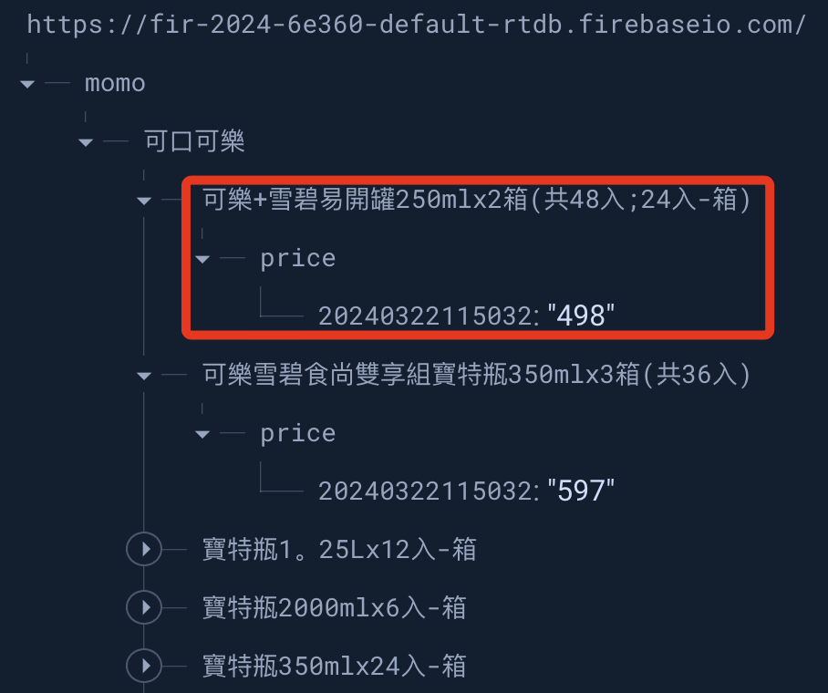

# Firebase Part II

_以下腳本必須合併 `02_爬蟲 Part 1` 的腳本內容來執行，並將查詢結果上傳到雲端資料庫。_

<br>

## 步驟說明

1. 延續之前的專案，將網站取得的資料寫入 Firebase 資料庫中，並指定主節點為 `momo`，以下腳本會使用到已經宣告過的 `_keyword` 變數，所以使用複製貼上的時候要注意程式碼的排序。

    ```python
    # Firebase 庫
    import firebase_admin
    from firebase_admin import credentials
    # db 是 Realtime Database 預設庫，注意相關物件命名不要重複
    from firebase_admin import db

    # 金鑰
    CredFile = 'fir-2024-6e360-firebase-adminsdk-16wwf-d2983e1f68.json'
    # 資料庫網址
    StorageBucket = 'https://fir-2024-6e360-default-rtdb.firebaseio.com/'

    # 初始化：先檢查 Firebase app 是否已經初始化
    if not firebase_admin._apps:
        cred = credentials.Certificate(CredFile)
        firebase_admin.initialize_app(cred, {
            'storageBucket': StorageBucket, # 這是 Firestore 服務，這裡並未使用
            'databaseURL': StorageBucket    # 所以先使用一樣的網址無妨
        })
    # 最上層節點
    refData = db.reference('momo').child(_keyword)
    # 自訂函數：寫入 Firebase
    def writeToFirebaseDB(_ref, _key, _value):
        try:
            _ref.update({_key: _value})
        except:
            # 實際上發生錯誤時應該中止或跳出程序
            print('發生錯誤')
    ```

<br>

2. 建立時間戳，用於寫入資料庫使用。

    ```python
    # 取得時間
    # 時區
    tz = dateutil.tz.gettz('Asia/Taipei')
    # 時間字串
    _info_time = datetime.datetime.now(tz).strftime("%Y%m%d%H%M%S")
    ```

<br>

3. 上傳，特別注意這部分要在瀏覽器關閉的語法 `chrome.quit()` 之前。

    ```python
    _datas = {}
    #
    for i in range(_count):
        _i = str(i+1)
        #
        xpath_name = f"/html/body/div[@id='BodyBase']/div[@class='bt_2_layout searchbox searchListArea selectedtop']/div[@class='searchPrdListArea bookList']/div[@id='columnType']/ul[@class='clearfix']/li[{_i}]/a[@class='goodsUrl']/div[@class='prdInfoWrap']/div[@class='prdNameTitle']/h3[@class='prdName']"
        xpath_info = f"/html/body/div[@id='BodyBase']/div[@class='bt_2_layout searchbox searchListArea selectedtop']/div[@class='searchPrdListArea bookList']/div[@id='columnType']/ul[@class='clearfix']/li[{_i}]/a[@class='goodsUrl']/div[@class='prdInfoWrap']/p[@class='sloganTitle']"
        xpath_price = f"/html/body/div[@id='BodyBase']/div[@class='bt_2_layout searchbox searchListArea selectedtop']/div[@class='searchPrdListArea bookList']/div[@id='columnType']/ul[@class='clearfix']/li[{_i}]/a[@class='goodsUrl']/div[@class='prdInfoWrap']/p[@class='money']/span[@class='price']/b"

        #
        _name = chrome.find_element(By.XPATH, xpath_name)
        _info = chrome.find_element(By.XPATH, xpath_info)
        _price = chrome.find_element(By.XPATH, xpath_price)
        # 處理字串
        _string = _name.text
        # 找到 括號 在第幾個字元
        _index = _string.find('】') + 1
        # 產品名稱從下一個字元開始擷取
        _string = _string[_index:]
        # 刪除字串所有的空白字元
        _string = _string.replace(" ", "")
        _string = _string.replace("/", "-")
        _string = _string.replace(".", "。")
        # 輸出看一下
        print(_string)
        print(_info.text)
        print(_price.text)
        print()
        # 下面就是要寫入 firebase 的部分
        #
        _node_product = refData.child(_string).child('price')
        #
        _str_price = _price.text
        writeToFirebaseDB(_node_product, _info_time, _str_price)
    ```

<br>

3. 最後會關閉瀏覽器。

    ```python
    chrome.quit()
    ```

<br>

4. 結果，在主節點 `momo` 下逐一將商品寫入，在價格 `price` 節點之下，以時間戳作為 `key`，然後將價格以 `value` 寫入。

    

<br>

## 程式碼

<br>

1. 完整程式碼。

    ```python
    '''
    1. 導入庫
    '''
    # selenium 相關庫
    from selenium import webdriver
    from selenium.webdriver.chrome.options import Options
    from selenium.webdriver.common.by import By
    from selenium.webdriver import Chrome
    # 處理時間戳
    import datetime
    import dateutil.tz
    import time
    # Firebase 庫
    import firebase_admin
    from firebase_admin import credentials
    # db 是 Realtime Database 預設庫，注意相關物件命名不要重複
    from firebase_admin import db

    '''
    2. 常數
    '''
    # 關鍵字
    _keyword = '可口可樂'
    # 網址
    URL = f'https://www.momoshop.com.tw/search/searchShop.jsp?keyword={_keyword}&searchType=1&curPage=1&_isFuzzy=0&showType=chessboardType&isBrandCategory=N&serviceCode=MT01'
    # 金鑰
    CredFile = 'fir-2024-6e360-firebase-adminsdk-16wwf-d2983e1f68.json'
    # 資料庫網址
    StorageBucket = 'https://fir-2024-6e360-default-rtdb.firebaseio.com/'

    '''
    3. 取得時間
    '''
    # 時區
    tz = dateutil.tz.gettz('Asia/Taipei')
    # 時間字串
    _info_time = datetime.datetime.now(tz).strftime("%Y%m%d%H%M%S")

    '''
    4. Firebase
    '''
    # 初始化：先檢查 Firebase app 是否已經初始化
    if not firebase_admin._apps:
        cred = credentials.Certificate(CredFile)
        firebase_admin.initialize_app(cred, {
            'storageBucket': StorageBucket, # 這是 Firestore 服務，這裡並未使用
            'databaseURL': StorageBucket    # 所以先使用一樣的網址無妨
        })
    # 最上層節點是 momo，第一個子節點是「關鍵字」
    refData = db.reference('momo').child(_keyword)

    '''
    5. 自訂函數
    '''
    # 寫入 Firebase
    def writeToFirebaseDB(_ref, _key, _value):
        try:
            _ref.update({_key: _value})
        except:
            # 實際上發生錯誤時應該中止或跳出程序
            print('發生錯誤')

    '''
    6. 瀏覽程式
    '''
    # 假如有任何設定，可透過 Option 物件調用方法進行
    options = Options()
    # 禁用通知
    options.add_argument("--disable-notifications")
    # 使用 options
    chrome = Chrome(options)
    chrome.get(URL)

    # 啟用無頭模式
    options.add_argument("--headless")
    # 禁用GPU加速，某些情況下可以提高兼容性
    options.add_argument("--disable-gpu")

    # 要點擊按鍵的 XPATH
    _button_xpath = "/html/body/div[@id='BodyBase']/div[@class='bt_2_layout searchbox searchListArea selectedtop']/div[@class='searchPrdListArea bookList']/section[@class='menuArea']/div[@class='viewType']/label[@class='columnType']"
    # 透過 XPATH 取得按鍵
    button_list = chrome.find_element(By.XPATH, _button_xpath)
    # 點擊
    button_list.click()

    # 數量的 XPATH
    _xpath_count = "/html/body/div[@id='BodyBase']/div[@class='bt_2_layout searchbox searchListArea selectedtop']/div[@class='pageArea topPage']/dl/dt/span[@class='totalTxt']/b" 
    # 找到按鈕
    _count = chrome.find_element(By.XPATH, _xpath_count)
    # 點擊
    _count = int(_count.text)
    # 可輸出看一下
    print(_count)

    if _count > 30:
        _count = 30

    # 建立一個 Dict 來存放結果
    _datas = {}
    # 依據資料筆數進行遍歷
    for i in range(_count):
        _i = str(i+1)
        # 商品名稱的 XPATH
        xpath_name = f"/html/body/div[@id='BodyBase']/div[@class='bt_2_layout searchbox searchListArea selectedtop']/div[@class='searchPrdListArea bookList']/div[@id='columnType']/ul[@class='clearfix']/li[{_i}]/a[@class='goodsUrl']/div[@class='prdInfoWrap']/div[@class='prdNameTitle']/h3[@class='prdName']"
        # 新版改用 Slogan Title，但變數名暫時不變
        xpath_info = f"/html/body/div[@id='BodyBase']/div[@class='bt_2_layout searchbox searchListArea selectedtop']/div[@class='searchPrdListArea bookList']/div[@id='columnType']/ul[@class='clearfix']/li[{_i}]/a[@class='goodsUrl']/div[@class='prdInfoWrap']/p[@class='sloganTitle']"
        # 商品價格
        xpath_price = f"/html/body/div[@id='BodyBase']/div[@class='bt_2_layout searchbox searchListArea selectedtop']/div[@class='searchPrdListArea bookList']/div[@id='columnType']/ul[@class='clearfix']/li[{_i}]/a[@class='goodsUrl']/div[@class='prdInfoWrap']/p[@class='money']/span[@class='price']/b"
        # 找到資料
        _name = chrome.find_element(By.XPATH, xpath_name)
        _info = chrome.find_element(By.XPATH, xpath_info)
        _price = chrome.find_element(By.XPATH, xpath_price)
        # 輸出查看
        print(_name.text)
        print(_info.text)
        print(_price.text)


    '''
    7. 遍歷資料並寫入 Firebase
    '''
    _datas = {}
    #
    for i in range(_count):
        _i = str(i+1)
        #
        xpath_name = f"/html/body/div[@id='BodyBase']/div[@class='bt_2_layout searchbox searchListArea selectedtop']/div[@class='searchPrdListArea bookList']/div[@id='columnType']/ul[@class='clearfix']/li[{_i}]/a[@class='goodsUrl']/div[@class='prdInfoWrap']/div[@class='prdNameTitle']/h3[@class='prdName']"
        xpath_info = f"/html/body/div[@id='BodyBase']/div[@class='bt_2_layout searchbox searchListArea selectedtop']/div[@class='searchPrdListArea bookList']/div[@id='columnType']/ul[@class='clearfix']/li[{_i}]/a[@class='goodsUrl']/div[@class='prdInfoWrap']/p[@class='sloganTitle']"
        xpath_price = f"/html/body/div[@id='BodyBase']/div[@class='bt_2_layout searchbox searchListArea selectedtop']/div[@class='searchPrdListArea bookList']/div[@id='columnType']/ul[@class='clearfix']/li[{_i}]/a[@class='goodsUrl']/div[@class='prdInfoWrap']/p[@class='money']/span[@class='price']/b"

        #
        _name = chrome.find_element(By.XPATH, xpath_name)
        _info = chrome.find_element(By.XPATH, xpath_info)
        _price = chrome.find_element(By.XPATH, xpath_price)
        # 處理字串
        _string = _name.text
        # 找到 括號 在第幾個字元
        _index = _string.find('】') + 1
        # 產品名稱從下一個字元開始擷取
        _string = _string[_index:]
        # 刪除字串所有的空白字元
        _string = _string.replace(" ", "")
        _string = _string.replace("/", "-")
        _string = _string.replace(".", "。")
        # 輸出看一下
        print(_string)
        print(_info.text)
        print(_price.text)
        print()
        # 下面就是要寫入 firebase 的部分
        # 以商品名稱作為節點，第二個子節點是「時間」，節點的值是「價格」
        _node_product = refData.child(_string).child('price')
        # 價格字串轉數字
        _str_price = _price.text
        # 調用自訂函數
        writeToFirebaseDB(_node_product, _info_time, _str_price)

    # 關閉瀏覽器
    chrome.quit()
    ```

<br>

_以上演繹將查詢的資料寫入雲端資料庫_

___

_END_