# 網站部署

_部署到 Firebase Hosting_

<br>

## 步驟

1. 進入桌面。

    ```bash
    cd ~/Desktop
    ```

<br>

2. 安裝 CLI 工具。

    ```bash
    sudo npm -g install firebase-tools
    ```

<br>

3. 建立並進入專案資料夾。

    ```bash
    mkdir MyWeb2024 && cd MyWeb2024
    ```

<br>

4. 登入 Google 帳號。

    ```bash
    firebase login
    ```

<br>

5. 輸入 `y` 按下 `ENTER` 。

    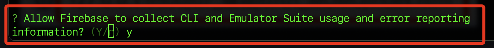

<br>

6. 逐步都 `允許`，就會看到登入完成畫面。

    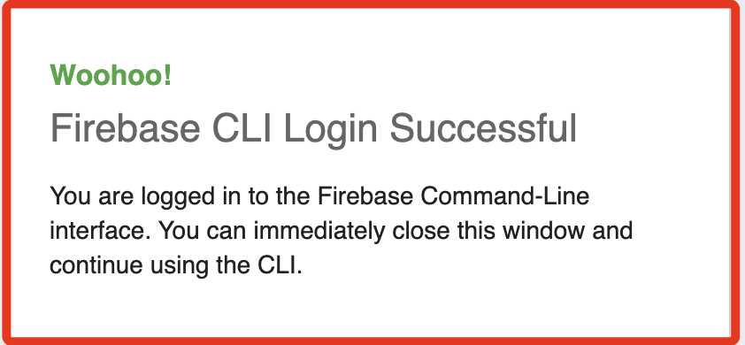

<br>

7. 假如需要切換帳號，先登出當前帳號。

    ```bash
    firebase logout
    ```

<br>

8. 初始化專案環境。

    ```bash
    firebase init
    ```

<br>

9. 使用上下鍵加空白鍵選取 `Hosting：Configure files for Firebase Hosting and set up GitHub Action deploys`，選好後按下 `ENTER`。

    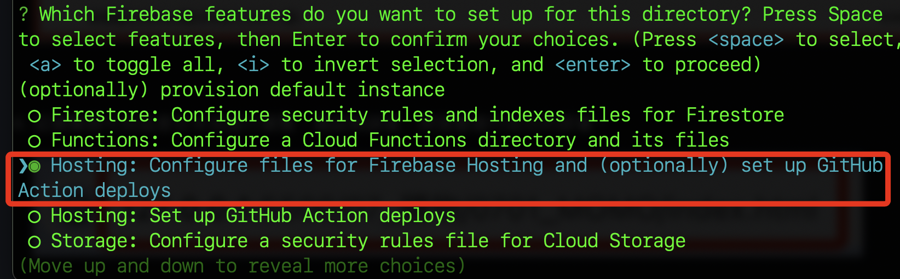

<br>

10. 選取之前步驟所建立的專案。

    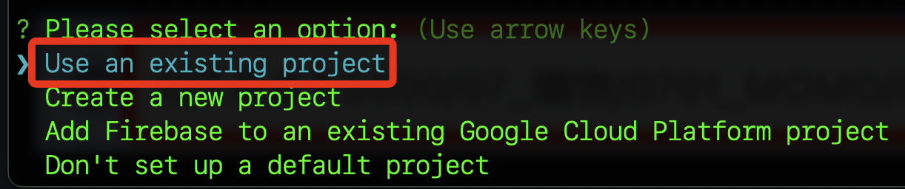

<br>

11. 找到前步驟建立的專案。

    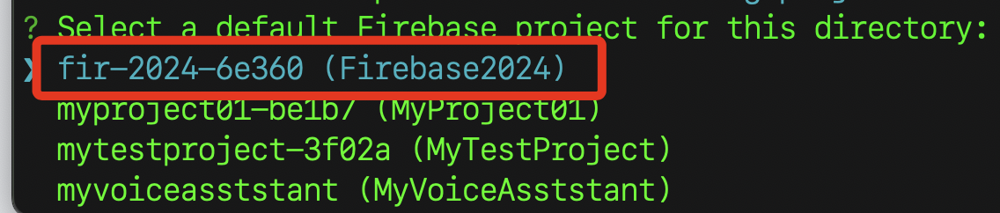

<br>

12. 這個步驟詢問主頁要存放的資料夾，使用預設的 `public` 即可。

    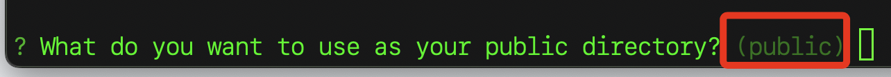

<br>

13. 接著詢問是否建立一個新的 `index.html` 文件，因為這是全新的專案，所以輸入 `y` 即可。

    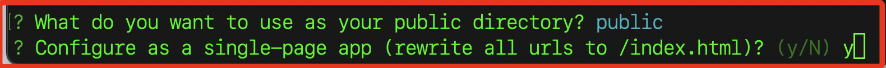

<br>

14. 暫時不用設定 `Github` 相關自動化的內容。

    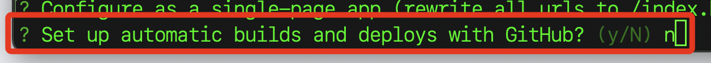

<br>

15. 顯示設定完成。

    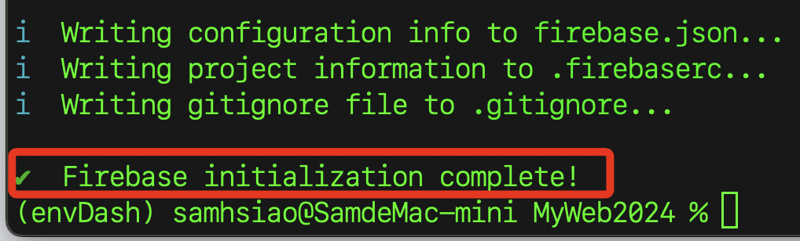

<br>

16. 可透過 `ls -al` 指令觀察資料夾內的文件。

    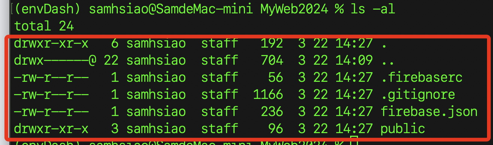

<br>

17. 直接輸入 `code .` 指令開啟 VSCode 進行編輯。

    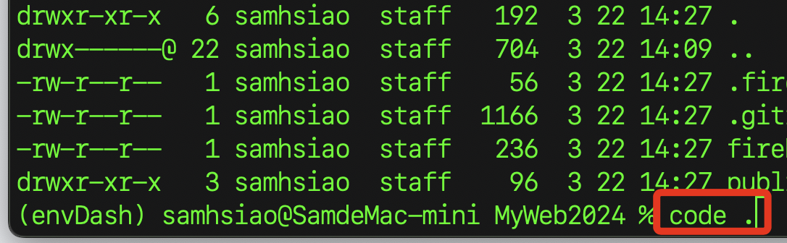

<br>

18. 透過 `Live Server` 插件瀏覽預設的 `index.html` 文件內容。

    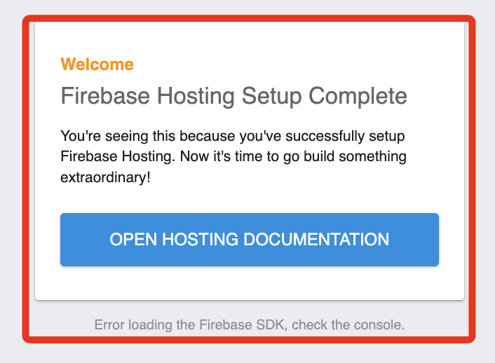

<br>

19. 接下來要用之前建立的專案來覆蓋，在此之前先將之前範例使用的金鑰名稱貼到專案資料夾內的 `.gitignore` 中，這是避免接下來誤將敏感檔案部署到雲端。

    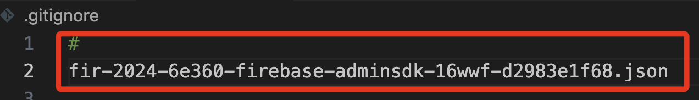

<br>

20. 加入例外清單後，再將金鑰檔案拖曳複製到 `public` 資料夾。

    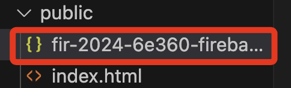

<br>

21. 將之前的 `index.html` 內容複製並覆蓋範例文件內容，再次進行瀏覽，會看到之前專案的顯示內容，確認無誤後便可以進行部署。

    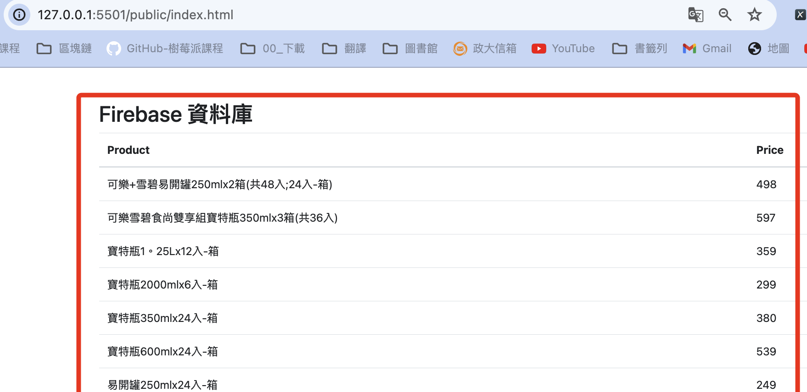

<br>

22. 進入終端機，進行部署。

    ```bash
    firebase deploy
    ```

<br>

23. 完成時會顯示專案網頁的公網網址 [https://fir-2024-6e360.web.app/](https://fir-2024-6e360.web.app/)。

    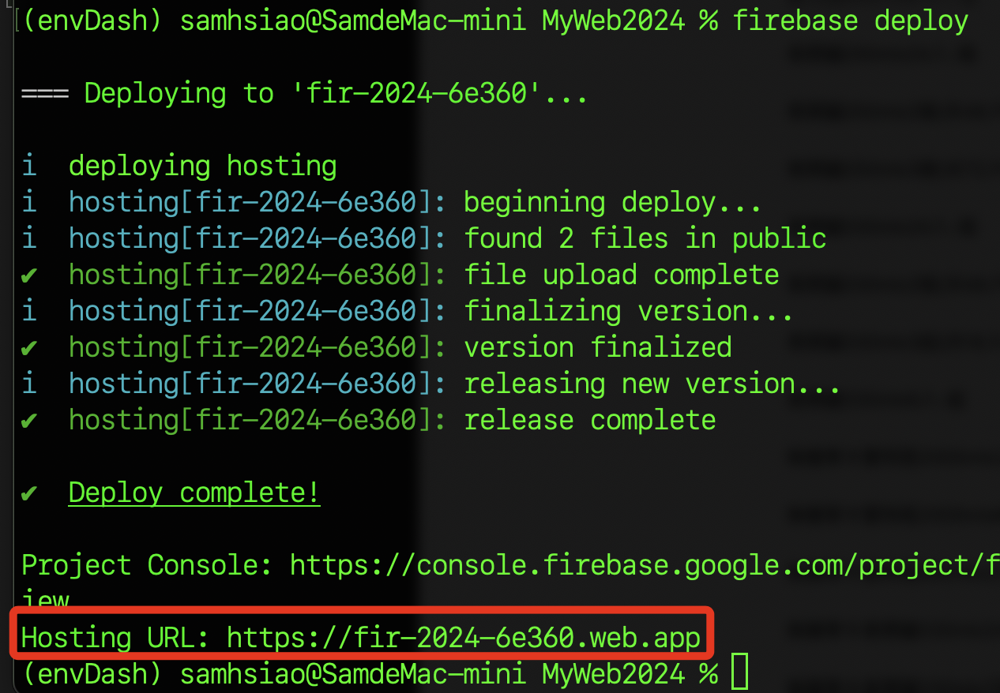

<br>

24. 使用瀏覽器進行瀏覽。

    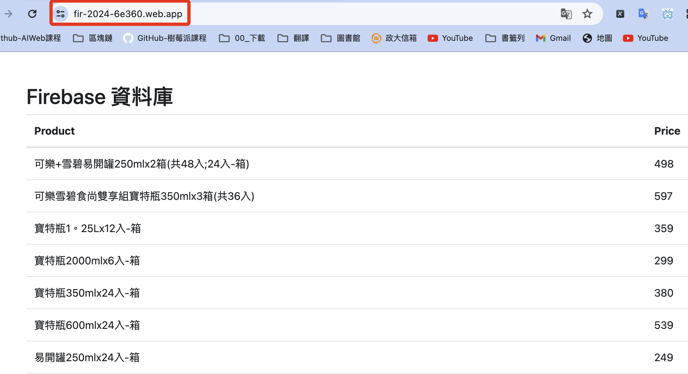

<br>

25. 為了觀察 `即時資料庫` 與 `動態網頁` 間的互動，手動修改資料庫內容，觀察網頁的即時變化。

    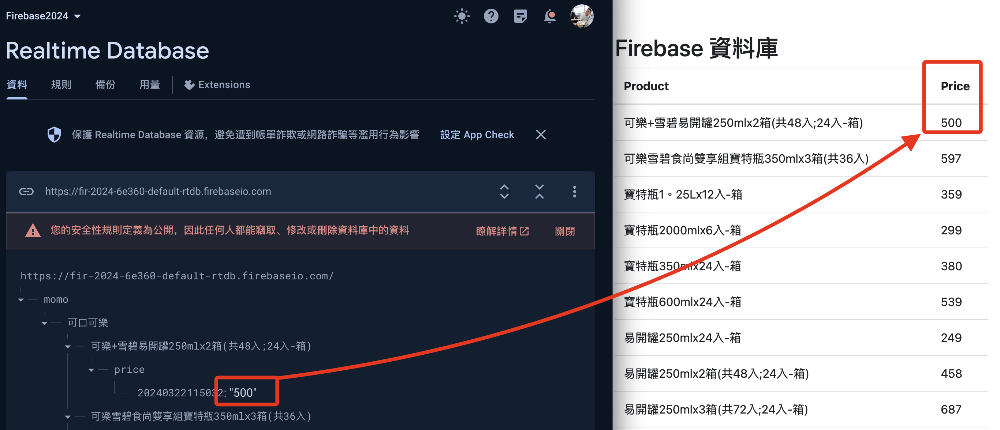

<br>

_以上完成動態網頁的製作與部署_

___

_END_