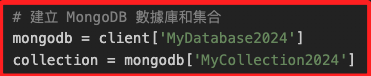
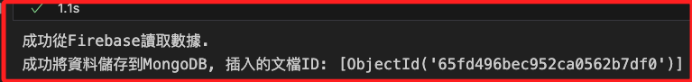
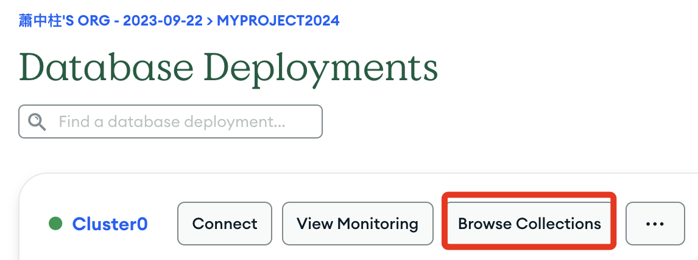
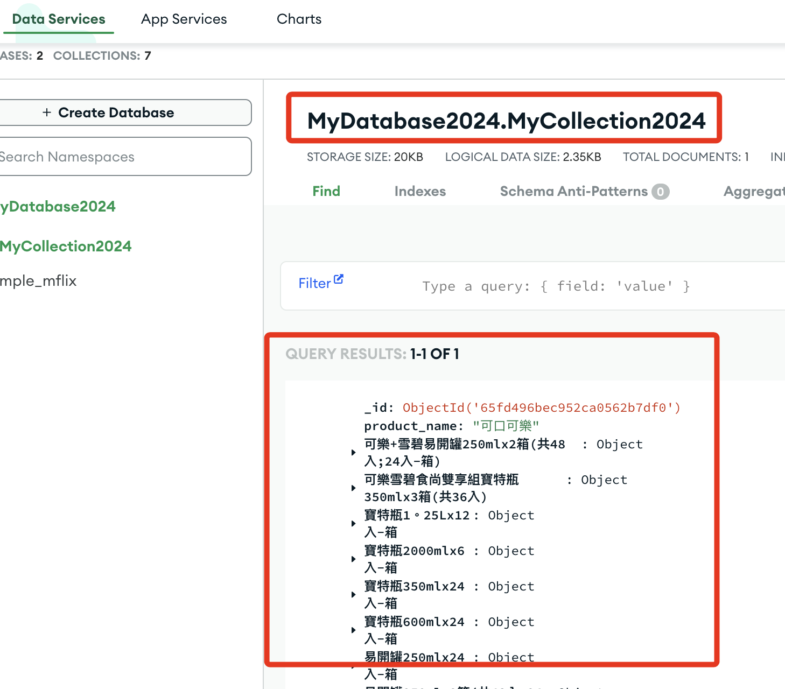

# 上傳到 MongoDB

_讀取 Firebase 節點上的資料，然後寫入 MongoDB_

<br>

## 腳本說明

1. 使用前一個小節的官方範例，並結合之前的 `MOMO` 購物網查詢腳本，先導入 `Firebase` 相關庫、讀取節點上的購物資訊，然後寫入 `MongoDB` 資料庫中。

<br>

2. 以下要自定義 `MongoDB` 的資料庫（Database）名稱以及集合（Collection）名稱，同學可自行定義。

    

<br>
   
3. 完整腳本。

    ```python
    # 導入庫
    from pymongo.mongo_client import MongoClient
    import firebase_admin
    from firebase_admin import credentials, db

    # Firebase初始化
    cred = credentials.Certificate('fir-2024-6e360-firebase-adminsdk-16wwf-d2983e1f68.json')
    firebase_admin.initialize_app(cred, {
        'databaseURL': 'https://fir-2024-6e360-default-rtdb.firebaseio.com/'
    })

    # MongoDB 連接設定
    uri = "mongodb+srv://<輸入自己的帳號>:<輸入自己的密碼>@cluster0.yhwvqqt.mongodb.net/?retryWrites=true&w=majority&appName=Cluster0"
    client = MongoClient(uri)

    # 建立 MongoDB 數據庫和集合
    mongodb = client['MyDatabase2024']
    collection = mongodb['MyCollection2024']

    # 從Firebase讀取數據
    ref = db.reference('momo')
    momo_data = ref.get()

    # 檢查是否成功獲取數據
    if momo_data:
        print("成功從Firebase讀取數據.")
        # 將數據存儲到MongoDB
        try:
            result = collection.insert_many([{'product_name': key, **value} for key, value in momo_data.items()])
            print(f"成功將資料儲存到MongoDB, 插入的文檔ID: {result.inserted_ids}")
        except Exception as e:
            print(f"將數據存儲到MongoDB時發生錯誤: {e}")
    else:
        print("從Firebase讀取數據失敗或數據為空.")

    # 關閉MongoDB連接
    client.close()
    ```

<br>

4. 複製以上腳本，貼在 `Jupyter NB` 運行後，可顯示以下訊息，其中 `Objectid` 就是寫入資料庫的文檔 ID。

    

<br>

5. 進入 `MongoDB` 官網進行觀察。

    

<br>

6. 點擊 `Browse Collections` 接著會顯示資料內容。

    

<br>

_以上完成資料寫入 MongoDB 資料庫_

___


_END_