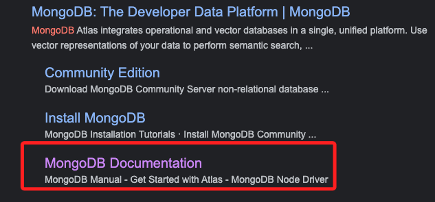
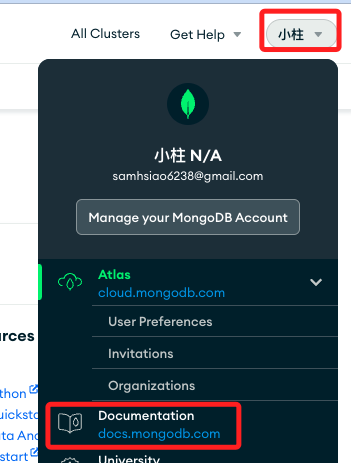
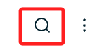
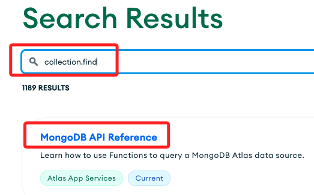
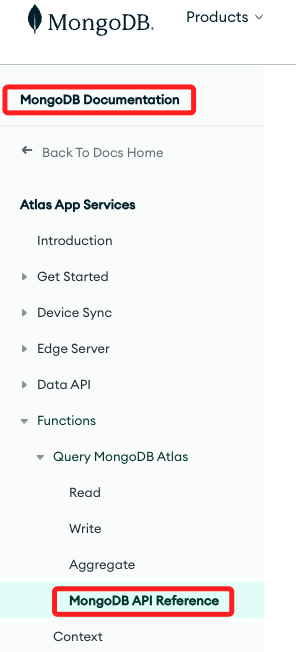
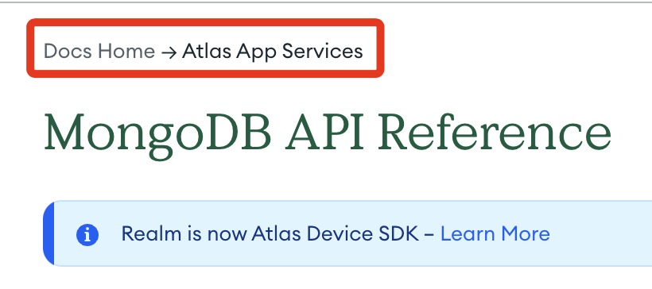
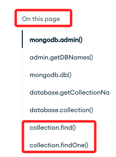
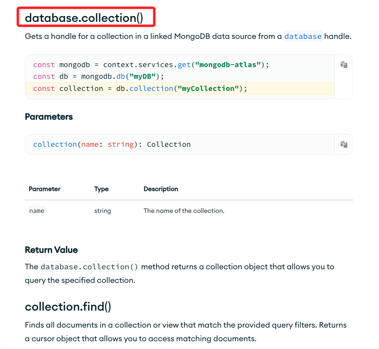
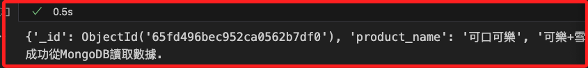

# 從 MongoDB 讀取資料

<br>

## 關於文件查詢

_以下說明如何查詢文件_

<br>

1. 在瀏覽器中搜尋 `mongodb`，點擊進入[文件](https://www.mongodb.com/docs/)。

    

<br>

2. 或是在官網內選取 `文件`。
    
    

<br>

3. 點擊放大鏡搜尋。

    

<br>

4. 使用關鍵字 `collecxtion.find` 進行查詢。
    
    

<br>

5. 從左側可看到資料的位置在 `MongoDB API Reference`。
    
    

<br>

6. 中間可查看內容，位置在 `Docs Home` 的 `Atlas App Services`。

    

<br>

7. 從右側導覽中可以看到相關函數。

    

<br>

8. 點擊後便可以查看詳細的語法說明與範例。

    

<br>

## 腳本

<br>

1. 完整腳本。

    ```python
    # 導入庫
    from pymongo.mongo_client import MongoClient

    # MongoDB 連接設定
    uri = "mongodb+srv://<輸入自己的帳號>:<輸入自己的密碼>@cluster0.yhwvqqt.mongodb.net/?retryWrites=true&w=majority&appName=Cluster0"
    client = MongoClient(uri)

    # 建立 MongoDB 數據庫和集合
    mongodb = client['MyDatabase2024']
    collection = mongodb['MyCollection2024']

    # 從 MongoDB 讀取數據
    try:
        documents = collection.find({})
        for document in documents:
            print(document)
        print("成功從MongoDB讀取數據.")
    except Exception as e:
        print(f"從MongoDB讀取數據時發生錯誤: {e}")

    # 關閉 MongoDB 連接
    client.close()
    ```

<br>

2. 會顯示如下結果。

    

<br>

___


_END_