# 基礎

_建置中_

<br>

## 說明

1. 開啟 [591 租屋網](https://rent.591.com.tw/)

    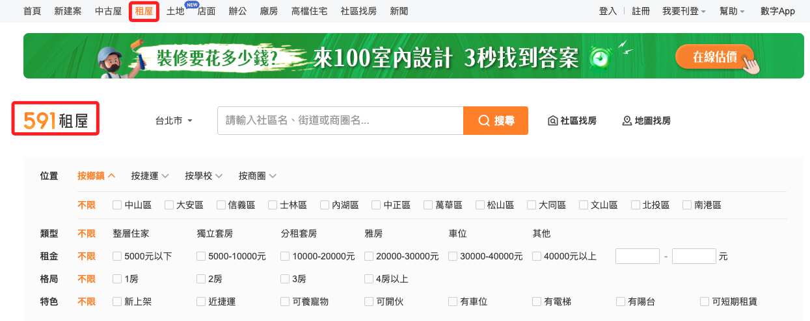

<br>

2. 使用 `F12` 開啟 `檢查` 模式視窗。

    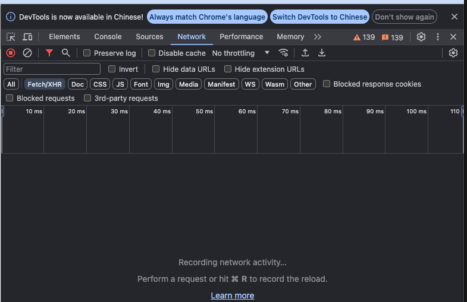

<br>

3. 預設是 `台北市`，這也是搜尋條件之一，所以也要觀察一下。

    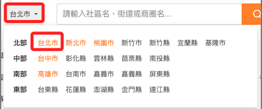

<br>

4. 在 `檢查` 視窗中，依序點擊 `Network`、`Fetch/XHR`，然後在左側視窗中選取 `rsList` 開頭的結果，其中搜尋條件就是 `Request URL` 中所顯示的個參數。

    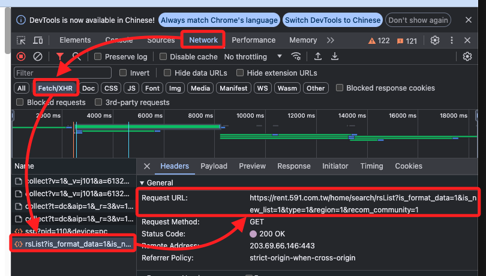

<br>

5. 可對其他結果點擊查看，分別是瀏覽或 GA 統計資訊。

    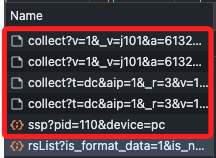

<br>

6. 點擊各種條件來觀察參數變化，其中部份條件如 `類型` 還會影響到子項目，這裡先使用 `分租套房`。

    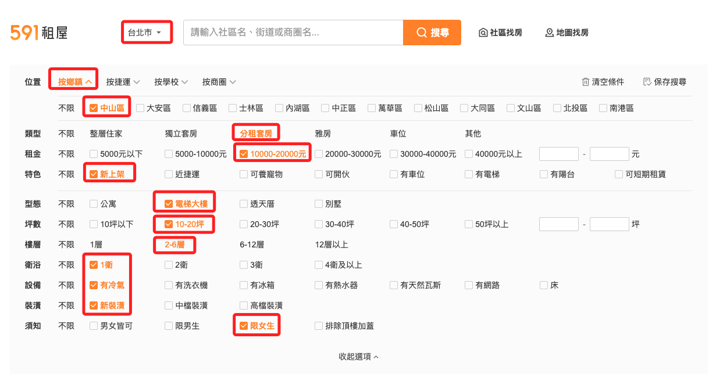

<br>

7. 觀察請求網址。

    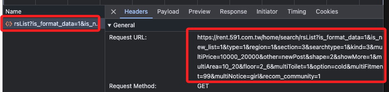

<br>

8. 可嘗試點擊各種選項來紀錄參數。

    ```python
    https://rent.591.com.tw/home/search/rsList?
    is_format_data=1&
    is_new_list=1&
    type=1&
    region=1&
    section=3&
    searchtype=1&
    kind=3&
    multiPrice=10000_20000&
    other=newPost&
    shape=2&
    showMore=1&
    multiArea=10_20&
    floor=2_6&
    multiToilet=1&
    option=cold&
    multiFitment=99&
    multiNotice=girl&
    recom_community=1
    ```

<br>

9. 列舉幾個重要的參數。

    ```markdown
    # 類型 `kind`:
    - 不限: `0`
    - 整層住家: `1`
    - 獨立套房: `2`
    - 分租套房: `3`
    - 雅房: `4`
    - 車位: `8`
    - 其他: `24`

    # 租金 `multiPrice`:
    - 5000元以下: `0_5000`
    - 5000-10000元: `5000_10000`
    - 10000-20000元: `10000_20000`
    - 20000-30000元: `20000_30000`
    - 30000-40000元: `30000_40000`
    - 40000元以上: `40000_`

    # 格局 `multiRoom`:
    - 1房: `1`
    - 2房: `2`
    - 3房: `3`
    - 4房以上: `4`

    # 特色 `other`:
    - 新上架 `newPost`
    - 近捷運 `near_subway`
    - 可養寵物 `pet`
    - 可開伙 `cook`
    - 有車位 `cartplace`
    - 有電梯 `lift`
    - 有陽台 `balcony_1`
    - 可短期租賃 `lease`

    # 型態 `shape`:
    - 公寓 `1`
    - 電梯大樓 `2`
    - 透天厝 `3`
    - 別墅 `4`

    # 坪數 `multiArea`:
    - 10坪以下 `0_10`
    - 10-20坪 `10_20`
    - 20-30坪 `20_30`
    - 30-40坪 `30_40`
    - 40-50坪 `40_50`
    - 50坪以上 `50_`

    # 樓層 `multiFloor`:
    - 1層 `0_1`
    - 2-6層 `2_6`
    - 6-12層 `6_12`
    - 12層以上 `12_`

    # 設備 `option`:
    - 有冷氣 `cold`
    - 有洗衣機 `washer`
    - 有冰箱 `icebox`
    - 有熱水器 `hotwater`
    - 有天然瓦斯 `naturalgas`
    - 有網路 `broadband`
    - 床 `bed`

    # 須知 `multiNotice`:
    - 男女皆可 `all_sex`
    - 限男生 `boy`
    - 限女生 `girl`
    - 排除頂樓加蓋 `not_cover`

    # 排序依據 `order`:
    - 發佈時間 `posttime`
    - 租金 `money`
    - 坪數 `area`

    # 排序順序 `orderType`:
    - 由小到大 `asc`
    - 由大到小 `desc`

    ```

<br>

10. 可複選的參數用 `逗號（,）` 相隔即可，例如 `格局` 可同時選取 `1房`、`2房`、`3房`。

    ```python
    &multiRoom=1,2,3
    ```

<br>

# 初步解析

1. 設定搜尋物件：台北市、中山區、1至2萬元、新上架。

    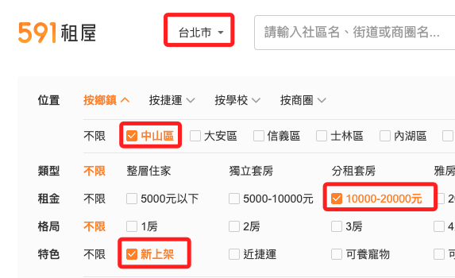

<br>

2. 可得到如下網址。

    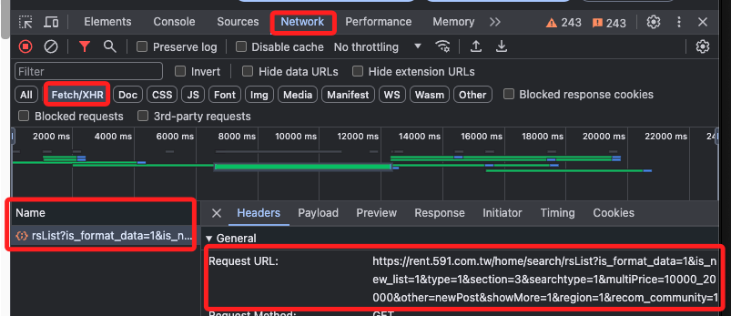

<br>

3. 複製網址備用。

    ```python
    https://rent.591.com.tw/home/search/rsList?is_format_data=1&is_new_list=1&type=1&section=3&searchtype=1&multiPrice=10000_20000&other=newPost&showMore=1&region=1&recom_community=1
    ```

<br>

4. 以 `問號（?）` 為分界將網址拆解為兩部分，兩部分都不用包含問號，參數部分改為字典（Dict）格式。

    ```python
    url = "https://rent.591.com.tw/home/search/rsList"
    params = {
        "is_format_data": "1",
        "is_new_list": "1",
        "type": "1",
        "section": "3",
        "searchtype": "1",
        "multiPrice": "10000_20000",
        "other": "newPost",
        "showMore": "1",
        "region": "1",
        "recom_community": "1"
    }
    ```

<br>

5. 綜合以上，透過 `requests` 模組的 `get()` 方法取得網頁內容。

    ```python
    import requests

    # 定義網址與參數
    url = "https://rent.591.com.tw/home/search/rsList"
    params = {
        "is_format_data": "1",
        "is_new_list": "1",
        "type": "1",
        "multiRoom": "1",
        "region": "1",
        "recom_community": "1"
    }

    # 發出 GET request
    response = requests.get(url, params=params)
    print(response.url)

    # 解析 response
    if response.status_code == 200:
        data = response.json()
    else:
        data = "Request failed with status code {}".format(response.status_code)

    # 輸出結果
    print(data)
    ```

<br>

6. 得到 `404` 的結果，這類的搜尋可能需要加入 `cookie`。

    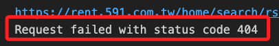

<br>

7. 開啟無痕視窗進行瀏覽，得到 `419`。

    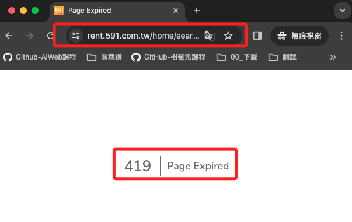

<br>

8. 這裡補充一下，可將 `Disable cache` 進行勾選用以停用瀏覽器快取，確保每次頁面加載都會從伺服器獲取最新的資源，而不使用已經儲存的快取。另外，後方 `No throttling` 使用預設值即可，這是設定網頁在不同網速下的表現，在本專案中並無需求。

    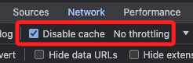

<br>

9. 可透過 `requests` 模組的 `Session()` 函數建立 `Session` 實體，這會自動儲存來自伺服器的 `cookies`。

    ```python
    # 建立 Session 實體
    s = requests.Session()
    # 網址
    url = 'https://rent.591.com.tw/'
    # 紀錄伺服器回傳的 cookie
    r = s.get(url, headers=self.headers)
    ```

<br>

## 使用 POSTMAN

_未完_