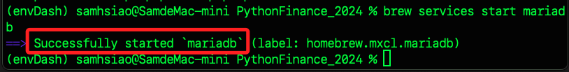
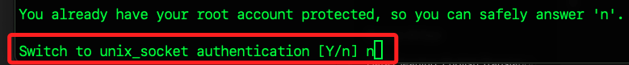
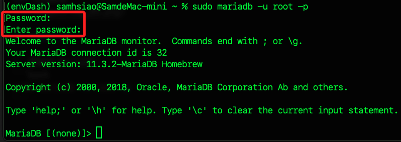
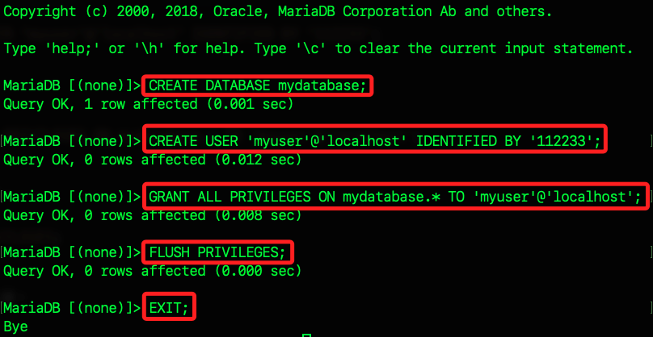
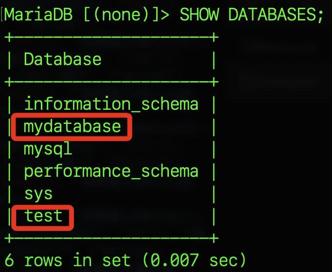
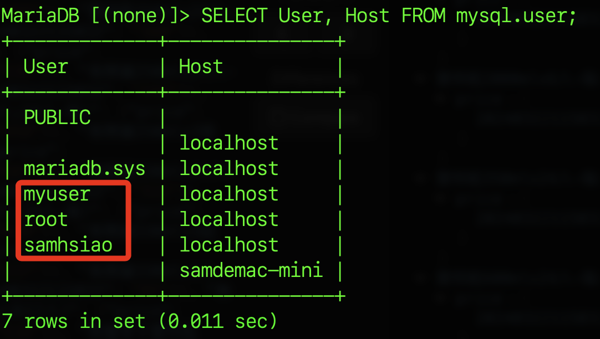

# 在 MacOS 中安裝並建立 MariaDB 服務

<br>

## 步驟

<br>

1. 安裝 Homebrew。

    ```bash
    /bin/bash -c "$(curl -fsSL https://raw.githubusercontent.com/Homebrew/install/HEAD/install.sh)"
    ```

<br>

2. 檢查安裝的版本。
    
    ```bash
    brew -v
    ```
<br>

3. 使用 Homebrew 安装 MariaDB。

    ```bash
    brew install mariadb
    ```

<br>

4. 啟動服務。

    ```bash
    brew services start mariadb
    ```

<br>

5. 會顯示成功啟動。

    

<br>

6. 接著進行安全配置，切記要使用 `sudo`。

    ```bash
    sudo mariadb-secure-installation
    ```

<br>

7. 使用預設的空白即可。

    

<br>

8. 依照指示，可直接使用 `n` 即可。

    

<br>

9. 不用修改密碼，也就是空白。

    

<br>

10. 自己的電腦都自己在用，所以也不用移除匿名帳號。

    

<br>

11. 不要禁用遠程，也就是允許遠程連線。

    

<br>

12. 預設有一個測試資料庫，保留即可。

    

<br>

13. 設定完成後重新加載授權設定，此外，每次若有更新使用者資訊，也都要進行授權的重新載入。

    

<br>

14. 完成設定。

    

<br>

## 設置資料庫

<br>

1. 登錄到 MariaDB。

    ```bash 
    sudo mariadb -u root -p
    ```

<br>

2. 執行指令後會詢問兩次密碼，第一次是 `sudo` 的使用者密碼，第二次是 root 的密碼，也就是空白 `ENTER`，這樣便進入了資料庫。

    

<br>

3. 建立資料庫。

    ```bash
    CREATE DATABASE mydatabase;
    ```

<br>

4. 建立用戶 `myuser`，並設置密碼 `112233`。

    ```bash
    CREATE USER 'myuser'@'localhost' IDENTIFIED BY '112233';
    ```

<br>

5. 授權。

    ```bash
    GRANT ALL PRIVILEGES ON mydatabase.* TO 'myuser'@'localhost';
    ```

<br>

6. 刷新授權。

    ```bash
    FLUSH PRIVILEGES;
    ```

<br>

7. 退出資料庫。

    ```bash
    EXIT;
    ```

<br>

8. 以上程序顯示如下。

    

<br>

9. 查詢當前資料庫。

    ```bash
    SHOW DATABASES;
    ```

<br>

10. 前面步驟建立的 `mydatabase` 以及預設的測試資料庫 `test` 如下。

    

<br>

11. 查詢當前使用者。

    ```bash
    SELECT User, Host FROM mysql.user;
    ```

<br>

12. 包含前面步驟建立的 `myuser`、預設的 `root`、原本的使用者帳號 `samhsiao`。

    

<br>

---

_以上為基礎步驟_