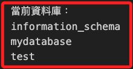
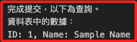

# 使用 Python 控制

<br>

## 準備工作

1. 安裝庫。

    ```bash
    pip install mariadb
    ```

<br>

## 查詢當前資料庫

<br>

1. 完整腳本：查詢當前資料庫。

    ```python
    # 導入庫
    import mariadb

    try:
        # 建立連線，這裡因為要查詢當前資料庫，所以不用加入 database 參數
        conn = mariadb.connect(
            user="myuser",
            password="112233",
            host="localhost",
            port=3306,
        )
    except mariadb.Error as e:
        print(f"連線 MariaDB 發生錯誤: {e}")
        # 強制退出程序
        exit(1)

    # 建立 cursor
    cur = conn.cursor()

    # 執行資料庫操作
    cur.execute("SHOW DATABASES;")

    # 當前資料庫
    print("當前資料庫：")
    for (database_name,) in cur:
        print(database_name)

    # 關閉連線
    conn.close()
    ```

<br>

2. 顯示查詢結果。

    

<br>

## 建立資料表

<br>

1. 完整腳本。

    ```python
    import mariadb

    try:
        conn = mariadb.connect(
            user="myuser",
            password="112233",
            host="localhost",
            port=3306,
            # 指定資料庫
            database="mydatabase"
        )
    except mariadb.Error as e:
        print(f"連線 MariaDB 發生錯誤: {e}")
        exit(1)

    # 建立 cursor
    cur = conn.cursor()

    # 資料庫語法：建立資料表
    cur.execute("CREATE TABLE IF NOT EXISTS mytable (id INT PRIMARY KEY AUTO_INCREMENT, name VARCHAR(255))")

    # 資料庫語法：插入一筆數據
    cur.execute("INSERT INTO mytable (name) VALUES ('Sample Name')")

    # 提交
    conn.commit()

    print('完成提交，以下為查詢。')

    # 資料庫語法：查詢
    cur.execute("SELECT id, name FROM mytable")

    print("資料表中的數據：")
    for (id, name) in cur:
        print(f"ID: {id}, Name: {name}")

    # 關閉連線
    conn.close()
    ```

<br>

3. 結果顯示，並可嘗試多次執行，就會顯示多筆資料，資料庫的資料是可以重複的，但每一筆資料會有一個 `id`。

    

<br>