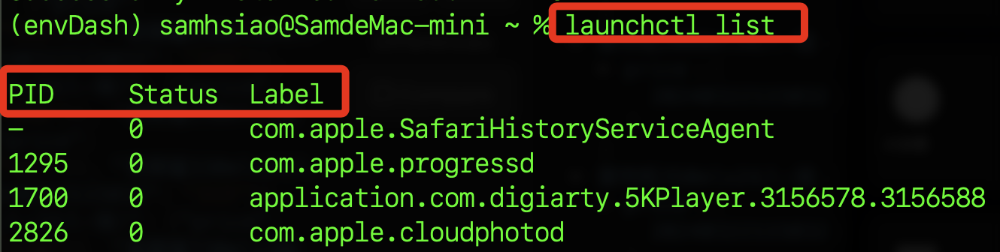
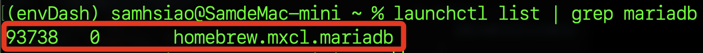
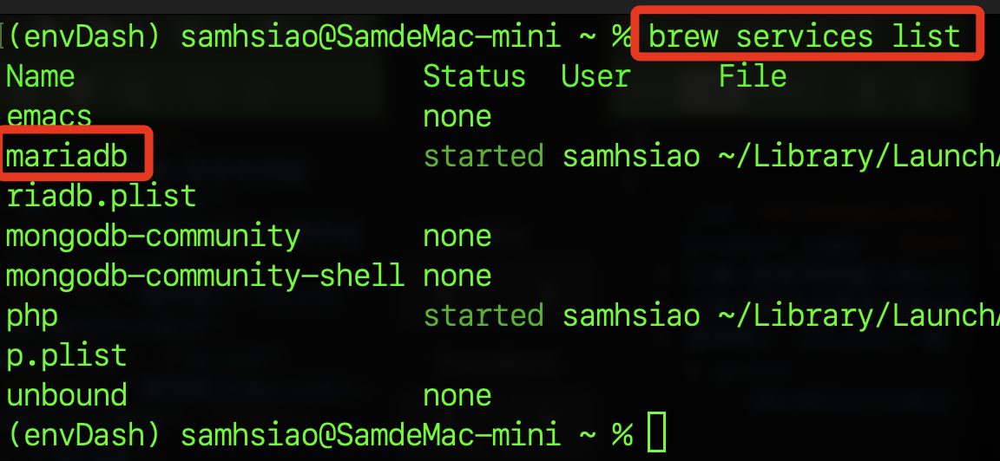
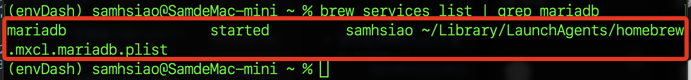
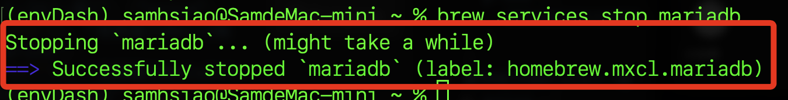
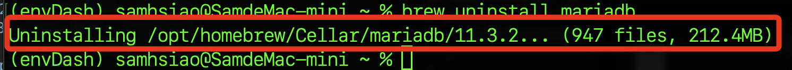

# Linux 其他操作

<br>

## 列出所有已經載入的服務

<br>

1. 指令。

    ```bash
    launchctl list
    ```

<br>

2. 顯示結果，每一列代表一個服務進程，`PID` 是進程代碼，`status` 代表服務的最後一個狀態，結果 `0` 表示成功執行，`label` 代表服務的標籤名稱。

    

<br>

## 查詢指定服務的當前狀態

<br>

1. 指令，以 `mariadb` 服務為例。

    ```bash
    launchctl list | grep mariadb
    ```

<br>

2. 結果。

    

<br>

## 列出透過 Homebrew 安裝並管理的服務

1. 指令。

    ```bash
    brew services list
    ```

<br>

2. 結果，可以看到前面安裝的 `mariadb`。

    

<br>

## 檢查 Homebrew 管理的指定服務的狀態

1. 指令。

    ```bash
    brew services list | grep mariadb
    ```

<br>

2. 結果。

    

<br>

## 卸載服務

1. 停止運行。

    ```bash
    brew services stop mariadb
    ```

<br>

2. 顯示訊息。

    

<br>

3. 卸載服務，特別注意，卸載服務將會刪除服務的所有文件以及配置設定，若想只是要停用並刪除服務但想保留數據，卸載前務必做好備份。

    ```bash
    brew uninstall mariadb
    ```

<br>

4. 顯示結果。

    

<br>

## 其他

_特別注意， Homebrew 不是唯一安裝的方法，使用其他途徑安裝的時候，相關 Linux 操作指令略有差異，這裡暫時略過。_


___

_END_