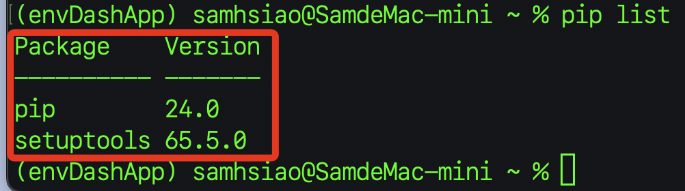
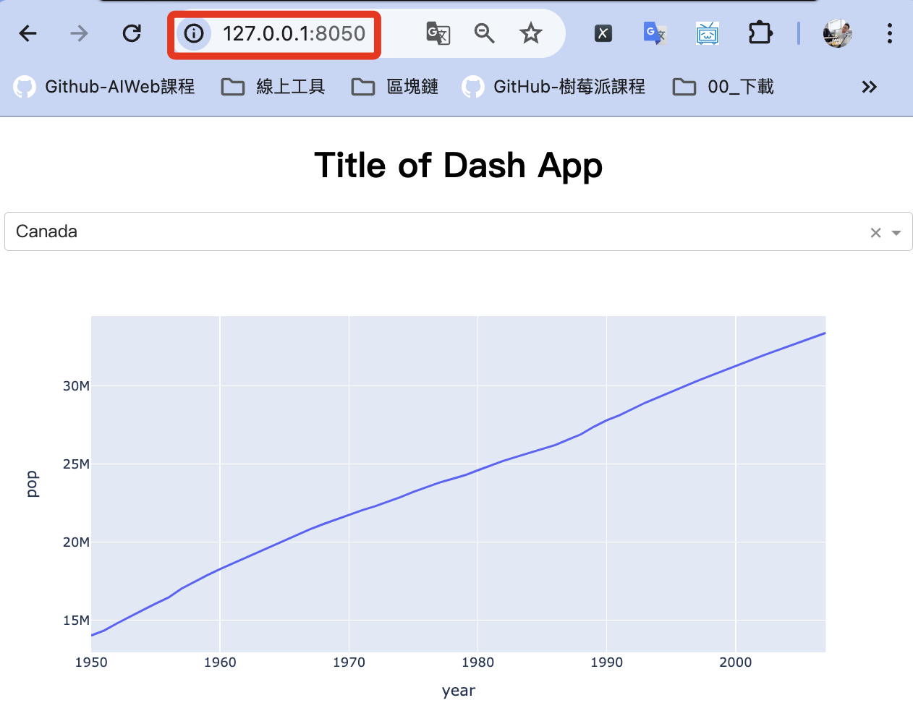

# Dash

_Python 的數據可視化框架，可參考 [Ployly 官網](https://dash.plotly.com/)。_

<br>

## 簡介

1. Python Dash 是一個由 Plotly 開發的開源框架，專門用於建立數據可視化的網頁應用，而 Plotly 是一個專業的圖表庫，支持多種語言的編輯如 Python、R、Javascript，其中應用在 Python 的圖表庫為 Plotly.py。

<br>

2. Dash 是建立在 Ployly 上的一個更高階的網頁框架，可使用純 Python 語法建立互動式網頁應用，相關說明可參考 [官網文件](https://dash.plotly.com/)，以下範例的建立將基於該說明進行。

<br>

## 說明

1. 建立虛擬環境，相關啟動與設定步驟省略說明，請參考其他基礎章節。

    ```bash
    python -m venv envDashApp
    ```

<br>

2. 完成後啟動並更新，再透過 `pip list` 觀察當前工作環境中的套件安裝現況。

    

<br>

3. 必要套件的安裝。

    ```bash
    pip install pandas dash
    ```

<br>

4. 建立專案資料夾與專案文件，這裡先建立在桌面。

    ```bash
    cd ~/Desktop && mkdir exDash && cd exDash && touch app.py && code .
    ```

    5. 依據官網範例編輯最簡易的一個 App。
    ```python
    from dash import Dash, html, dcc, callback, Output, Input
    import plotly.express as px
    import pandas as pd

    df = pd.read_csv(
        "https://raw.githubusercontent.com/plotly/datasets/master/gapminder_unfiltered.csv"
    )

    app = Dash(__name__)

    app.layout = html.Div(
        [
            html.H1(children="Title of Dash App", style={"textAlign": "center"}),
            dcc.Dropdown(df.country.unique(), "Canada", id="dropdown-selection"),
            dcc.Graph(id="graph-content"),
        ]
    )


    @callback(
        Output("graph-content", "figure"),
        Input("dropdown-selection", "value")
    )
    def update_graph(value):
        dff = df[df.country == value]
        return px.line(dff, x="year", y="pop")


    if __name__ == "__main__":
        app.run(debug=True)

    ```

<br>

6. 運行後透過瀏覽器訪問本地網址 `http://127.0.0.1:8050/`。

    

<br>

___

<br>

_其他功能請參考官網說明_

