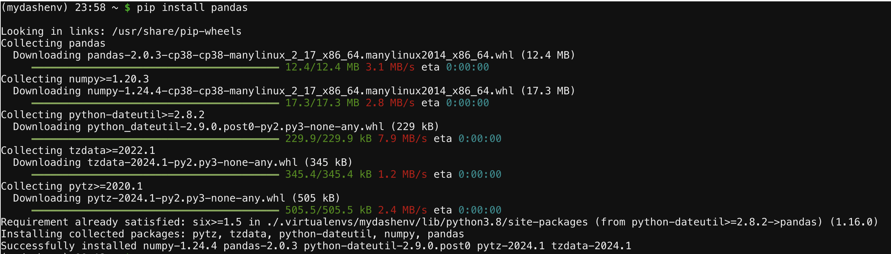
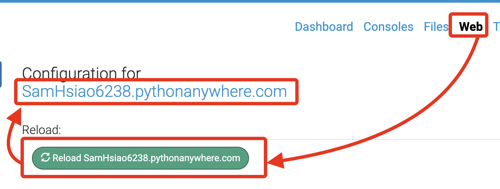

# PythonAnywhere

_要部署應用到 PythonAnywhere，先進行官網註冊_

<br>

## 步驟

1. 前往 [PythonAnywhere 官網](https://www.pythonanywhere.com/) ，點擊 `Pricing & signup` 進行註冊。

   

<br>

2. 建立免費帳號。

   

<br>

3. 填寫基本資料。

   

<br>

4. 完成以上步驟便可進入看起來有點小複雜的主控台。

   

<br>

## 開始部署

<br>

_這部分參考另一個講義內容 [說明](https://github.com/samhsiao6238/RaspberryPi_20231015/blob/main/D05_物件導向、例外與偵錯/2_Dash+PythonAnywhere/02_部署簡單的Dash應用.md) ，滑動到 `開始部署` 的部分接續操作。_

1. 由於官方範例還使用了 `pandas`，所以要在 Pythonanywhere 的 Console 中進行安裝。

    ```bash
    pip install pandas
    ```

<br>

2. 過程同樣很耗時，完成時會顯示以下資訊。

    

<br>

3. 重新啟動。

    

<br>

4. 點擊網址進行瀏覽。

    

---

<br>

_END_
