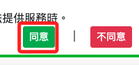
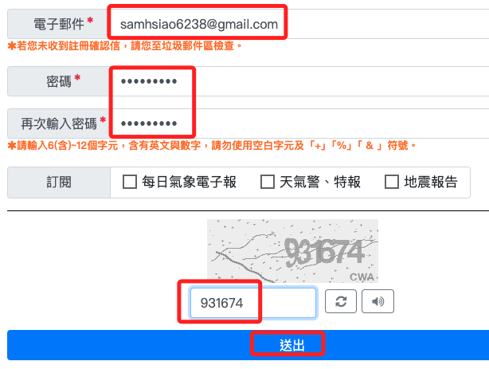
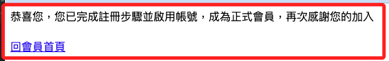
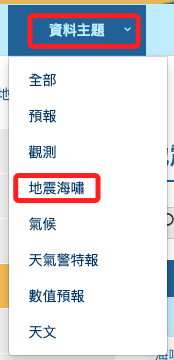
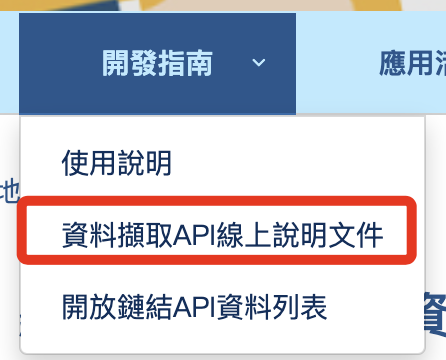
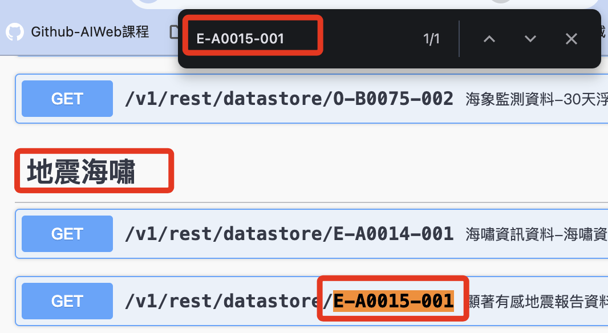
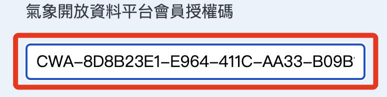
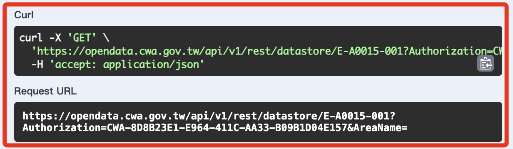
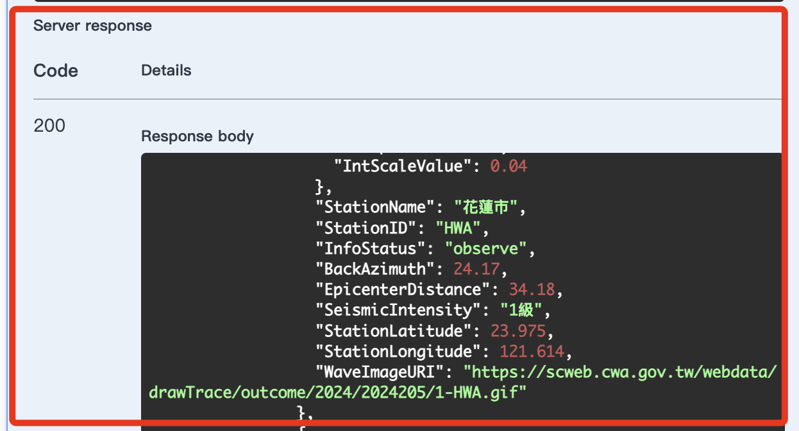
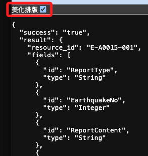

# 中央氣象局

_氣象資訊開放平台_

 

1. 開啟 [官網登入網址](https://opendata.cwa.gov.tw/userLogin)。

 

2. 第一次使用點擊 `加入會員`。

   

 

3. 點擊 `同意`。

   

 

4. 自訂密碼。

   

 

5. 通過郵件驗證之後成為正式會員。

   

 

6. 前往平台。

   

 

7. 進行登入。

   

 

8. 取得授權碼並儲存。

   

 

9. 選取主題，如 `地震海嘯`。

   

 

10. 可看出提過的資料有四種型態：`ZIP`、`API`、`JSON`、`XML`。

    

 

## API

_示範使用 API 進行相關查詢。_

 

1. 假如想查詢的資料是 _顯著有感地震報告資料_，資料編號是 `E-A0015-001`。

   

 

2. 展開上方頁籤 _開發指南_ 並點擊 _資料擷取 API 線上說明文件_。

   

 

3. 以 `資料編號` 作為關鍵字進行搜尋，找到後點擊展開。

   

 

4. 點擊 `Try it out` 可測試 API。

   

 

5. 填入個人在前面步驟取得的會員 `授權碼`。

   

 

6. 其他欄位全部都使用預設值即可，接著點擊下方的 _執行_ `Execute`。

   

 

7. 這裡將提供兩行語法，分用兩種模式開啟網址瀏覽。

   

 

8. 透過服務器的回應可以觀察所取得的資訊內容。

   

 

9. 下方也提供了 _Response header_ 的內容。

   

 

10. 將上面的網址用瀏覽器開啟，並點擊 `美化排版`，如此便可觀察完整的資料結構。

    

 

---

 

_以上確認 API 可以取得資訊。_
