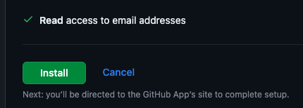

# Vercel

_[官網網址](https://vercel.com/)，這是作為 Heroku 的替代方案，可以部署 LineBot。_

 

# 註冊步驟

1. 進入官網後點擊 `Start Deploying` 開始部署。

   

 

## 新用戶

1. 建立帳號，輸入類型以及名字。

   

 

2. （整合）連結 GitHub。

   

 

3. 假如沒有自動跳轉，可以點擊下面連結。

   

 

4. 授權。

   

 

5. 驗證。

   

 

6. 驗證碼。

   

 

7. 點擊 `Install`。

   

 

8. 說明授權範圍。

   

 

9. 確認安裝。

   

 

10. 需要再次授權。

   

 

11. 若是第一次啟用，會顯示沒有發現出存庫。

   

 

12. 若已有倉庫可選擇儲存庫，也可以切換帳號。

   

 

13. 任意載入一個儲存庫。

   

 

14. 進行必要與客製的設置之後點擊部署 `Deploy`。

   

 

15. 完成時，畫面中央會顯示錯誤訊息，不用理會，因為目前尚未建立專案。

   

 

___

_以上是完成 Vercel 的註冊，準備好後待用。_
