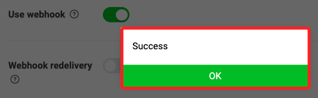

# 建立 LineBot

_實作：本實作會以建立 LineBot 為例，介紹 Vercel 與 GitHub 整合。_

</br>

## MacOS

1. 建立並進入專案目錄，這裡示範在 `桌面` 建立 `_test02_`；專案路徑及名稱可自行修正。

   ```bash
   cd ~/Desktop && mkdir _test02_ && cd _test02_
   ```

</br>

2. 在專案資料夾內開啟新的 VSCode 工作區。

   ```bash
   code .
   ```

</br>

3. 若要部署在 `Vercel`，需建立如下的資料結構。

   ```bash
   mkdir api && touch api/index.py && touch requirements.txt && touch vercel.json
   ```

   

</br>

## 範例程式

_參考 [Line 官方 Github](https://github.com/line/line-bot-sdk-python)_

</br>

1. 建立並啟動虛擬環境，這裡不再贅述。

<br>

2. 依照官方指示，先安裝套件；假如有提示缺少套件則再進行安裝即可。

   ```bash
   python -m pip install line-bot-sdk
   ```

</br>

3. 在 VSCode 中編輯 `api` 資料夾內的文件 `index.py`，複製以下內容貼上即可。

   ```python
   # 導入 Flask 相關模組
   from flask import Flask, request, abort

   # 導入 LineBot 相關模組
   from linebot import LineBotApi, WebhookHandler

   # 導入 LineBot 的例外處理
   from linebot.exceptions import InvalidSignatureError

   # 導入 LineBot 的模型
   from linebot.models import (
      MessageEvent, TextMessage, TextSendMessage
   )

   import os  # 導入 os 模組

   # 從環境變數中取得 LineBot 的設置
   line_bot_api = LineBotApi(
      os.getenv("LINE_CHANNEL_ACCESS_TOKEN")
   )
   line_handler = WebhookHandler(
      os.getenv("LINE_CHANNEL_SECRET")
   )
   # 建立 Flask 應用
   app = Flask(__name__)


   # 定義根路由
   @app.route("/")
   def home():
      # 返回簡單的文字訊息
      return "=== 這是預設的首頁 ==="


   # 定義 webhook 路由
   @app.route("/webhook", methods=["POST"])
   def callback():
      # 取得 X-Line-Signature 標頭值
      signature = request.headers["X-Line-Signature"]
      # 取得請求主體
      body = request.get_data(as_text=True)
      # 記錄請求主體
      app.logger.info("Request body: " + body)
      try:
         # 處理 webhook 主體
         line_handler.handle(body, signature)
      # 捕捉無效簽名的錯誤
      except InvalidSignatureError:
         # 返回 400 錯誤
         abort(400)
      # 返回正確的響應
      return "OK"


   # 處理 Line 的訊息事件
   @line_handler.add(MessageEvent, message=TextMessage)
   def handle_message(event):

      if event.message.type != "text":
         line_bot_api.reply_message(
               event.reply_token, 
               TextSendMessage(
                  text="我目前僅可以讀取文字訊息"
               )
         )
         return
      if event.message.text == "說話":

         line_bot_api.reply_message(
               event.reply_token, 
               TextSendMessage(
                  text="我可以說話囉，歡迎來跟我互動 ^_^ "
               )
         )
         return
      else:
         line_bot_api.reply_message(
               event.reply_token, 
               TextSendMessage(
                  text="我目前還未擁有對應的功能"
               )
         )
         return


   if __name__ == "__main__":
      # 運行 Flask 應用
      app.run()

   ```

</br>

## 建立 Line Developer

_特別注意，這並非唯一的進入程序，只要能進入設定畫面並進行設定皆可。_

<br>

1. 進入 [中文官網](https://developers.line.biz/zh-hant/) 。

<br>

2. 點擊 `Messaging API`。

   

<br>

3. 點擊 `開始體驗`，另外文件在製作筆記的同時是 `404` 的。

   

<br>

4. 使用自己的帳號登入。

   

_若有其他步驟請依據使用經驗自行判斷，應該沒難度。_

5. 建立 `channel`，首先要選擇現有的 `Provider` 或是建立新的，這裡示範建立名為 `Test_0412` 的 Provider。

   

<br>

6. 區域設定為 `Taiwan`，接著在設定 `Email address` 之前的其餘項目皆可 _任意輸入_。

   

<br>

7. 勾選兩個同意選項之後點擊建立 `Create`。

   

<br>

8. 點擊 `OK`。

   

<br>

9. 點擊同意 `Agree`。

   

<br>

10. 以上完成建立並進入開發介面。

    

<br>

11. 在這個階段，可以先取得 `secret` 以及 `token`，首先取得 `secret` 並記錄下來。

    

<br>

12. 日後若要重新設定新的 `secret` 則點擊 `issue` 即可。

    

<br>

13. 切換到 `Messaging API` 頁籤。

    

<br>

14. 點擊 `issue` 建立新的 `token`，先記錄下來。

   

<br>

15. 日後要更新則點擊 `Reissue` 即可。

   

_以上完成初步建置，接著回到腳本編輯。_

<br>

## 繼續編輯腳本

1. 編輯套件管理檔案 `requirements.txt` ，套件有版本相容問題，所以要加上版本號，無論是否使用 `Vercel` 作為部署服務器，都還是可建立這個管理檔案的，有利於未來重建專案時的版本管理。

   ```txt
   Flask==2.2.2
   line-bot-sdk
   Werkzeug==2.3.7
   ```

</br>

2. 建立 Vercel 設定檔案 `vercel.json`，這是給部署在服務器上使用的設定文件。

   ```json
   {
       "builds": [
       {
           "src": "api/index.py",
           "use": "@vercel/python"
       }
       ],
       "routes": [
       {
           "src": "/(.*)",
           "dest": "api/index.py"
       }
       ]
   }
   ```

</br>

3. 將 `secret` 及 `token` 貼到範例中。

   

<br>

4. 運行腳本。

   ```bash
   python index.py
   ```

<br>

5. 會出現紅色警告，暫時不予理會。

   

<br>

6. 啟動 `ngrok`，在同樣的端口上運行。

   ```bash
   ./ngrok http 5000
   ```

<br>

7. 這裡要特別說明一點，以上的程序看似都沒問題，但因為在 `macOS Monterey` 以上的版本中自帶的 `AirPlay Receiver` 服務會佔用 `5000` 端口，所以後續進行 `webhook` 設定時會出現 `Error`，所以 MacOS 使用者可對腳本進行修改，指定使用其他端口如 `5001`。

   ```python
   if __name__ == "__main__":
      app.run('0.0.0.0', port=5001)
   ```

<br>

8. 特別注意，若有修改時要重新指定 `ngrok` 的服務端口與腳本相同。

   ```bash
   ./ngrok http 5001
   ```

<br>

9. 複製網址。

   

<br>

10. 進入 `Line Developer` 介面進行 `webhook` 設定，在 `Messaging API` 頁籤中進行編輯 `Edit`。

   

<br>

11. 特別注意，先查看一下腳本中的路由設置，範例專案是設定為 `/callback`，有時也常用 `/webhook`。

   

<br>

12. 貼上 `ngrok` 提供的網址以及路由。

   

<br>

13. 開啟 `Use webhook`，並點擊 `Verify` 進行驗證以確認設定是否正確。

   

<br>

14. 成功時會顯示 `Success`。

   

<br>

15. 始用手機掃描條碼來添加好友。

   

<br>

16. 點擊加入好友後會直接跳出歡迎對話。

   

<br>

17. 接著進行 `LINE Official Account features` 的設定。

   

<br>

18. 添加相片，在這裡添加相片可對相片進行縮放，而在建立帳號的時候添加相片將無法進行縮放，所以建議在這個步驟添加相片，每次添加後一個小時內無法變更。

   

<br>

19. 接受加入群組以及接收文字以外訊息可拓展更多機器人的功能。

   

<br>

20. 這時透過對話發送一個 `你好` 的訊息，會發現機器人回覆了兩個訊息，其中第一個是 `自動回覆`，而第二個是腳本中撰寫的回應相同內容的訊息。

   

<br>

21. 可在 `回應設定` 頁籤中關閉 `自動回應訊息`，之後就透過腳本編程來進行回應。

   

<br>

22. 再次發送訊息，機器人便只會回應相同內容。

   

<br>

_以上完成初步的設置_
