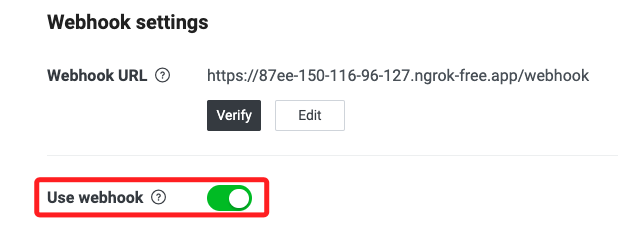

# 建立 LineBot

_實作：本實作會以建立 LineBot 為例，介紹 Vercel 與 GitHub 整合。_

</br>

## 步驟

_以下是在 MacOS 中操作，若在 Win 系統操作，將中終端機指令改為 cmd 指令，或使用面板操作相關檔案建立的步驟即可。_

<br>

1. 開啟終端機，透過指令建立並進入專案目錄，這裡示範在 `桌面` 建立 `_test02_`；專案路徑及名稱可自行修正。

   ```bash
   cd ~/Desktop && mkdir _test02_ && cd _test02_
   ```

</br>

2. 在專案資料夾內開啟新的 VSCode 工作區。

   ```bash
   code .
   ```

</br>

3. 若要部署在 `Vercel`，需建立如下的資料結構。

   ```bash
   mkdir api && touch api/index.py && touch requirements.txt vercel.json
   ```

   

</br>

4. 另外，先建立幾個腳本備用；其中 `.env` 用以儲存敏感資訊、`.gitignore` 用以設定不同步的清單、`randomNumber.py` 則是範例的自訂模組。

   ```bash
   touch .env .gitignore randomNumber.py
   ```

<br>

## 範例程式

_以下代碼是參考 [Line 官方 Github](https://github.com/line/line-bot-sdk-python/blob/master/examples/flask-echo/app_with_handler.py) 及 [網路文章](https://github.com/mant0u0/LineBot-Mant0u) 後略作修改的腳本，使用開啟的 VSCode 進行編輯。_

</br>

1. 建立並啟動虛擬環境 `envLineBot`，相關建立細節不做贅述。

   ```bash
   cd ~/Documents/PythonVenv && python -m venv envLineBot
   ```

<br>

2. 設定路徑後，啟動虛擬環境。

   ```bash
   source ~/.zshrc
   ```

<br>

3. 更新 PIP 並安裝套件。

   ```bash
   pip install --upgrade pip && python -m pip install line-bot-sdk flask python-dotenv
   ```

</br>

4. 在 VSCode 中編輯 `api` 資料夾內的文件 `index.py`，複製以下內容貼上即可。

   ```python
   from flask import Flask, request, abort
   from linebot import LineBotApi, WebhookHandler
   from linebot.exceptions import InvalidSignatureError
   from linebot.models import *

   import os
   import json

   # 判斷是否本地運行
   # 如果沒有 Vercel 環境變數，則認為是在本地
   if os.getenv("VERCEL") is None:
      from dotenv import load_dotenv
      load_dotenv()

   from .randomNumber import randomNumberMain

   line_bot_api = LineBotApi(os.getenv("CHANNEL_ACCESS_TOKEN"))
   line_handler = WebhookHandler(os.getenv("CHANNEL_SECRET"))

   app = Flask(__name__)


   # domain root
   @app.route('/')
   def home():
      return '這是個測試網頁 09。'


   @app.route("/webhook", methods=['POST'])
   def callback():
      # get X-Line-Signature header value
      signature = request.headers['X-Line-Signature']
      # get request body as text
      body = request.get_data(as_text=True)
      app.logger.info("Request body: " + body)
      # handle webhook body
      try:
         line_handler.handle(body, signature)
      except InvalidSignatureError:
         abort(400)
      return 'OK'


   @line_handler.add(MessageEvent, message=TextMessage)
   def handle_message(event):
      # 取得「使用者」訊息
      user_message = event.message.text

      if user_message == '文字':
         # 設定「機器人」回覆訊息
         bot_message = "文字"
         # 發送訊息
         line_bot_api.reply_message(
               event.reply_token, TextSendMessage(text=bot_message))

      if user_message == '圖片':
         # 設定「機器人」回覆訊息
         bot_message = ImageSendMessage(
               original_content_url='https://i.imgur.com/Hfl3xaT.png',
               preview_image_url='https://i.imgur.com/Hfl3xaT.png'
         )
         # 發送訊息
         line_bot_api.reply_message(event.reply_token, bot_message)

      if user_message == '亂數':
         # 設定「機器人」回覆訊息
         bot_message = randomNumberMain(0, 100)
         # 發送訊息
         line_bot_api.reply_message(
               event.reply_token, TextSendMessage(text=bot_message))

      if user_message == '讀取':
         # 讀取 JSON 檔案
         filename = '/tmp/data.json'
         data = read_JSON_data(filename)
         # 發送訊息
         replyLineMessage = TextSendMessage(str(data))
         line_bot_api.reply_message(event.reply_token, replyLineMessage)

      if user_message == '寫入':
         # 讀取 JSON 檔案
         filename = '/tmp/data.json'
         data = read_JSON_data(filename)
         # 寫入新資料
         newData = {"number": randomNumberMain(0, 100)}
         data.append(newData)
         write_JSON_data(filename, data)
         # 發送訊息
         replyLineMessage = TextSendMessage(str(data))
         line_bot_api.reply_message(event.reply_token, replyLineMessage)

      if user_message == '清除':
         # 寫入空白
         filename = '/tmp/data.json'
         data = []
         write_JSON_data(filename, data)
         # 發送訊息
         replyLineMessage = TextSendMessage(str(data))
         line_bot_api.reply_message(event.reply_token, replyLineMessage)

      else:
         # 設定「機器人」回覆訊息
         bot_message = "回傳文字：" + user_message
         # 發送訊息
         line_bot_api.reply_message(
               event.reply_token, TextSendMessage(text=bot_message))


   if __name__ == "__main__":
      app.run()


   # 讀取JSON資料
   def read_JSON_data(filename):
      try:
         with open(filename, 'r') as file:
               data = json.load(file)
      except FileNotFoundError:
         data = []
      return data


   # 寫入JSON資料
   def write_JSON_data(filename, data):
      with open(filename, 'w') as file:
         json.dump(data, file)

   ```

</br>

5. 編輯 `.env` 文件，先貼上以下內容。

   ```json
   CHANNEL_ACCESS_TOKEN=<填入自己的 Token>
   CHANNEL_SECRET=<填入自己的 Secret>
   ```

<br>

6. 在 `.gitignore` 文件中寫入 `.env`、`.vercel`。

   ```json
   .env
   .vercel
   ```

<br>

7. 編輯 `randomNumber.py`。

   ```python
   import random


   # 亂數產生
   def randomNumberMain(min, max):
      num = random.randint(min, max)

      return str(num)
   ```

<br>

## 進入 Line Developer

_特別注意，這並非唯一的進入程序，只要能進入設定畫面並進行設定皆可。_

<br>

1. 進入 [中文官網](https://developers.line.biz/zh-hant/) 。

<br>

2. 點擊 `Messaging API`。

   

<br>

3. 點擊 `開始體驗`，另外文件在製作筆記的同時是 `404` 的。

   

<br>

4. 使用自己的帳號登入。

   

_若有其他步驟請依據使用經驗自行判斷，應該沒難度。_

<br>

## 建立機器人

1. 建立 `channel`，首先要選擇現有的 `Provider` 或是建立新的，這裡示範建立名為 `Test_0412` 的 Provider。

   

<br>

2. 區域設定為 `Taiwan`，接著在設定 `Email address` 之前的其餘項目皆可 _任意輸入_。

   

<br>

3. 勾選兩個同意選項之後點擊建立 `Create`。

   

<br>

4. 點擊 `OK`。

   

<br>

5. 點擊同意 `Agree`。

   

<br>

6. 以上完成建立並進入開發介面。

   

<br>

## 取得憑證

_先取得 `secret` 以及 `token`_

<br>

1. 首先取得 `secret` 並記錄在 `.env` 文件中的 `CHANNEL_SECRET`。

   

<br>

2. 日後若要重新設定新的 `secret` 則點擊 `issue` 即可。

   

<br>

3. 切換到 `Messaging API` 頁籤。

   

<br>

4. 點擊 `issue` 建立新的 `token` 並記錄在 `.env` 文件中的 `CHANNEL_SECRET`。

   

<br>

5. 日後要更新則點擊 `Reissue` 即可。

   

_以上完成初步建置，接著回到腳本編輯。_

<br>

## 編輯專案

_回到專案資料夾中繼續編輯腳本_

<br>

1. 編輯套件管理檔案 `requirements.txt` ，套件有版本相容問題，所以要加上版本號，無論是否使用 `Vercel` 作為部署服務器，都還是可建立這個管理檔案的，有利於未來重建專案時的版本管理。

   ```txt
   Flask==2.2.2
   line-bot-sdk
   Werkzeug==2.3.7
   ```

</br>

2. 編輯 Vercel 設定檔案 `vercel.json`，這是給部署在服務器上使用的設定文件。

   ```json
   {
      "builds": [
         {
            "src": "api/index.py",
            "use": "@vercel/python"
         }
      ],
      "routes": [
         {
            "src": "/(.*)",
            "dest": "api/index.py"
         }
      ]
   }
   ```

</br>

3. 在 `api` 資料夾開啟終端機。

   

<br>

4. 運行腳本。

   ```bash
   python index.py
   ```

<br>

5. 會出現紅色警告，暫時不予理會。

   

<br>

6. 啟動 `ngrok`，在同樣的端口上運行。

   ```bash
   ngrok http 8000
   ```

<br>

7. 特別說明，在 `macOS Monterey` 以上的版本中，自帶的 `AirPlay Receiver` 服務會佔用 `5000` 端口，所以可依據運行的端口啟動 `ngrok`，若要指定端口，務必避開 `5000`，也可透過代碼指定如 `5001`。

   ```python
   if __name__ == "__main__":
      app.run('0.0.0.0', port=5001)
   ```

<br>

## 設定 Webhook

1. 複製 `ngrok` 配發的網址。

   

<br>

2. 進入 `Line Developer` 介面進行 `webhook` 設定，在 `Messaging API` 頁籤中進行編輯 `Edit`。

   

<br>

3. 特別注意，先查看一下腳本中的路由設置，範例專案是設定為 `/callback`，有時也常用 `/webhook`。

   

<br>

4. 貼上 `ngrok` 提供的網址以及代碼中指定的路由 `/callback`。

   

<br>

5. 開啟 `Use webhook`，並點擊 `Verify` 進行驗證以確認設定是否正確。

   

<br>

6. 成功時會顯示 `Success`。

   

<br>

## 添加好友

1. 使用手機掃描條碼來添加好友。

   

<br>

2. 點擊加入好友後會直接跳出歡迎對話。

   

<br>

## 設定帳號屬性

1. 接著進行 `LINE Official Account features` 的設定。

   

<br>

2. 添加相片，在這裡添加相片可對相片進行縮放，而在建立帳號的時候添加相片將無法進行縮放，所以建議在這個步驟添加相片，每次添加後一個小時內無法變更。

   

<br>

3. 接受加入群組以及接收文字以外訊息可拓展更多機器人的功能。

   

<br>

4. 這時透過對話發送一個 `你好` 的訊息，會發現機器人回覆了兩個訊息，其中第一個是 `自動回覆`，而第二個是腳本中撰寫的回應相同內容的訊息。

   

<br>

5. 可在 `回應設定` 頁籤中關閉 `自動回應訊息`，之後就透過腳本編程來進行回應。

   

<br>

6. 再次發送訊息，機器人便只會回應相同內容。

   

<br>

___

_以上完成初步的設置_
