# 設置 Vercel

<br>

## 安裝套件

1. 進入 [官網登入](https://vercel.com/login)，選擇 `Github` 登入即可。

    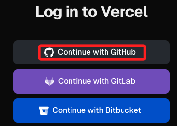

<br>

2. 點擊右上方的 `Docs` 文件查看相關設置的說明。

    

<br>

3. 進入教程。

    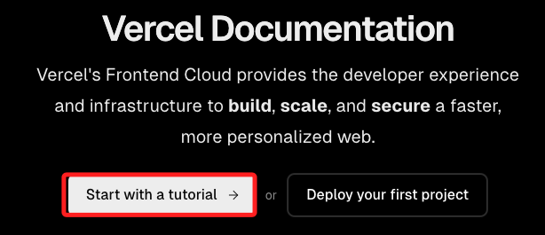

<br>

4. 使用 `npm` 進行安裝。

    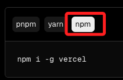

<br>

5. 記得要加上 `sudo`，否則安裝過程中會報錯。

    ```bash
    sudo npm i -g vercel
    ```
<br>

## 補充說明

_說明前面步驟設定的 `.env` 文件_

<br>

1. 在做任何的部署之前，都要確保腳本中的敏感資訊是否得到保護，在官方的腳本中，並未將 `secret` 以及 `token` 進行保護，這裡展示透過 `dotenv` 來隱藏敏感資訊。

    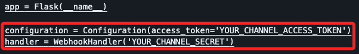

<br>

2. 安裝套件。

    ```bash
    pip install python-dotenv
    ```

<br>

3. 在專案內根目錄自建立一格隱藏檔案 `.env` 並編輯內容。

    ```bash
    _CHANNEL_ACCESS_TOKEN_ = <貼上 TKOKEN>
    _CHANNEL_SECRET_ = <貼上 SECRET>
    ```

<br>

4. 特別注意， `.env` 檔案內的字串無需加上引號，與等號間有無間隔皆可。
    
    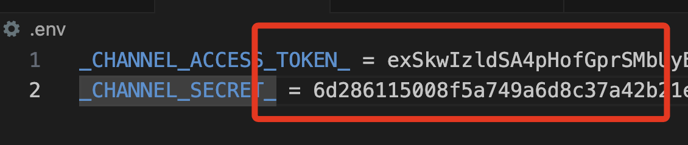

<br>

5. 在根目錄添加 `.gitignore` 檔案，並將 `.env` 寫入其中。

    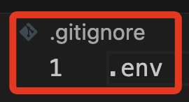

<br>

6. 在主腳本 `index.py` 導入 dotenv。

    ```python
    import os
    from dotenv import load_dotenv
    load_dotenv()
    ```

<br>

7. 在程序中使用 `os` 來取得 Token 及 Secret。

    _取得_
    ```python
    CHANNEL_ACCESS_TOKEN = os.getenv("_CHANNEL_ACCESS_TOKEN_")
    CHANNEL_SECRET = os.getenv("_CHANNEL_SECRET_")
    ```
    _使用_
    ```
    configuration = Configuration(access_token=CHANNEL_ACCESS_TOKEN)
    handler = WebhookHandler(CHANNEL_SECRET)
    ```

<br>

8. 重新運行一次腳本，然後進行對話測試，確認沒問題，便可以進行以下步驟。

    

_以上完成敏感資訊處理_

<br>

## 進行設定與部署

_透過 Vercel CLI 進行部署，進入根目錄中開啟終端機，務必確認是在根目錄_

<br>

1. 運行 CLI，輸入 `Y`。

    ```bash
    sudo vercel
    ```

    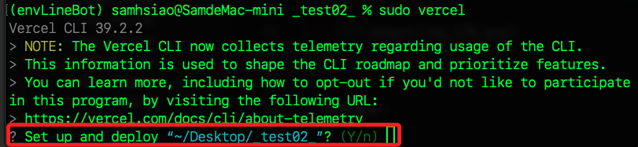

<br>

2. 執行後會出現對話。

    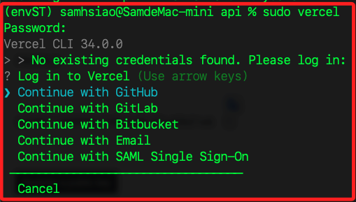

</br>

3. 使用 `Github` 進行登入。

    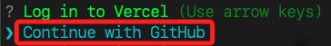

<br>

4. 成功登入後會顯示如下畫面，不會自動返回終端機，要手動切換。

    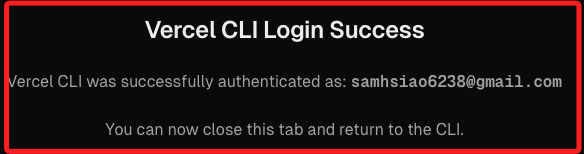

<br>

5. 表示這個專案資料夾並非是一個 `repo`，詢問是否設置並且部署：`Y`。

    

<br>

6. 選擇當前的專案。

    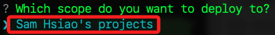

<br>

7. 不要連結現有專案：N。

    

<br>

8. 專案名稱，幾如有提供預設則使用預設即可（ENTER）。
    
    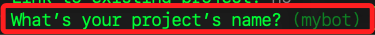

<br>

9. 在哪個目錄（ENTER）。

    

<br>

10. 假如沒有提供預設名稱，則手動輸入。

    

</br>

11. 出現錯誤。

    

<br>

12. 進入 Vercel 控制台中在前面步驟所建立的專案中，點擊 `Settings`。

    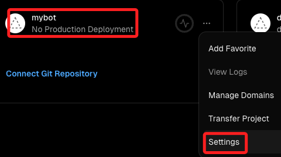 

<br>

13. 在 `General` 頁籤中找到 `Node.js Version`，手動切換到 `18.0`。

    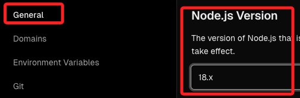

<br>

14. 切換後記得儲存 `Save`。

    

<br>

15. 再次透過 `sudo vercel` 指令進行設定。

    

<br>

16. 完成後會顯示進行部署的提示。

    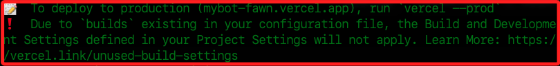

<br>

17. 使用以下指令進行部署，切記加上 `sudo`。

    ```bash
    sudo vercel --prod
    ```

<br>

18. 完成部署，而訊息中顯示因為 `builds` 已經存在於設置檔案中，所以設置沒有套用，這並不影響部署的完成。

    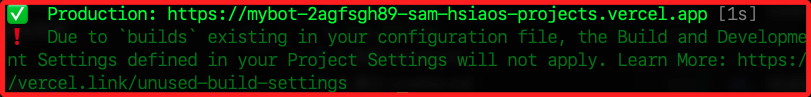

<br>

19. 另外依據說明，這並非一個 repo，這在之後的步驟會進行部署，這裡暫不理會。

    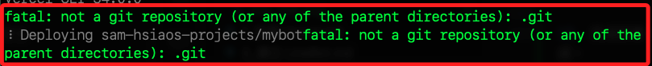

</br>

## C. 前往 Vercel 主控台

1. 到 Vercel 主控台，點擊剛剛上傳的專案，這裡示範是 `mybot`，名稱是部署的時候自動建立的。

    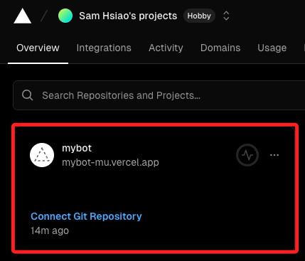

</br>

2. 先複製 Domain，可能會有兩個以上的 URL，任意複製一個即可。

    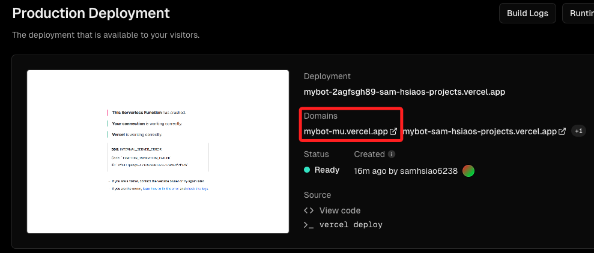

<br>

3. 這個時候網頁會顯示有錯誤，不用理會。

    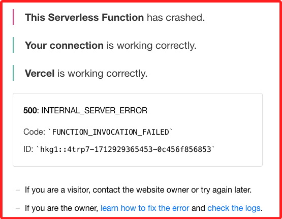

</br>

## D. 前往 Line Developers

1. 回到 Line Developers，編輯或修改 Webhook。

   

</br>

2. 貼上網址，加上「/webhook」，然後 Update。

   

</br>

3. 再次說明這裡的 `webhook` 尾綴是定義在 `index.py` 中的路由 `route`。

   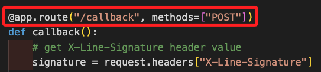

</br>

4. 確認 `Use webhook` 是開啟。

   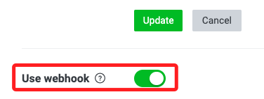

</br>

5. 這時還沒完成設定，點擊驗證會是錯的。

   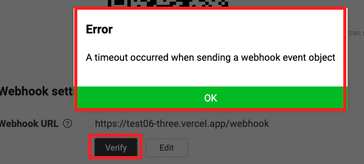

</br>

6. 繼續進行設定，點擊 Edit。

   

</br>

7. 選擇接受邀請。

   

</br>

8. 總的來說是這樣。

   

</br>

_🔺 以上完成第一階段的 Line Developers 設定_

</br>

## E. 進入 Vercel

1. 接著進入 Vercel 的設定 `Settings`。

   

</br>

2. 點擊左側環境變數。

   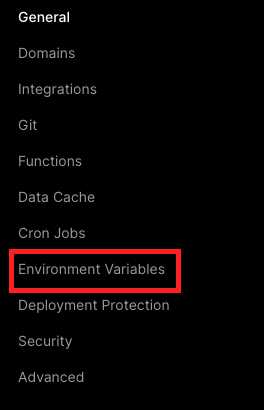

</br>

3. 複製程式碼中的兩個環境變數名稱作為 Key。

    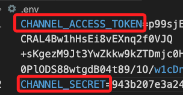

</br>

4. 先貼上 Key。

    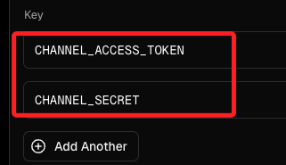

<br>

5. 再貼上 Line Develop 所提供對應的 `Token` 與 `Secret` 的值。

    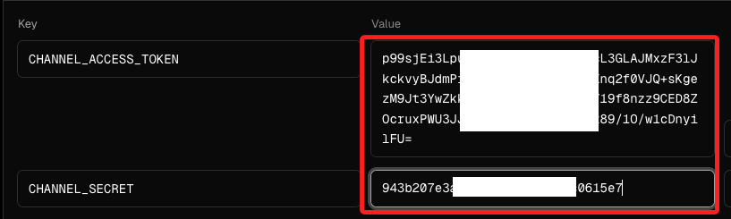

</br>

6. 務必記得儲存。

   

7. 儲存後會顯示在 `Settings` 的最下方。

    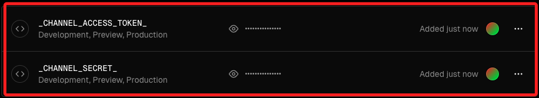

</br>

## F. 進入 VSCode

1. 將專案發佈到新的儲存庫中。

   

</br>

2. 選公開。

   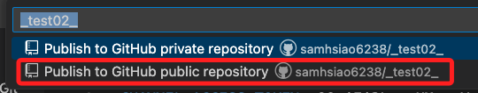

</br>

3. 完成部署在 Github 上查看。

    

<br>

## G. 再回到 Vercel 中

1. 點擊連結到專案。

   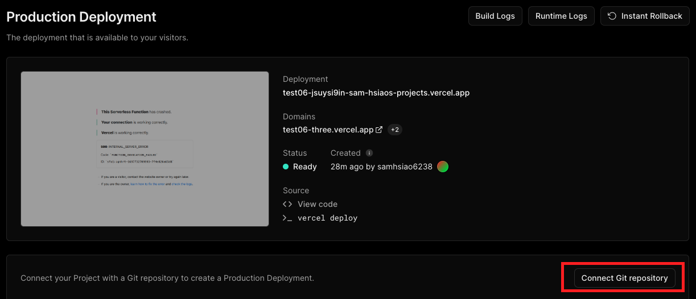

</br>

2. 選取 GitHub。

   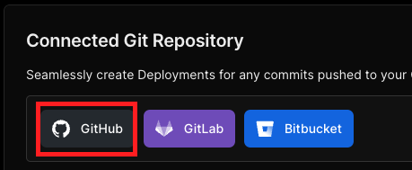

</br>

3. 連結對應的專案，在這裡是 `mybot`。

    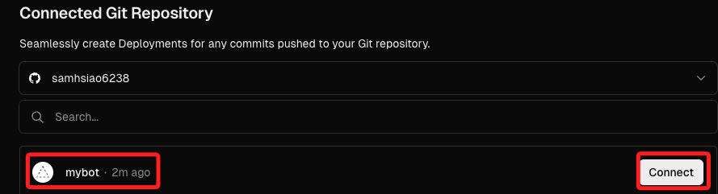

</br>

4. 回到產品部署 `Production Deployment` 的畫面，可以點擊 `Source code` 查看內容以確認是否為更新的內容。

   

</br>

## H. 驗證結果

1. Vercel 的部署有時會有延遲狀況，可以透過去修改一下 `index.py` 來同步並觀察一下部署狀況。

   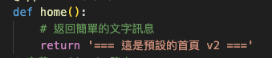

</br>

2. 直到畫面正常顯示就表示部署完成。

   

</br>

3. 也可以透過驗證 Webhook 確認是否完成部署。

   

</br>

## I. 其他補充

    _介紹完伺服器後，再使用 `Ngrok` 將 LineBot 部署在樹莓派上_

</br>

---

_END:這裡僅是確認部署，至於腳本內容並無太多功能_