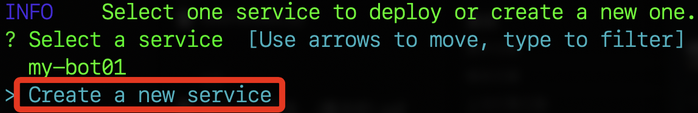
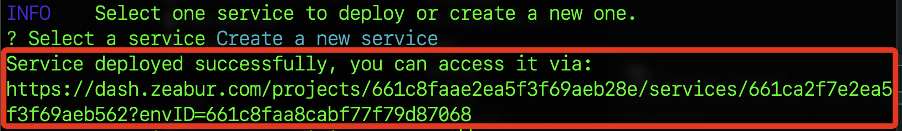
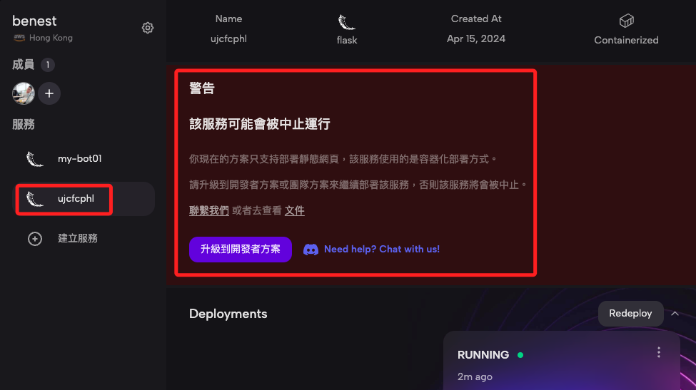

# Zeabur CLI

<br>

## 說明

1. 參考 [官方文件](https://zeabur.com/docs/zh-TW/deploy/deploy-in-cli) 進行安裝。

    ```bash
    brew install zeabur/tap/cli
    ```

<br>

2. 登入。

    ```bash
    zeabur auth login
    ```

<br>

3. 會開啟網頁對話，按下 `確認` 即可。

    

<br>

4. 若要登出或重新登入。

    ```bash
    zeabur auth logout
    ```

<br>

5. 開始部署。

    ```bash
    zeabur
    ```

<br>

6. 建立新的服務。

    

<br>

7. 假如已經設置過區域，到這便完成部署。

    

<br>

8. 進入 `Zeabur` 首頁便可看到添加一個新的 Flask 專案圖標。
    
    

<br>

9. 點擊進入會看到預設了一個專案名稱，可對其進行修改，其餘部分與之前步驟相同。

    

<br>

___


<br>

_END_

